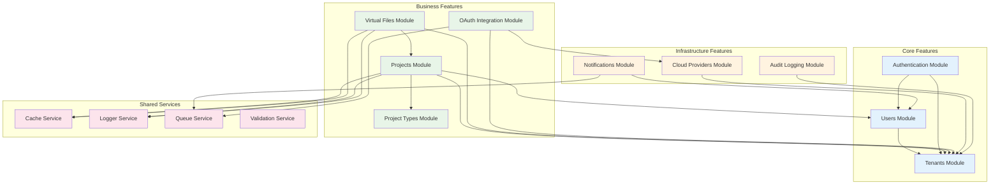
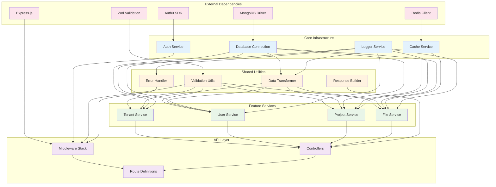

# 🧩 MWAP Component Structure & Relationships

## 🎯 Overview

This document provides detailed information about MWAP's component architecture, including component relationships, dependencies, interfaces, and interaction patterns. Understanding these relationships is crucial for effective development and maintenance.

## 🏗️ Component Hierarchy

### **System-Level Components**
```typescript
interface SystemArchitecture {
  presentation: {
    webClient: 'React/Next.js (Future)';
    mobileClient: 'React Native (Future)';
    apiClient: 'REST API Consumer';
  };
  
  gateway: {
    loadBalancer: 'NGINX/CloudFlare';
    apiGateway: 'Express.js Server';
    middleware: MiddlewareStack;
  };
  
  application: {
    featureModules: FeatureModule[];
    sharedServices: SharedService[];
    utilities: UtilityModule[];
  };
  
  data: {
    primaryDatabase: 'MongoDB Atlas';
    cache: 'Redis';
    authentication: 'Auth0';
    storage: CloudStorageProvider[];
  };
  
  infrastructure: {
    containerization: 'Docker';
    orchestration: 'Kubernetes';
    monitoring: MonitoringStack;
    logging: LoggingStack;
  };
}
```

## 🔧 Feature Module Architecture

### **Standard Feature Module Structure**
```typescript
// Feature module template
interface FeatureModule {
  name: string;
  domain: BusinessDomain;
  components: {
    routes: RouteDefinition[];
    controllers: ControllerClass[];
    services: ServiceClass[];
    models: ModelDefinition[];
    types: TypeDefinition[];
    validation: ValidationSchema[];
    tests: TestSuite[];
  };
  dependencies: {
    internal: InternalDependency[];
    external: ExternalDependency[];
    shared: SharedServiceDependency[];
  };
}

// Example: Projects Feature Module
const projectsModule: FeatureModule = {
  name: 'projects',
  domain: 'ProjectManagement',
  components: {
    routes: ['project.routes.ts'],
    controllers: ['project.controller.ts'],
    services: ['project.service.ts'],
    models: ['project.model.ts'],
    types: ['project.types.ts'],
    validation: ['project.validation.ts'],
    tests: ['__tests__/project.*.test.ts']
  },
  dependencies: {
    internal: ['tenants', 'users'],
    external: ['mongodb', 'auth0'],
    shared: ['auth', 'cache', 'logger']
  }
};
```

### **Feature Module Relationships**


## 📊 Component Interaction Patterns

### **Request-Response Pattern**
```typescript
// Standard request-response flow
interface RequestResponseFlow {
  request: {
    source: 'HTTP Client';
    entry: 'Express Router';
    middleware: MiddlewareChain;
    controller: ControllerMethod;
  };
  
  processing: {
    validation: 'Zod Schema Validation';
    authorization: 'RBAC Check';
    businessLogic: 'Service Layer';
    dataAccess: 'Repository Pattern';
  };
  
  response: {
    formatting: 'Response Transformer';
    serialization: 'JSON Serialization';
    delivery: 'HTTP Response';
  };
}

// Example implementation
class ProjectController {
  constructor(
    private projectService: ProjectService,
    private authService: AuthService,
    private logger: Logger
  ) {}

  async createProject(req: Request, res: Response, next: NextFunction) {
    try {
      // 1. Validation (handled by middleware)
      const validatedData = req.validatedBody as CreateProjectRequest;
      
      // 2. Authorization
      const { tenantId, userId } = req.user!;
      await this.authService.checkPermission(userId, 'project:create', tenantId);
      
      // 3. Business Logic
      const project = await this.projectService.createProject(
        tenantId,
        userId,
        validatedData
      );
      
      // 4. Response
      res.status(201).json(
        new SuccessResponse(project, 'Project created successfully')
      );
    } catch (error) {
      next(error); // Error handling middleware
    }
  }
}
```

### **Event-Driven Pattern**
```typescript
// Event-driven communication between modules
interface EventDrivenPattern {
  eventBus: EventEmitter;
  publishers: EventPublisher[];
  subscribers: EventSubscriber[];
  events: DomainEvent[];
}

// Example: Project lifecycle events
class ProjectService extends EventEmitter {
  async createProject(tenantId: string, userId: string, data: CreateProjectRequest) {
    // Create project
    const project = await this.repository.create({
      ...data,
      tenantId,
      createdBy: userId
    });

    // Emit domain event
    this.emit('project.created', {
      projectId: project.id,
      tenantId,
      userId,
      timestamp: new Date()
    });

    return project;
  }
}

// Event subscribers
class NotificationService {
  constructor(projectService: ProjectService) {
    projectService.on('project.created', this.handleProjectCreated.bind(this));
  }

  private async handleProjectCreated(event: ProjectCreatedEvent) {
    await this.sendNotification({
      type: 'project_created',
      recipientId: event.userId,
      data: { projectId: event.projectId }
    });
  }
}
```

### **Repository Pattern**
```typescript
// Data access abstraction
interface Repository<T> {
  findById(id: string): Promise<T | null>;
  findByTenant(tenantId: string, filters?: any): Promise<T[]>;
  create(data: Partial<T>): Promise<T>;
  update(id: string, data: Partial<T>): Promise<T>;
  delete(id: string): Promise<void>;
}

// Implementation
class ProjectRepository implements Repository<IProject> {
  constructor(private model: Model<IProject>) {}

  async findById(id: string): Promise<IProject | null> {
    return this.model.findById(id).lean();
  }

  async findByTenant(tenantId: string, filters: ProjectFilters = {}): Promise<IProject[]> {
    const query = { tenantId, ...filters };
    return this.model.find(query)
      .populate('projectType', 'name description')
      .sort({ updatedAt: -1 })
      .lean();
  }

  async create(data: Partial<IProject>): Promise<IProject> {
    const project = new this.model(data);
    await project.save();
    return project.toObject();
  }

  async update(id: string, data: Partial<IProject>): Promise<IProject> {
    const project = await this.model.findByIdAndUpdate(
      id,
      { ...data, updatedAt: new Date() },
      { new: true, runValidators: true }
    );
    
    if (!project) {
      throw new AppError('Project not found', 404);
    }
    
    return project.toObject();
  }

  async delete(id: string): Promise<void> {
    const result = await this.model.findByIdAndDelete(id);
    if (!result) {
      throw new AppError('Project not found', 404);
    }
  }
}
```

## 🔐 Security Component Integration

### **Authentication Flow Components**
```typescript
// Authentication component chain
interface AuthenticationChain {
  jwtExtractor: JWTExtractor;
  tokenValidator: TokenValidator;
  userResolver: UserResolver;
  permissionChecker: PermissionChecker;
}

// JWT Authentication Middleware
class JWTAuthenticationMiddleware {
  constructor(
    private jwtService: JWTService,
    private userService: UserService,
    private logger: Logger
  ) {}

  authenticate = async (req: Request, res: Response, next: NextFunction) => {
    try {
      // 1. Extract token
      const token = this.extractToken(req);
      if (!token) {
        throw new AppError('Authentication token required', 401);
      }

      // 2. Validate token
      const payload = await this.jwtService.verify(token);
      
      // 3. Resolve user
      const user = await this.userService.findByAuth0Id(payload.sub);
      if (!user) {
        throw new AppError('User not found', 401);
      }

      // 4. Attach to request
      req.user = {
        userId: user.auth0Id,
        tenantId: user.tenantId,
        role: user.role,
        permissions: user.permissions
      };

      next();
    } catch (error) {
      this.logger.error('Authentication failed', { error: error.message });
      next(new AppError('Authentication failed', 401));
    }
  };

  private extractToken(req: Request): string | null {
    const authHeader = req.headers.authorization;
    if (authHeader && authHeader.startsWith('Bearer ')) {
      return authHeader.substring(7);
    }
    return null;
  }
}
```

### **Authorization Component Integration**
```typescript
// Role-based access control components
interface RBACComponents {
  roleDefinitions: RoleDefinition[];
  permissionMatrix: PermissionMatrix;
  tenantIsolation: TenantIsolationFilter;
  resourceGuards: ResourceGuard[];
}

// Authorization middleware factory
class AuthorizationMiddleware {
  static requireRole(role: UserRole) {
    return (req: Request, res: Response, next: NextFunction) => {
      if (!req.user) {
        return next(new AppError('Authentication required', 401));
      }

      if (!this.hasRole(req.user.role, role)) {
        return next(new AppError('Insufficient permissions', 403));
      }

      next();
    };
  }

  static requirePermission(permission: string) {
    return (req: Request, res: Response, next: NextFunction) => {
      if (!req.user) {
        return next(new AppError('Authentication required', 401));
      }

      if (!req.user.permissions.includes(permission)) {
        return next(new AppError('Insufficient permissions', 403));
      }

      next();
    };
  }

  static requireTenantOwner() {
    return (req: Request, res: Response, next: NextFunction) => {
      if (!req.user) {
        return next(new AppError('Authentication required', 401));
      }

      if (req.user.role !== UserRole.TENANT_OWNER) {
        return next(new AppError('Tenant owner access required', 403));
      }

      next();
    };
  }

  private static hasRole(userRole: UserRole, requiredRole: UserRole): boolean {
    const roleHierarchy = {
      [UserRole.SUPERADMIN]: 3,
      [UserRole.TENANT_OWNER]: 2,
      [UserRole.PROJECT_MEMBER]: 1
    };

    return roleHierarchy[userRole] >= roleHierarchy[requiredRole];
  }
}
```

## 📦 Dependency Management

### **Dependency Injection Container**
```typescript
// Service container for dependency management
class ServiceContainer {
  private services = new Map<string, any>();
  private factories = new Map<string, () => any>();

  register<T>(name: string, factory: () => T): void {
    this.factories.set(name, factory);
  }

  get<T>(name: string): T {
    if (this.services.has(name)) {
      return this.services.get(name);
    }

    const factory = this.factories.get(name);
    if (!factory) {
      throw new Error(`Service ${name} not registered`);
    }

    const service = factory();
    this.services.set(name, service);
    return service;
  }
}

// Service registration
const container = new ServiceContainer();

// Register core services
container.register('logger', () => new Logger());
container.register('cache', () => new CacheService(process.env.REDIS_URL!));
container.register('database', () => new DatabaseConnection(process.env.MONGODB_URI!));

// Register repositories
container.register('projectRepository', () => 
  new ProjectRepository(container.get('database').models.Project)
);

// Register services
container.register('projectService', () => 
  new ProjectService(
    container.get('projectRepository'),
    container.get('cache'),
    container.get('logger')
  )
);

// Register controllers
container.register('projectController', () => 
  new ProjectController(
    container.get('projectService'),
    container.get('authService'),
    container.get('logger')
  )
);
```

### **Module Dependencies Graph**


## 🔄 Component Lifecycle Management

### **Application Startup Sequence**
```typescript
// Application bootstrap process
class ApplicationBootstrap {
  private container: ServiceContainer;
  private logger: Logger;

  constructor() {
    this.container = new ServiceContainer();
    this.logger = new Logger();
  }

  async start(): Promise<void> {
    try {
      this.logger.info('Starting MWAP application...');

      // 1. Initialize core services
      await this.initializeCoreServices();
      
      // 2. Connect to external services
      await this.connectExternalServices();
      
      // 3. Register feature modules
      await this.registerFeatureModules();
      
      // 4. Setup middleware stack
      await this.setupMiddleware();
      
      // 5. Register routes
      await this.registerRoutes();
      
      // 6. Start HTTP server
      await this.startServer();
      
      this.logger.info('MWAP application started successfully');
    } catch (error) {
      this.logger.error('Failed to start application', { error: error.message });
      process.exit(1);
    }
  }

  private async initializeCoreServices(): Promise<void> {
    // Initialize logger
    this.container.register('logger', () => this.logger);
    
    // Initialize configuration
    this.container.register('config', () => new ConfigService());
    
    // Initialize cache service
    this.container.register('cache', () => 
      new CacheService(this.container.get('config').redis.url)
    );
  }

  private async connectExternalServices(): Promise<void> {
    // Connect to MongoDB
    const database = new DatabaseConnection(
      this.container.get('config').database.uri
    );
    await database.connect();
    this.container.register('database', () => database);

    // Initialize Auth0 service
    const authService = new Auth0Service(
      this.container.get('config').auth0
    );
    this.container.register('authService', () => authService);
  }

  private async registerFeatureModules(): Promise<void> {
    const modules = [
      new TenantsModule(this.container),
      new UsersModule(this.container),
      new ProjectsModule(this.container),
      new FilesModule(this.container)
    ];

    for (const module of modules) {
      await module.register();
    }
  }

  private async setupMiddleware(): Promise<void> {
    const app = express();
    
    // Security middleware
    app.use(helmet());
    app.use(cors(this.container.get('config').cors));
    
    // Request processing middleware
    app.use(express.json({ limit: '10mb' }));
    app.use(express.urlencoded({ extended: true }));
    
    // Authentication middleware
    app.use('/api', this.container.get('authMiddleware').authenticate);
    
    // Logging middleware
    app.use(this.container.get('loggingMiddleware').log);
    
    this.container.register('app', () => app);
  }

  private async registerRoutes(): Promise<void> {
    const app = this.container.get('app');
    
    // Health check
    app.get('/health', (req, res) => res.json({ status: 'healthy' }));
    
    // API routes
    app.use('/api/v1/tenants', this.container.get('tenantRoutes'));
    app.use('/api/v1/users', this.container.get('userRoutes'));
    app.use('/api/v1/projects', this.container.get('projectRoutes'));
    app.use('/api/v1/files', this.container.get('fileRoutes'));
    
    // Error handling
    app.use(this.container.get('errorHandler').handle);
  }

  private async startServer(): Promise<void> {
    const app = this.container.get('app');
    const config = this.container.get('config');
    
    const server = app.listen(config.server.port, () => {
      this.logger.info(`Server listening on port ${config.server.port}`);
    });
    
    this.container.register('server', () => server);
  }
}
```

### **Graceful Shutdown Process**
```typescript
// Graceful shutdown handler
class GracefulShutdown {
  private container: ServiceContainer;
  private logger: Logger;
  private isShuttingDown = false;

  constructor(container: ServiceContainer) {
    this.container = container;
    this.logger = container.get('logger');
    this.setupSignalHandlers();
  }

  private setupSignalHandlers(): void {
    process.on('SIGTERM', () => this.shutdown('SIGTERM'));
    process.on('SIGINT', () => this.shutdown('SIGINT'));
    process.on('uncaughtException', (error) => {
      this.logger.error('Uncaught exception', { error: error.message });
      this.shutdown('uncaughtException');
    });
    process.on('unhandledRejection', (reason) => {
      this.logger.error('Unhandled rejection', { reason });
      this.shutdown('unhandledRejection');
    });
  }

  private async shutdown(signal: string): Promise<void> {
    if (this.isShuttingDown) {
      return;
    }

    this.isShuttingDown = true;
    this.logger.info(`Received ${signal}, starting graceful shutdown...`);

    try {
      // 1. Stop accepting new requests
      const server = this.container.get('server');
      server.close();

      // 2. Close database connections
      const database = this.container.get('database');
      await database.disconnect();

      // 3. Close cache connections
      const cache = this.container.get('cache');
      await cache.disconnect();

      // 4. Flush logs
      await this.logger.flush();

      this.logger.info('Graceful shutdown completed');
      process.exit(0);
    } catch (error) {
      this.logger.error('Error during shutdown', { error: error.message });
      process.exit(1);
    }
  }
}
```

## 📊 Component Performance Monitoring

### **Performance Metrics Collection**
```typescript
// Component performance monitoring
class ComponentMetrics {
  private metrics = new Map<string, ComponentMetric[]>();
  private prometheus: PrometheusRegistry;

  constructor() {
    this.prometheus = new PrometheusRegistry();
    this.setupMetrics();
  }

  private setupMetrics(): void {
    // Request duration histogram
    this.requestDuration = new Histogram({
      name: 'http_request_duration_seconds',
      help: 'Duration of HTTP requests in seconds',
      labelNames: ['method', 'route', 'status_code'],
      buckets: [0.1, 0.3, 0.5, 0.7, 1, 3, 5, 7, 10]
    });

    // Database query duration
    this.dbQueryDuration = new Histogram({
      name: 'db_query_duration_seconds',
      help: 'Duration of database queries in seconds',
      labelNames: ['operation', 'collection'],
      buckets: [0.01, 0.05, 0.1, 0.3, 0.5, 1, 2, 5]
    });

    // Cache hit rate
    this.cacheHitRate = new Counter({
      name: 'cache_operations_total',
      help: 'Total cache operations',
      labelNames: ['operation', 'result']
    });
  }

  recordRequestDuration(method: string, route: string, statusCode: number, duration: number): void {
    this.requestDuration
      .labels(method, route, statusCode.toString())
      .observe(duration);
  }

  recordDbQuery(operation: string, collection: string, duration: number): void {
    this.dbQueryDuration
      .labels(operation, collection)
      .observe(duration);
  }

  recordCacheOperation(operation: 'hit' | 'miss' | 'set' | 'delete'): void {
    this.cacheHitRate
      .labels('cache', operation)
      .inc();
  }
}
```

## 📚 Related Documentation

- [🏗️ System Design](./system-design.md) - Overall system design principles
- [🗺️ Domain Map](./v3-domainmap.md) - Domain-driven design structure
- [🔒 Security Architecture](../04-Backend/security-architecture.md) - Security component details
- [🛠️ Development Guide](../07-Standards/development-guide.md) - Development standards and patterns

---

*This component structure documentation provides a comprehensive understanding of how MWAP components interact, depend on each other, and work together to deliver a secure, scalable multi-tenant platform.*