# 🏗️ MWAP System Architecture Diagrams

## 🎯 Overview

This document provides comprehensive visual representations of the MWAP system architecture, including component relationships, data flows, and security boundaries.

## 🌐 High-Level System Architecture

### **Overall System Diagram**
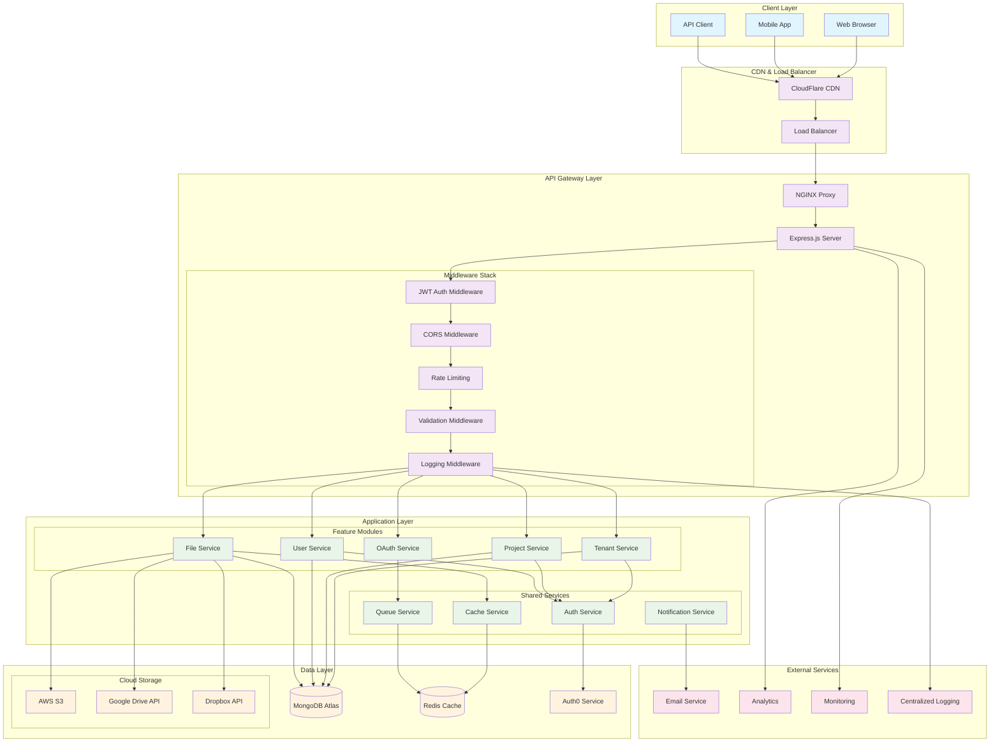

## 🔐 Security Architecture

### **Authentication & Authorization Flow**
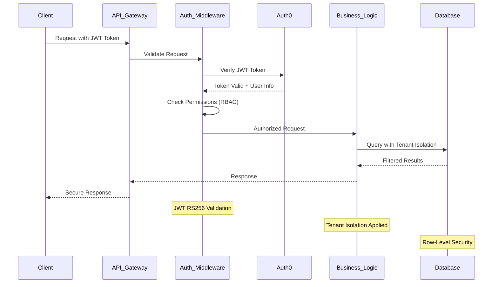

### **Multi-Tenant Security Boundaries**
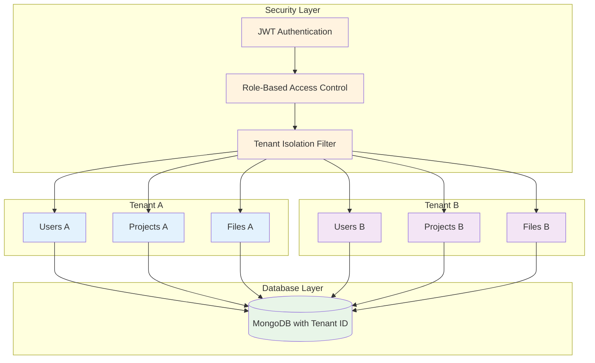

## 📊 Data Architecture

### **Database Schema Relationships**
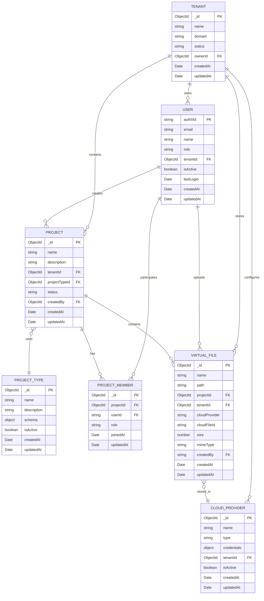

### **Data Flow Architecture**
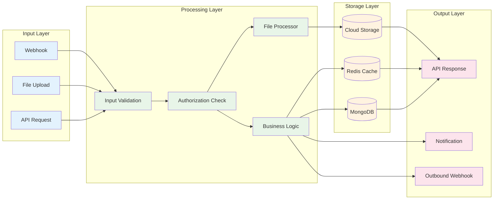

## 🔄 Component Interaction Patterns

### **Feature Module Architecture**
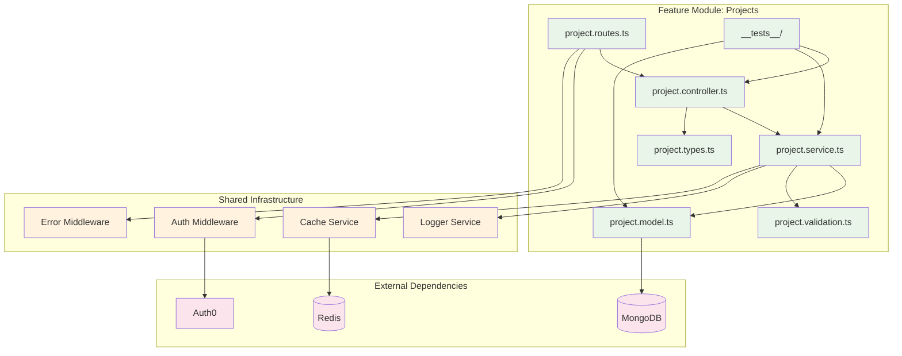

### **Request Processing Pipeline**
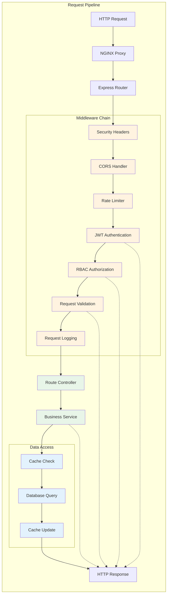

## 🚀 Deployment Architecture

### **Production Deployment**
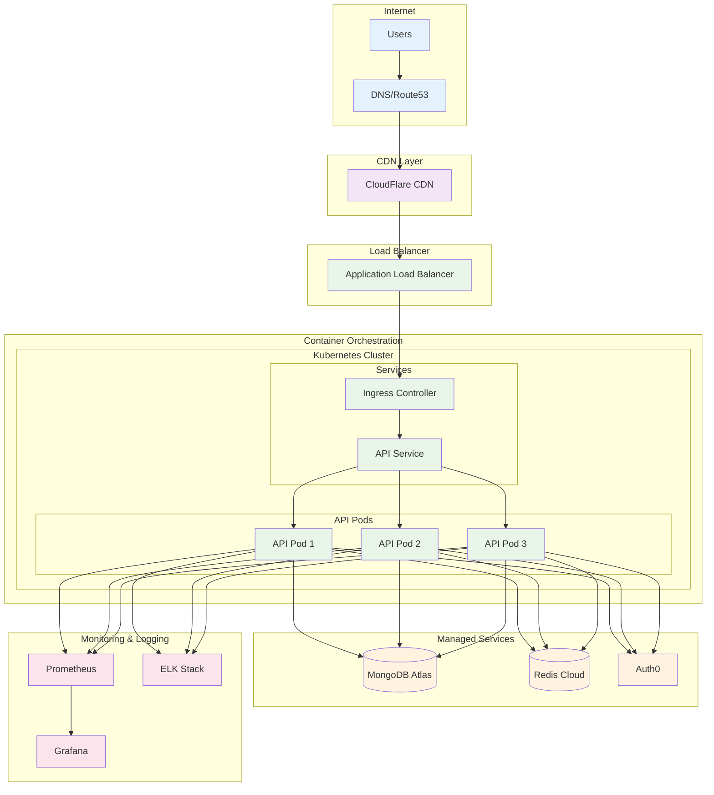

### **Development Environment**
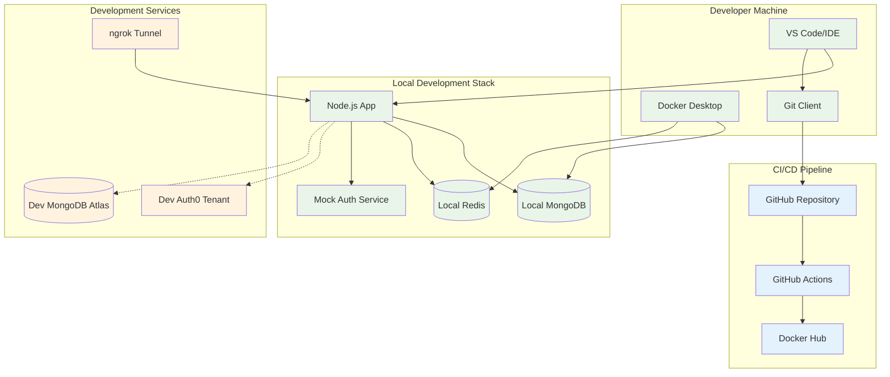

## 📈 Scalability Patterns

### **Horizontal Scaling Architecture**
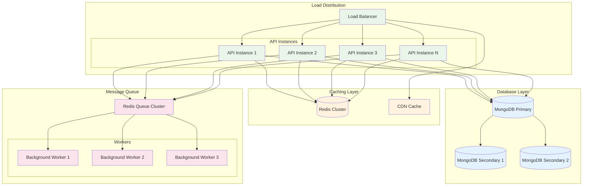

## 🔧 Technology Stack Visualization

### **Full Stack Architecture**
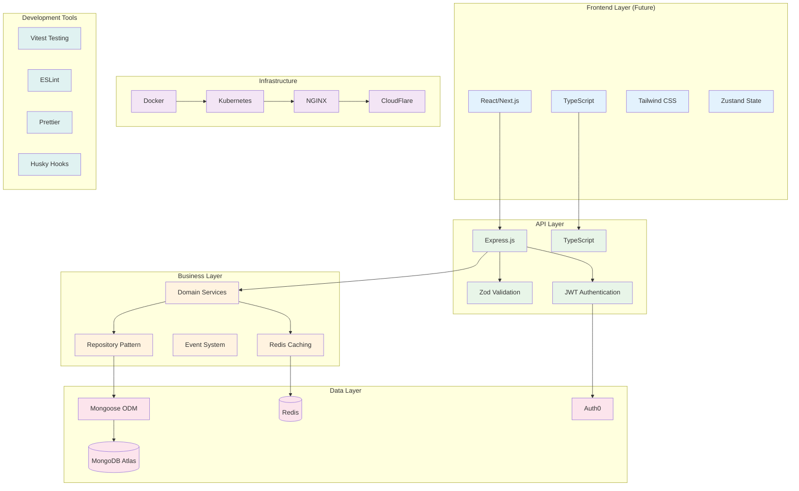

---

## 📚 Related Documentation

- [🏗️ System Design](../system-design.md) - Detailed system design decisions
- [🗺️ Domain Map](../v3-domainmap.md) - Domain-driven design mapping
- [🔒 Security Architecture](../../04-Backend/security-architecture.md) - Security implementation details
- [📊 Database Schema](../../04-Backend/database-schema.md) - Detailed database design

---

*These architecture diagrams provide visual representations of the MWAP system design, helping developers understand component relationships, data flows, and system boundaries.*