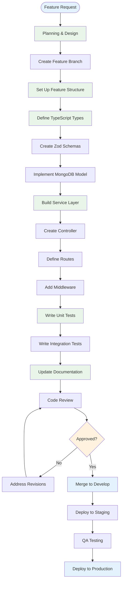

# 📁 MWAP Project Structure & Organization

## 🎯 Overview

This document provides comprehensive documentation of the MWAP project structure, organization principles, and development workflows. Understanding this structure is essential for effective development, maintenance, and contribution to the project.

## 🏗️ Repository Structure

### **Root Directory Layout**
```
mwapserver/
├── 📁 .github/                    # GitHub workflows and templates
│   ├── workflows/                 # CI/CD pipelines
│   ├── ISSUE_TEMPLATE/           # Issue templates
│   └── PULL_REQUEST_TEMPLATE.md  # PR template
├── 📁 .openhands/                # OpenHands AI agent configuration
│   └── microagents/              # AI agent definitions
├── 📁 .vscode/                   # VS Code workspace settings
│   ├── settings.json             # Editor configuration
│   ├── extensions.json           # Recommended extensions
│   └── launch.json               # Debug configuration
├── 📁 docs/                      # Comprehensive documentation
│   ├── 00-Overview/              # Project overview and vision
│   ├── 01-Getting-Started/       # Setup and onboarding
│   ├── 02-Architecture/          # System architecture
│   ├── 03-Frontend/              # Frontend documentation
│   ├── 04-Backend/               # Backend documentation
│   ├── 05-AI-Agents/             # AI integration guides
│   ├── 06-Guides/                # Development guides
│   ├── 07-Standards/             # Coding standards
│   ├── 08-Contribution/          # Contribution workflow
│   └── 09-Reports-and-History/   # Historical content
├── 📁 scripts/                   # Build and deployment scripts
│   ├── build.sh                  # Production build script
│   ├── deploy.sh                 # Deployment automation
│   ├── test.sh                   # Testing automation
│   └── validate-docs-links.js    # Documentation validation
├── 📁 src/                       # Application source code
│   ├── features/                 # Feature modules
│   ├── middleware/               # Express middleware
│   ├── utils/                    # Shared utilities
│   ├── config/                   # Configuration management
│   ├── types/                    # Global TypeScript types
│   └── app.ts                    # Application entry point
├── 📁 tests/                     # Test suites
│   ├── unit/                     # Unit tests
│   ├── integration/              # Integration tests
│   ├── fixtures/                 # Test data
│   └── helpers/                  # Test utilities
├── 📄 package.json               # Node.js dependencies and scripts
├── 📄 tsconfig.json              # TypeScript configuration
├── 📄 eslint.config.js           # ESLint configuration
├── 📄 prettier.config.js         # Prettier configuration
├── 📄 vitest.config.ts           # Vitest testing configuration
├── 📄 docker-compose.yml         # Local development environment
├── 📄 Dockerfile                 # Container configuration
├── 📄 .env.example               # Environment variables template
├── 📄 .gitignore                 # Git ignore patterns
└── 📄 README.md                  # Project overview
```

## 🧩 Source Code Organization

### **Feature-Based Architecture**
```typescript
// Feature module structure template
src/features/{feature-name}/
├── 📄 {feature}.routes.ts        # Express route definitions
├── 📄 {feature}.controller.ts    # HTTP request handlers
├── 📄 {feature}.service.ts       # Business logic layer
├── 📄 {feature}.model.ts         # MongoDB model definitions
├── 📄 {feature}.types.ts         # TypeScript type definitions
├── 📄 {feature}.validation.ts    # Zod validation schemas
├── 📄 {feature}.middleware.ts    # Feature-specific middleware
├── 📄 {feature}.utils.ts         # Feature utility functions
├── 📁 __tests__/                 # Feature test suite
│   ├── {feature}.service.test.ts # Service layer tests
│   ├── {feature}.controller.test.ts # Controller tests
│   ├── {feature}.integration.test.ts # Integration tests
│   └── {feature}.fixtures.ts     # Test data fixtures
└── 📄 index.ts                   # Feature module exports
```

### **Current Feature Modules**
```typescript
interface FeatureModules {
  // Core business features
  tenants: {
    description: 'Multi-tenant management and isolation';
    dependencies: ['users', 'auth'];
    routes: '/api/v1/tenants';
    responsibilities: [
      'Tenant CRUD operations',
      'Tenant settings management',
      'Billing and subscription handling',
      'Tenant isolation enforcement'
    ];
  };

  users: {
    description: 'User management and authentication';
    dependencies: ['tenants', 'auth'];
    routes: '/api/v1/users';
    responsibilities: [
      'User profile management',
      'Role and permission assignment',
      'User preferences and settings',
      'Authentication integration'
    ];
  };

  projects: {
    description: 'Project management and collaboration';
    dependencies: ['tenants', 'users', 'project-types'];
    routes: '/api/v1/projects';
    responsibilities: [
      'Project CRUD operations',
      'Project member management',
      'Project settings and configuration',
      'Project statistics and reporting'
    ];
  };

  'project-types': {
    description: 'Project type definitions and schemas';
    dependencies: ['tenants'];
    routes: '/api/v1/project-types';
    responsibilities: [
      'Project type management',
      'Custom field definitions',
      'Validation schema management',
      'Workflow configuration'
    ];
  };

  'virtual-files': {
    description: 'File management and cloud storage';
    dependencies: ['projects', 'cloud-providers'];
    routes: '/api/v1/files';
    responsibilities: [
      'File upload and download',
      'File versioning and history',
      'File sharing and permissions',
      'Cloud storage integration'
    ];
  };

  'cloud-providers': {
    description: 'Cloud storage provider integration';
    dependencies: ['tenants'];
    routes: '/api/v1/cloud-providers';
    responsibilities: [
      'Cloud provider configuration',
      'Storage quota management',
      'Provider-specific API integration',
      'File synchronization'
    ];
  };

  // Infrastructure features
  auth: {
    description: 'Authentication and authorization';
    dependencies: ['users'];
    routes: '/api/v1/auth';
    responsibilities: [
      'JWT token validation',
      'Role-based access control',
      'Permission checking',
      'Auth0 integration'
    ];
  };

  notifications: {
    description: 'Notification system';
    dependencies: ['users', 'projects'];
    routes: '/api/v1/notifications';
    responsibilities: [
      'Email notifications',
      'In-app notifications',
      'Notification preferences',
      'Event-driven messaging'
    ];
  };

  audit: {
    description: 'Audit logging and compliance';
    dependencies: ['users', 'tenants'];
    routes: '/api/v1/audit';
    responsibilities: [
      'Activity logging',
      'Compliance reporting',
      'Security event tracking',
      'Data access auditing'
    ];
  };
}
```

### **Shared Infrastructure**
```typescript
// Shared components structure
src/
├── 📁 middleware/                # Express middleware
│   ├── auth.middleware.ts        # JWT authentication
│   ├── rbac.middleware.ts        # Role-based access control
│   ├── validation.middleware.ts  # Request validation
│   ├── logging.middleware.ts     # Request logging
│   ├── error.middleware.ts       # Error handling
│   ├── rate-limit.middleware.ts  # Rate limiting
│   └── tenant.middleware.ts      # Tenant isolation
├── 📁 utils/                     # Shared utilities
│   ├── logger.ts                 # Structured logging
│   ├── cache.ts                  # Redis caching
│   ├── encryption.ts             # Data encryption
│   ├── validation.ts             # Common validators
│   ├── response.ts               # Response formatting
│   ├── errors.ts                 # Error classes
│   └── constants.ts              # Application constants
├── 📁 config/                    # Configuration management
│   ├── database.ts               # MongoDB configuration
│   ├── auth0.ts                  # Auth0 configuration
│   ├── redis.ts                  # Redis configuration
│   ├── environment.ts            # Environment validation
│   └── index.ts                  # Configuration aggregation
├── 📁 types/                     # Global TypeScript types
│   ├── express.d.ts              # Express type extensions
│   ├── auth.types.ts             # Authentication types
│   ├── api.types.ts              # API response types
│   ├── database.types.ts         # Database types
│   └── common.types.ts           # Common utility types
└── 📄 app.ts                     # Application bootstrap
```

## 📋 Development Workflow

### **Feature Development Process**


### **Code Organization Principles**
```typescript
// Feature development guidelines
interface DevelopmentPrinciples {
  // 1. Single Responsibility
  singleResponsibility: {
    description: 'Each module has one clear purpose';
    example: 'project.service.ts handles only project business logic';
    antiPattern: 'Mixing user management in project service';
  };

  // 2. Dependency Injection
  dependencyInjection: {
    description: 'Dependencies injected through constructor';
    example: `
      class ProjectService {
        constructor(
          private projectRepository: ProjectRepository,
          private cacheService: CacheService,
          private logger: Logger
        ) {}
      }
    `;
  };

  // 3. Interface Segregation
  interfaceSegregation: {
    description: 'Small, focused interfaces';
    example: `
      interface IProjectRepository {
        findById(id: string): Promise<IProject | null>;
        create(data: CreateProjectData): Promise<IProject>;
        update(id: string, data: UpdateProjectData): Promise<IProject>;
      }
    `;
  };

  // 4. Error Handling
  errorHandling: {
    description: 'Consistent error handling patterns';
    example: `
      try {
        const project = await this.projectService.create(data);
        return new SuccessResponse(project, 'Project created');
      } catch (error) {
        if (error instanceof ValidationError) {
          throw new AppError('Invalid project data', 400);
        }
        throw error;
      }
    `;
  };

  // 5. Testing Strategy
  testingStrategy: {
    description: 'Comprehensive test coverage';
    structure: {
      unit: 'Test individual functions and methods';
      integration: 'Test API endpoints and database interactions';
      fixtures: 'Reusable test data and mocks';
    };
  };
}
```

## 🔧 Configuration Management

### **Environment Configuration**
```typescript
// Configuration structure
interface ApplicationConfig {
  // Server configuration
  server: {
    port: number;
    host: string;
    nodeEnv: 'development' | 'staging' | 'production';
    apiVersion: string;
  };

  // Database configuration
  database: {
    uri: string;
    options: MongooseConnectOptions;
    connectionTimeout: number;
    maxPoolSize: number;
  };

  // Authentication configuration
  auth0: {
    domain: string;
    clientId: string;
    clientSecret: string;
    audience: string;
    managementClientId: string;
    managementClientSecret: string;
  };

  // Security configuration
  security: {
    jwtSecret: string;
    jwtExpiresIn: string;
    sessionSecret: string;
    corsOrigin: string;
    rateLimitWindowMs: number;
    rateLimitMaxRequests: number;
  };

  // Logging configuration
  logging: {
    level: 'debug' | 'info' | 'warn' | 'error';
    format: 'json' | 'simple';
    filePath: string;
    maxFileSize: string;
    maxFiles: number;
  };

  // Feature flags
  features: {
    swaggerUI: boolean;
    debugLogging: boolean;
    performanceMonitoring: boolean;
    auditLogging: boolean;
  };
}

// Configuration validation
const configSchema = z.object({
  server: z.object({
    port: z.number().min(1000).max(65535),
    host: z.string().min(1),
    nodeEnv: z.enum(['development', 'staging', 'production']),
    apiVersion: z.string().default('v1')
  }),
  database: z.object({
    uri: z.string().url().startsWith('mongodb'),
    connectionTimeout: z.number().min(1000).default(10000)
  }),
  auth0: z.object({
    domain: z.string().min(1),
    clientId: z.string().min(1),
    clientSecret: z.string().min(32),
    audience: z.string().url()
  }),
  security: z.object({
    jwtSecret: z.string().min(32),
    corsOrigin: z.string().min(1),
    rateLimitMaxRequests: z.number().min(1).default(100)
  })
});
```

### **Build and Deployment Scripts**
```bash
#!/bin/bash
# scripts/build.sh - Production build script

set -e

echo "🏗️  Building MWAP for production..."

# Clean previous builds
rm -rf dist/

# Install dependencies
echo "📦 Installing dependencies..."
npm ci --only=production

# Type checking
echo "🔍 Running type checks..."
npm run type-check

# Linting
echo "🧹 Running linter..."
npm run lint

# Testing
echo "🧪 Running tests..."
npm run test:unit
npm run test:integration

# Build application
echo "🔨 Building application..."
npm run build

# Validate build
echo "✅ Validating build..."
if [ ! -f "dist/app.js" ]; then
  echo "❌ Build failed: app.js not found"
  exit 1
fi

# Security audit
echo "🔒 Running security audit..."
npm audit --audit-level=moderate

echo "✅ Build completed successfully!"
```

```bash
#!/bin/bash
# scripts/deploy.sh - Deployment automation

set -e

ENVIRONMENT=${1:-staging}
VERSION=$(node -p "require('./package.json').version")

echo "🚀 Deploying MWAP v${VERSION} to ${ENVIRONMENT}..."

# Validate environment
if [[ ! "$ENVIRONMENT" =~ ^(staging|production)$ ]]; then
  echo "❌ Invalid environment: $ENVIRONMENT"
  echo "Usage: ./deploy.sh [staging|production]"
  exit 1
fi

# Build application
./scripts/build.sh

# Create deployment package
echo "📦 Creating deployment package..."
tar -czf "mwap-${VERSION}.tar.gz" \
  dist/ \
  package.json \
  package-lock.json \
  .env.${ENVIRONMENT}

# Deploy based on environment
case $ENVIRONMENT in
  staging)
    echo "🔄 Deploying to staging..."
    # Heroku deployment
    git push heroku-staging main
    ;;
  production)
    echo "🔄 Deploying to production..."
    # Production deployment
    git push heroku-production main
    ;;
esac

# Health check
echo "🏥 Running health check..."
sleep 30
curl -f "https://api-${ENVIRONMENT}.mwap.com/health" || {
  echo "❌ Health check failed"
  exit 1
}

echo "✅ Deployment completed successfully!"
```

## 🧪 Testing Organization

### **Test Structure**
```typescript
// Test organization principles
interface TestingStructure {
  // Unit tests - Test individual functions
  unit: {
    location: 'src/features/{feature}/__tests__/{feature}.service.test.ts';
    purpose: 'Test business logic in isolation';
    example: `
      describe('ProjectService', () => {
        describe('createProject', () => {
          it('should create project with valid data', async () => {
            // Arrange
            const projectData = { name: 'Test Project' };
            vi.mocked(projectRepository.create).mockResolvedValue(mockProject);
            
            // Act
            const result = await projectService.createProject(tenantId, userId, projectData);
            
            // Assert
            expect(result.name).toBe(projectData.name);
            expect(projectRepository.create).toHaveBeenCalledWith({
              ...projectData,
              tenantId,
              createdBy: userId
            });
          });
        });
      });
    `;
  };

  // Integration tests - Test API endpoints
  integration: {
    location: 'src/features/{feature}/__tests__/{feature}.integration.test.ts';
    purpose: 'Test complete request-response cycle';
    example: `
      describe('Projects API', () => {
        beforeEach(async () => {
          await setupTestDatabase();
          authToken = generateTestJWT();
        });

        describe('POST /api/v1/projects', () => {
          it('should create project via API', async () => {
            const response = await request(app)
              .post('/api/v1/projects')
              .set('Authorization', \`Bearer \${authToken}\`)
              .send({ name: 'Test Project' })
              .expect(201);

            expect(response.body.success).toBe(true);
            expect(response.body.data.name).toBe('Test Project');
          });
        });
      });
    `;
  };

  // Test utilities and fixtures
  utilities: {
    location: 'tests/helpers/ and tests/fixtures/';
    purpose: 'Shared test utilities and data';
    components: [
      'Database setup and teardown',
      'JWT token generation',
      'Mock data factories',
      'Test database seeding',
      'Common assertions'
    ];
  };
}
```

### **Test Configuration**
```typescript
// vitest.config.ts
export default defineConfig({
  test: {
    globals: true,
    environment: 'node',
    setupFiles: ['./tests/setup.ts'],
    coverage: {
      provider: 'v8',
      reporter: ['text', 'json', 'html'],
      exclude: [
        'node_modules/',
        'dist/',
        'tests/',
        '**/*.test.ts',
        '**/*.spec.ts'
      ],
      thresholds: {
        global: {
          branches: 80,
          functions: 80,
          lines: 80,
          statements: 80
        }
      }
    },
    testTimeout: 10000,
    hookTimeout: 10000
  },
  resolve: {
    alias: {
      '@': path.resolve(__dirname, './src'),
      '@tests': path.resolve(__dirname, './tests')
    }
  }
});
```

## 📊 Project Metrics & Monitoring

### **Code Quality Metrics**
```typescript
interface ProjectMetrics {
  // Code quality
  codeQuality: {
    testCoverage: '>80%';
    eslintErrors: '0';
    typeScriptErrors: '0';
    duplicatedCode: '<5%';
    maintainabilityIndex: '>70';
  };

  // Performance metrics
  performance: {
    buildTime: '<2 minutes';
    testExecutionTime: '<30 seconds';
    apiResponseTime: '<200ms (95th percentile)';
    memoryUsage: '<512MB';
  };

  // Security metrics
  security: {
    vulnerabilities: '0 high/critical';
    dependencyAudit: 'Pass';
    secretsInCode: '0';
    authenticationCoverage: '100%';
  };

  // Documentation metrics
  documentation: {
    apiDocumentation: '100% endpoints documented';
    codeComments: '>20% comment ratio';
    readmeUpdated: 'Within 30 days';
    architectureDocumentation: 'Current';
  };
}
```

### **Monitoring and Alerting**
```typescript
// Monitoring configuration
interface MonitoringConfig {
  // Application monitoring
  application: {
    healthChecks: [
      '/health',
      '/health/database',
      '/health/auth0',
      '/health/redis'
    ];
    metrics: [
      'request_duration_seconds',
      'request_count_total',
      'error_count_total',
      'database_query_duration_seconds'
    ];
    alerts: [
      'Response time > 1s',
      'Error rate > 5%',
      'Database connection failures',
      'Memory usage > 80%'
    ];
  };

  // Infrastructure monitoring
  infrastructure: {
    servers: ['CPU usage', 'Memory usage', 'Disk space', 'Network I/O'];
    database: ['Connection pool', 'Query performance', 'Index usage'];
    cache: ['Hit rate', 'Memory usage', 'Connection count'];
  };

  // Business metrics
  business: {
    users: ['Active users', 'New registrations', 'Login failures'];
    projects: ['Projects created', 'File uploads', 'Storage usage'];
    performance: ['Page load times', 'API response times', 'Error rates'];
  };
}
```

## 🔄 Maintenance Procedures

### **Regular Maintenance Tasks**
```typescript
interface MaintenanceProcedures {
  // Daily tasks
  daily: [
    'Monitor application health',
    'Check error logs',
    'Verify backup completion',
    'Review security alerts'
  ];

  // Weekly tasks
  weekly: [
    'Update dependencies',
    'Run security audit',
    'Review performance metrics',
    'Clean up old logs',
    'Update documentation'
  ];

  // Monthly tasks
  monthly: [
    'Rotate secrets and keys',
    'Review and update monitoring',
    'Performance optimization review',
    'Security vulnerability assessment',
    'Database maintenance and optimization'
  ];

  // Quarterly tasks
  quarterly: [
    'Architecture review',
    'Dependency major version updates',
    'Disaster recovery testing',
    'Security penetration testing',
    'Documentation comprehensive review'
  ];
}
```

### **Update and Migration Procedures**
```bash
#!/bin/bash
# scripts/update-dependencies.sh

echo "🔄 Updating MWAP dependencies..."

# Check for outdated packages
npm outdated

# Update patch and minor versions
npm update

# Check for major version updates
npx npm-check-updates

# Run tests after updates
npm run test:all

# Update lock file
npm install

echo "✅ Dependencies updated successfully!"
```

## 📚 Related Documentation

- [🛠️ Development Guide](../07-Standards/development-guide.md) - Complete development standards
- [🤝 Contributing Guide](../08-Contribution/contributing.md) - Contribution workflow
- [🔒 Coding Standards](../07-Standards/coding-standards.md) - Code quality guidelines
- [🧪 Testing Strategy](../06-Guides/testing-strategy.md) - Testing approach and tools

---

*This project structure documentation provides comprehensive guidance for understanding, developing, and maintaining the MWAP platform. Follow these organizational principles to ensure consistent, scalable, and maintainable code.*