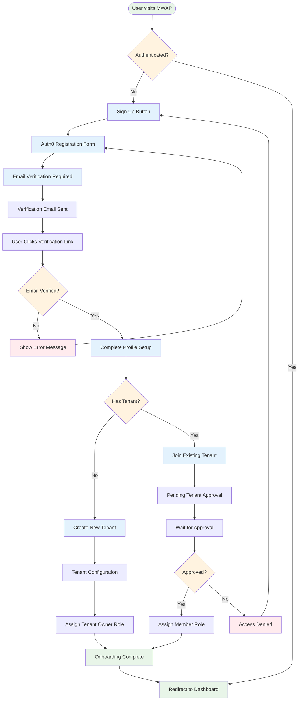
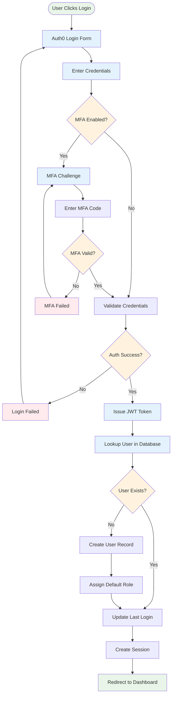
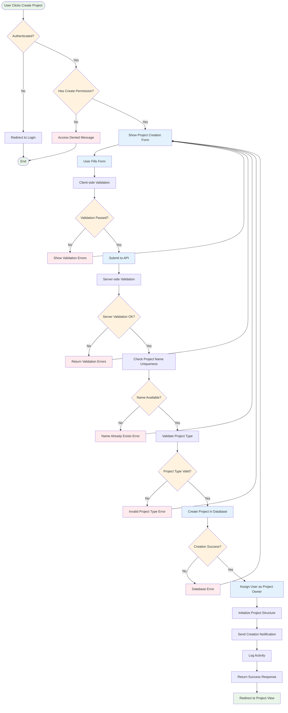
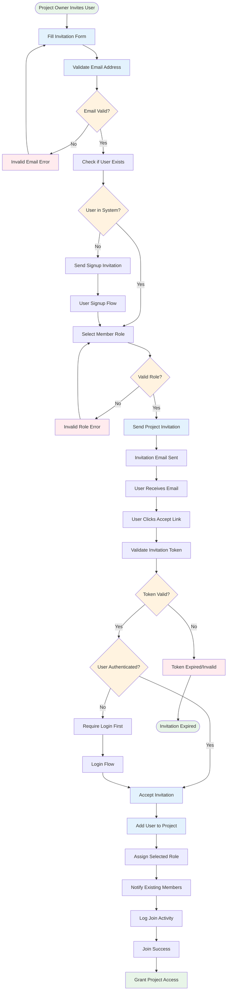
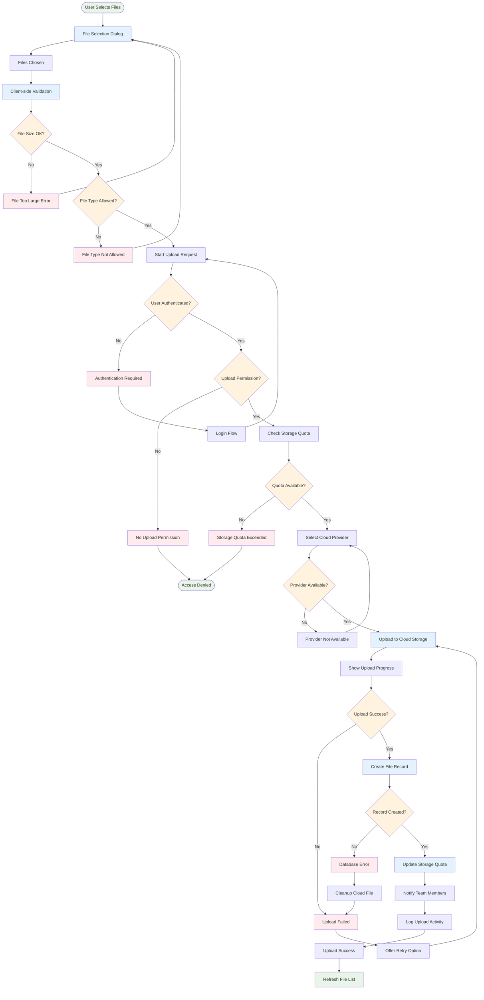
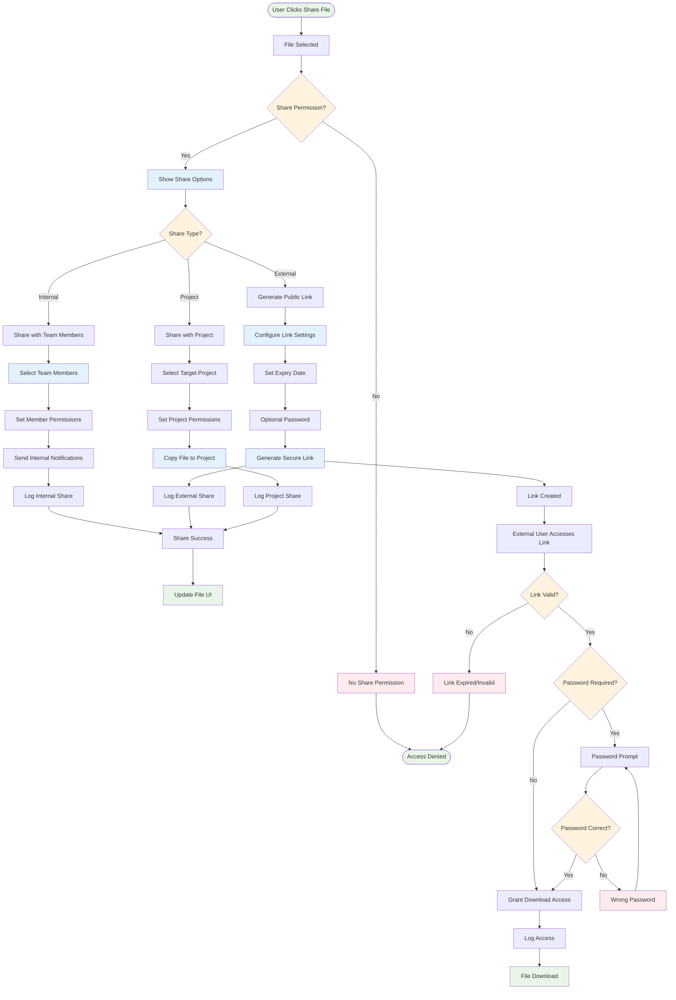
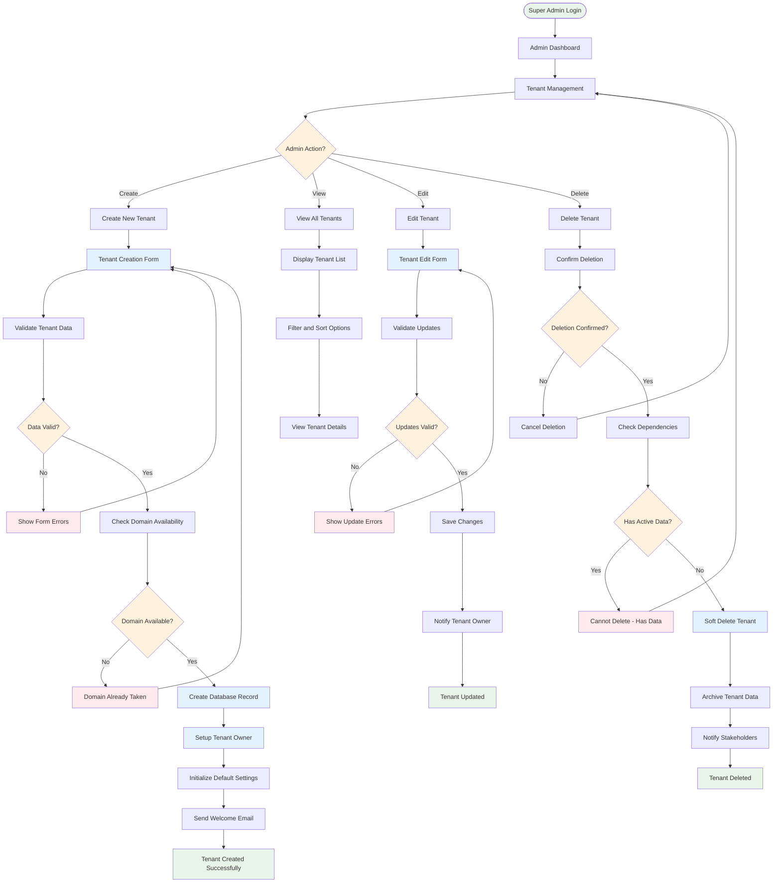
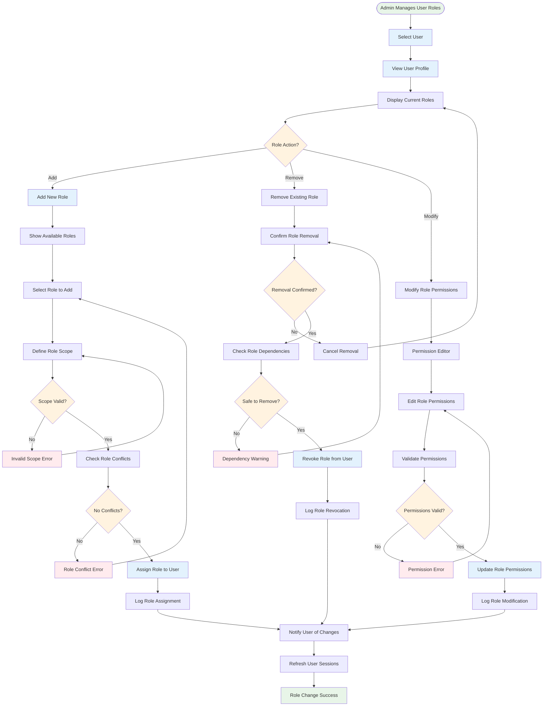
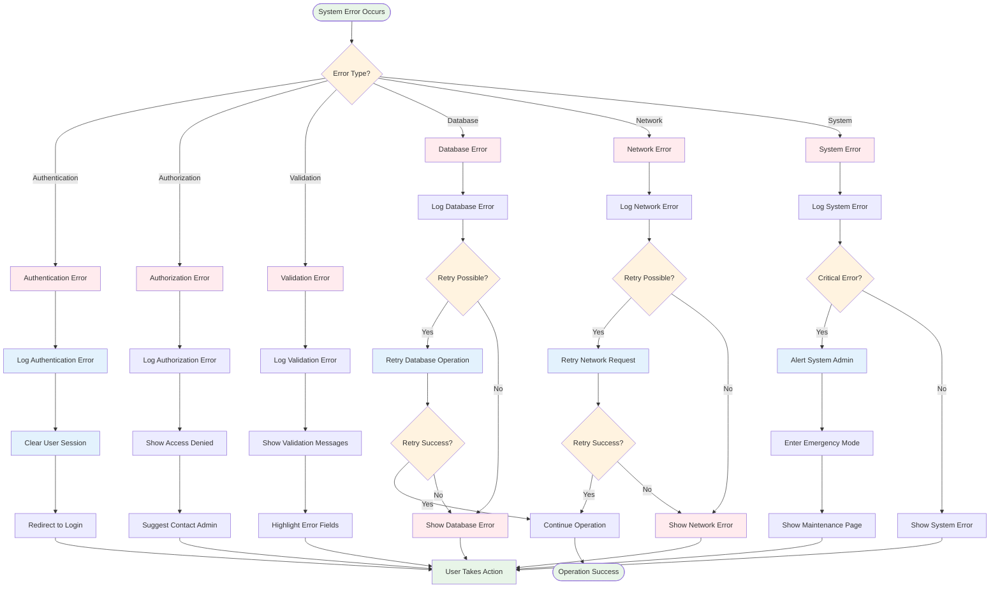
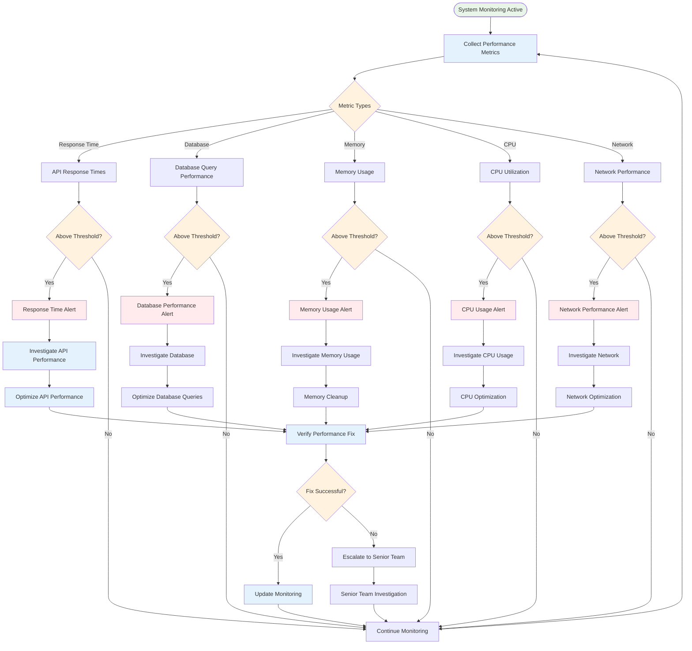

# 👥 MWAP User Flow Diagrams

## 🎯 Overview

This document provides comprehensive user flow diagrams for key MWAP features, illustrating user interactions, system responses, and decision points throughout the application lifecycle.

## 🔐 Authentication & Authorization Flows

### **User Registration & Onboarding Flow**

### **Login & Session Management Flow**

## 📊 Project Management Flows

### **Project Creation Flow**

### **Project Collaboration Flow**

## 📁 File Management Flows

### **File Upload Flow**

### **File Sharing Flow**

## ⚙️ System Administration Flows

### **Tenant Management Flow**

### **User Role Management Flow**

## 🔄 Error Handling & Recovery Flows

### **System Error Recovery Flow**

## 📊 Performance Monitoring Flow

### **System Performance Monitoring Flow**

## 📚 Related Documentation

- [🏗️ System Architecture Diagrams](./diagrams/system-architecture.md) - Visual system architecture
- [🧩 Component Structure](./component-structure.md) - Component relationships and dependencies
- [🔒 Security Architecture](../04-Backend/security-architecture.md) - Security implementation details
- [📊 Database Schema](../04-Backend/database-schema.md) - Database design and relationships

---

*These user flow diagrams provide comprehensive visualization of user interactions and system processes throughout the MWAP platform, helping developers understand the complete user experience and system behavior.*