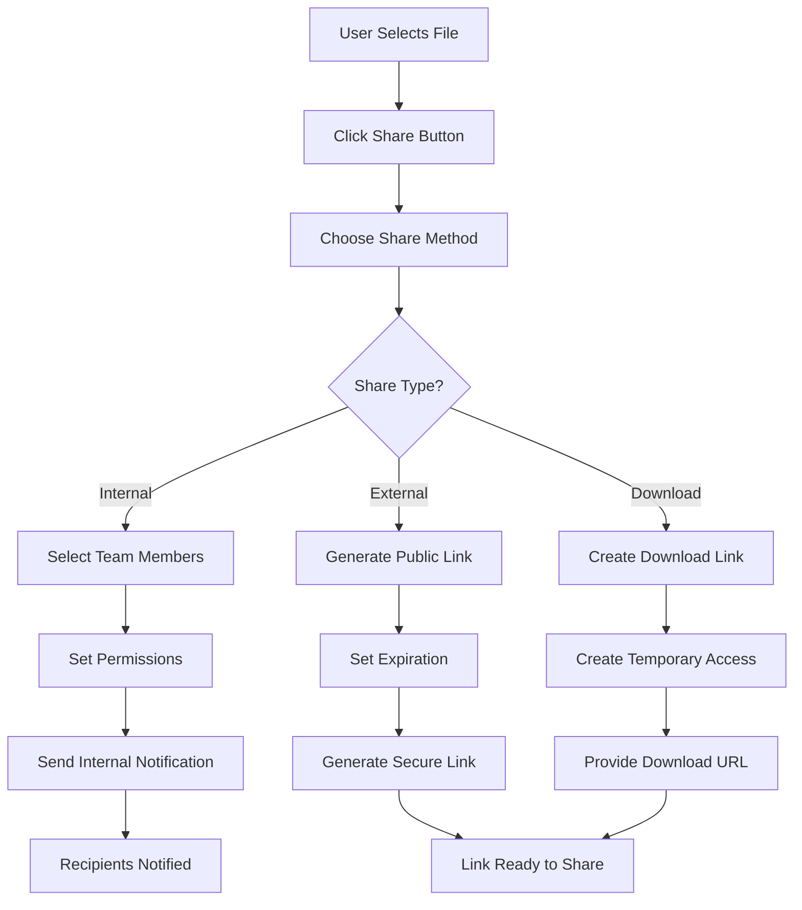

# User Flows

This document describes the key user interaction patterns and workflows within the MWAP platform.

## 🧭 Overview

MWAP supports multiple user personas with distinct workflows:
- **Tenant Owners**: Manage organizations and high-level settings
- **Project Admins**: Manage projects and team members
- **Project Members**: Collaborate on projects and access files
- **System Admins**: Manage platform-wide settings (super admin)

## 🔐 Authentication Flows

### Initial User Registration & Login

### Token Refresh Flow

## 🏢 Tenant Management Flows

### Tenant Creation (First-Time User)

### Tenant Settings Management

## 📁 Project Management Flows

### Project Creation Flow

### Project Member Management

## ☁️ Cloud Integration Flows

### Cloud Provider Connection

### File Access Flow

## 🔄 Token Refresh Flow

### Automatic Token Refresh

## 👥 Collaboration Flows

### Project Access Flow

### File Sharing Flow

## 🔒 Security Flows

### Role-Based Access Control

### Audit Trail Flow

## 📊 Error Handling Flows

### API Error Flow

### Recovery Flow

## 🎯 User Experience Flows

### Onboarding Flow

### Dashboard Navigation

---

*These user flows ensure intuitive and secure user experiences across all MWAP platform interactions.* 