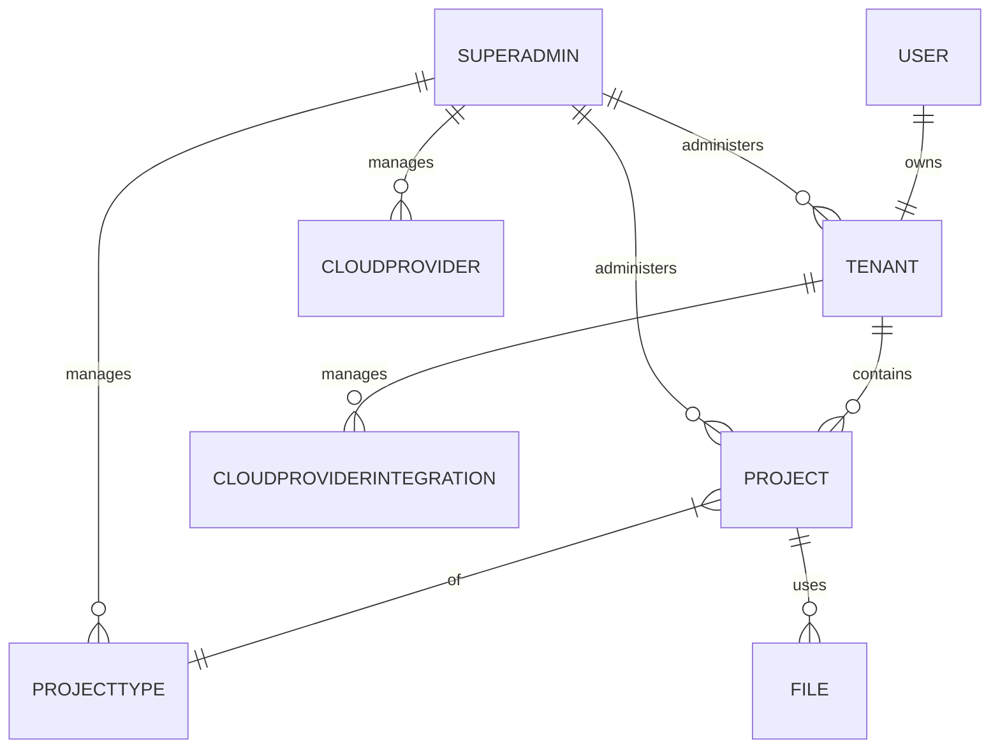

# 📘 MWAP Core Documentation Domain Map

---

## 1. 🧭 System Model Overview

#### 🗺️ Domain Map – Full Entity Documentation

---

### **1. User**

* Represents an authenticated person via Auth0  
*Scope: platform*

* **Source of truth**: Auth0 `sub` (external ID)
* **Fields**:

  * `id`: string (Auth0 `sub`)
  * `email`: string (from Auth0 claims)
  * `name`: string (from Auth0 claims)
* **Constraints**:

  * Cannot exist without Auth0 registration
  * Can own only **one** tenant

---

### **2. Tenant**

* Represents a user-owned workspace and logical isolation unit

  *Scope: tenant*

* **Fields**:

  * `_id`: ObjectId (Mongo-generated, do not set manually)
  * `ownerId`: string (Auth0 `sub`)
  * `name`: string
  * `createdAt`: Date
  * `archived`: boolean (soft delete)
  * `integrations`: CloudProviderIntegration[]
* **Constraints**:

  * One tenant per user (enforced in DB + app layer)
  * Deletable only by superadmin (hard delete, removes all associated projects and integrations)
* **Relations**:

  * One-to-one with User
  * One-to-many with Project
  * One-to-many with CloudProviderIntegration

---

### **3. Project**

* Application instance inside a tenant with fixed config
*Scope: tenant*
* **Fields**:

  * `_id`: ObjectId (Mongo-generated, do not set manually)
  * `tenantId`: ObjectId (references a tenant)
  * `projectTypeId`: ObjectId (references a ProjectType)
  * `cloudIntegrationId`: ObjectId (references a CloudProviderIntegration)
  * `folderpath`: string
  * `name`: string
  * `description?`: string (optional)
  * `archived`: boolean (optional soft-archive, but hard delete supported via API)
  * `members[]`: [{ User.id: string (Auth0 `sub`), role: 'OWNER' | 'DEPUTY' | 'MEMBER' }]
* **Constraints**:

  * `cloudProvider`, `folderpath`, `projectTypeId` are immutable after creation
  * `members` must include the tenant `ownerId` as `OWNER`
* **Relations**:

  * Belongs to Tenant
  * References one ProjectType
  * Has many Members (Users) max. 10

---

### **4. ProjectType**

* Defines application behavior (Sorter, Tagger, Mailer, etc)
*Scope: platform*
* **Fields**:

  * `_id`: ObjectId (Mongo-generated, do not set manually)
  * `slug`: string (slug or shortname)
  * `name`: string
  * `description`: string
  * `entryComponent`: string
  * `configSchema?`: Zod-compatible JSON schema
  * `createdAt`: Date
  * `updatedAt`: Date
  * `createdBy`: string (Auth0 sub)
* **Constraints**:

  * Cannot be deleted once used by a project
* **Relations**:

  * Referenced by multiple Projects

---

### **5. CloudProvider**

* Represents a supported, static cloud provider such as GDrive, Dropbox, etc.
*Scope: platform*
* **Fields**:

  * `_id`: ObjectId (Mongo-generated, do not set manually)
  * `name`: string (e.g. "Google Drive")
  * `slug`: string (e.g. "gdrive")
  * `scopes`: string\[]
  * `authUrl`: string (OAuth 2.0 authorization endpoint)
  * `tokenUrl`: string (OAuth 2.0 token exchange endpoint)
  * `metadata?`: object (optional provider-specific metadata)
  * `createdAt`: Date
  * `updatedAt`: Date
  * `createdBy`: string (Auth0 sub)
* **Constraints**:

  * One document per supported provider (e.g., one for GDrive, one for Dropbox)
  * Admin-managed only (not tenant editable)
* **Usage**:

  * Referenced by integrations for configuration purposes

---

### **6. CloudProviderIntegration**

* Represents a tenant's authenticated connection to a specific `CloudProvider`
*Scope: tenant*
* **Fields**:

  * `_id`: ObjectId (Mongo-generated, do not set manually)
  * `tenantId`: ObjectId (references Tenant)
  * `providerId`: ObjectId (references CloudProvider)
  * `clientId`: string (from the tenant’s app registration)
  * `clientSecret`: string (encrypted)
  * `redirectUri`: string
  * `accessToken`: string (encrypted)
  * `refreshToken`: string (encrypted)
  * `expiresAt`: Date
  * `metadata?`: object (optional cloud-specific claims)
* **Constraints**:

  * A tenant may have at most one integration per `CloudProvider`
  * Required for any project that uses cloud access
* **Relations**:

  * Belongs to one Tenant
  * References one CloudProvider

---

### **7. File (Virtual)**

* Represents a file that exists in the cloud provider folder configured on the project
*Scope: tenant*
* **Not stored in MongoDB** – fetched at runtime via cloud APIs
* **Fields**:

  * `fileId`: string (from the cloud provider)
  * `name`: string
  * `mimeType`: string
  * `path`: string (virtualized or absolute path)
  * `status`: 'pending' | 'processed' | 'error'
  * `metadata?`: object (depends on projectType, e.g. tags, annotations)
* **Contextual Info** (retrieved from project):

  * Cloud provider is derived via the project’s `cloudIntegrationId` (which links to a dynamic `CloudProviderIntegration`)
  * Folder path is derived via the project’s `folderpath` (which references a folder in the selected CloudProvider by the dynamic CloudProviderIntegration)
* **Constraints**:

  * Only visible within scope of a project + integration
  * Not persisted in local database
* **Relations**:

  * Used only in runtime workflows for sorting, tagging, mailing, etc.
  * Handled via cloud API integrations and internal middleware (e.g., file listing, metadata parsing)

---

### **8. SuperAdmin**

*Represents a platform-level administrator with elevated permissions*

*Scope: platform*

*Stored in MongoDB – Collection: `superadmins`*

- **Fields**:
  - `_id`: ObjectId (Mongo-generated, do not set manually)
  - `userId`: string (**Auth0 `sub`** – serves as primary identity key)
  - `createdAt`: Date
  - `createdBy`: string (Auth0 sub of the admin who created this entry)
  - `name?`: string (optional for traceability)
  - `email?`: string (optional for traceability)

- **Constraints**:
  - Must reference a valid Auth0 user

- **Relations**:
  - Platform-scoped access to:
    - All `Tenants` (admin-only)
    - All `Projects` (admin-only)
    - All `ProjectTypes` (CRUD)
    - All `CloudProviders` (CRUD)

- **Permissions**:
  - Can create, update, delete `ProjectType` and `CloudProvider`
  - Can archive/unarchive any `Tenant` or `Project`
  
---

### Diagram: Relationships

