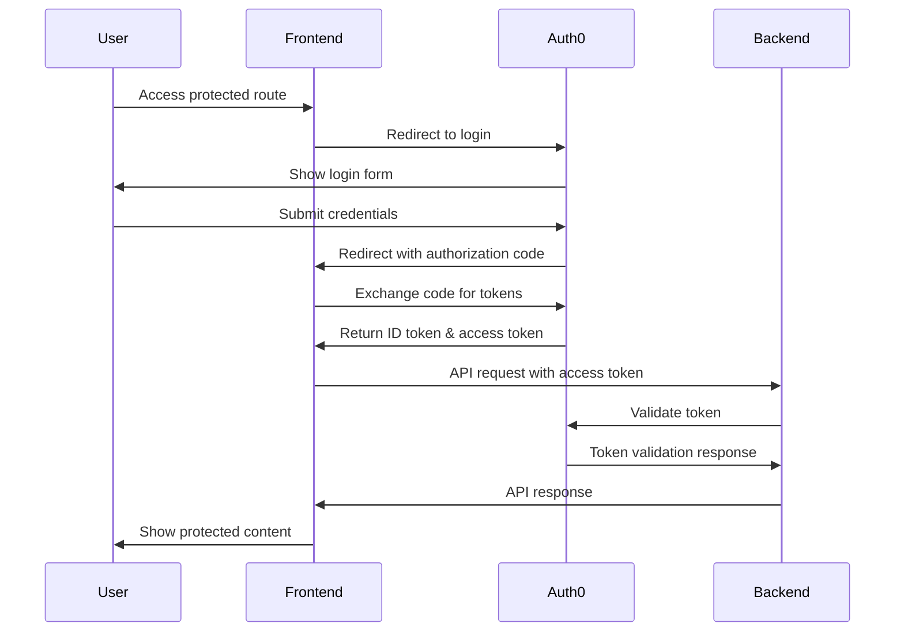

# 🔐 Frontend Auth0 Integration

## 🎯 Overview

This document provides comprehensive guidance for integrating Auth0 authentication in the MWAP frontend application, covering setup, implementation patterns, security considerations, and best practices.

## 🏗️ Auth0 Architecture

### **Authentication Flow**


### **Token Management**
```typescript
interface AuthTokens {
  accessToken: string;      // For API authentication
  idToken: string;          // User identity information
  refreshToken?: string;    // For token renewal
  expiresAt: number;        // Token expiration timestamp
}

interface UserProfile {
  sub: string;              // Auth0 user ID
  email: string;            // User email
  name: string;             // Display name
  picture?: string;         // Profile picture URL
  tenantId: string;         // MWAP tenant ID
  role: string;             // User role
  permissions: string[];    // User permissions
}
```

## ⚙️ Auth0 Configuration

### **Auth0 Application Setup**
```typescript
// src/config/auth0.config.ts
export const auth0Config = {
  domain: process.env.REACT_APP_AUTH0_DOMAIN!,
  clientId: process.env.REACT_APP_AUTH0_CLIENT_ID!,
  audience: process.env.REACT_APP_AUTH0_AUDIENCE!,
  redirectUri: `${window.location.origin}/callback`,
  scope: 'openid profile email',
  
  // PKCE configuration for security
  useRefreshTokens: true,
  cacheLocation: 'localstorage' as const,
  
  // Advanced settings
  advancedOptions: {
    defaultScope: 'openid profile email'
  },
  
  // Custom claims
  customClaims: {
    tenantId: 'https://mwap.local/tenant_id',
    role: 'https://mwap.local/role',
    permissions: 'https://mwap.local/permissions'
  }
};
```

### **Environment Variables**
```env
# Auth0 Configuration
REACT_APP_AUTH0_DOMAIN=your-tenant.auth0.com
REACT_APP_AUTH0_CLIENT_ID=your_client_id
REACT_APP_AUTH0_AUDIENCE=https://api.mwap.local

# Application URLs
REACT_APP_API_BASE_URL=http://localhost:3001/api/v1
REACT_APP_CALLBACK_URL=http://localhost:3000/callback
```

## 🔧 Auth0 Provider Setup

### **Auth0 Provider Component**
```typescript
// src/providers/Auth0Provider.tsx
import React, { createContext, useContext, useEffect, useState } from 'react';
import { Auth0Provider as Auth0ProviderBase, useAuth0 } from '@auth0/auth0-react';
import { auth0Config } from '../config/auth0.config';
import { LoadingSpinner } from '../components/ui/LoadingSpinner';

interface AuthContextType {
  user: UserProfile | null;
  isAuthenticated: boolean;
  isLoading: boolean;
  login: () => void;
  logout: () => void;
  getAccessToken: () => Promise<string>;
  hasPermission: (permission: string) => boolean;
  hasRole: (role: string) => boolean;
}

const AuthContext = createContext<AuthContextType | undefined>(undefined);

export const Auth0Provider: React.FC<{ children: React.ReactNode }> = ({ children }) => {
  return (
    <Auth0ProviderBase
      domain={auth0Config.domain}
      clientId={auth0Config.clientId}
      authorizationParams={{
        redirect_uri: auth0Config.redirectUri,
        audience: auth0Config.audience,
        scope: auth0Config.scope
      }}
      useRefreshTokens={auth0Config.useRefreshTokens}
      cacheLocation={auth0Config.cacheLocation}
    >
      <AuthWrapper>{children}</AuthWrapper>
    </Auth0ProviderBase>
  );
};

const AuthWrapper: React.FC<{ children: React.ReactNode }> = ({ children }) => {
  const {
    user: auth0User,
    isAuthenticated,
    isLoading: auth0Loading,
    loginWithRedirect,
    logout: auth0Logout,
    getAccessTokenSilently
  } = useAuth0();

  const [user, setUser] = useState<UserProfile | null>(null);
  const [isLoading, setIsLoading] = useState(true);

  useEffect(() => {
    if (isAuthenticated && auth0User) {
      // Extract custom claims from Auth0 user
      const userProfile: UserProfile = {
        sub: auth0User.sub!,
        email: auth0User.email!,
        name: auth0User.name!,
        picture: auth0User.picture,
        tenantId: auth0User[auth0Config.customClaims.tenantId] as string,
        role: auth0User[auth0Config.customClaims.role] as string,
        permissions: auth0User[auth0Config.customClaims.permissions] as string[] || []
      };
      
      setUser(userProfile);
    } else {
      setUser(null);
    }
    
    setIsLoading(auth0Loading);
  }, [isAuthenticated, auth0User, auth0Loading]);

  const login = () => {
    loginWithRedirect({
      appState: {
        returnTo: window.location.pathname
      }
    });
  };

  const logout = () => {
    auth0Logout({
      logoutParams: {
        returnTo: window.location.origin
      }
    });
  };

  const getAccessToken = async (): Promise<string> => {
    try {
      return await getAccessTokenSilently({
        authorizationParams: {
          audience: auth0Config.audience
        }
      });
    } catch (error) {
      console.error('Failed to get access token:', error);
      throw new Error('Authentication required');
    }
  };

  const hasPermission = (permission: string): boolean => {
    if (!user) return false;
    
    return user.permissions.some(userPermission => {
      if (userPermission.endsWith('*')) {
        const prefix = userPermission.slice(0, -1);
        return permission.startsWith(prefix);
      }
      return userPermission === permission;
    });
  };

  const hasRole = (role: string): boolean => {
    if (!user) return false;
    
    const roleHierarchy = {
      'superadmin': 3,
      'tenant_owner': 2,
      'project_member': 1
    };
    
    const userRoleLevel = roleHierarchy[user.role as keyof typeof roleHierarchy] || 0;
    const requiredRoleLevel = roleHierarchy[role as keyof typeof roleHierarchy] || 0;
    
    return userRoleLevel >= requiredRoleLevel;
  };

  const contextValue: AuthContextType = {
    user,
    isAuthenticated,
    isLoading,
    login,
    logout,
    getAccessToken,
    hasPermission,
    hasRole
  };

  if (isLoading) {
    return <LoadingSpinner />;
  }

  return (
    <AuthContext.Provider value={contextValue}>
      {children}
    </AuthContext.Provider>
  );
};

export const useAuth = (): AuthContextType => {
  const context = useContext(AuthContext);
  if (!context) {
    throw new Error('useAuth must be used within an Auth0Provider');
  }
  return context;
};
```

## 🛡️ Protected Routes

### **Route Protection Component**
```typescript
// src/components/auth/ProtectedRoute.tsx
import React from 'react';
import { Navigate, useLocation } from 'react-router-dom';
import { useAuth } from '../../providers/Auth0Provider';
import { LoadingSpinner } from '../ui/LoadingSpinner';

interface ProtectedRouteProps {
  children: React.ReactNode;
  requiredPermission?: string;
  requiredRole?: string;
  fallback?: React.ReactNode;
}

export const ProtectedRoute: React.FC<ProtectedRouteProps> = ({
  children,
  requiredPermission,
  requiredRole,
  fallback
}) => {
  const { isAuthenticated, isLoading, hasPermission, hasRole } = useAuth();
  const location = useLocation();

  if (isLoading) {
    return <LoadingSpinner />;
  }

  if (!isAuthenticated) {
    return <Navigate to="/login" state={{ from: location }} replace />;
  }

  // Check permission if required
  if (requiredPermission && !hasPermission(requiredPermission)) {
    return fallback || <Navigate to="/unauthorized" replace />;
  }

  // Check role if required
  if (requiredRole && !hasRole(requiredRole)) {
    return fallback || <Navigate to="/unauthorized" replace />;
  }

  return <>{children}</>;
};
```

### **Login Component**
```typescript
// src/components/auth/LoginPage.tsx
import React, { useEffect } from 'react';
import { Navigate, useLocation } from 'react-router-dom';
import { useAuth } from '../../providers/Auth0Provider';
import { Button } from '../ui/Button';
import { Card } from '../ui/Card';

export const LoginPage: React.FC = () => {
  const { isAuthenticated, login, isLoading } = useAuth();
  const location = useLocation();

  const from = location.state?.from?.pathname || '/dashboard';

  useEffect(() => {
    // Auto-redirect if already authenticated
    if (isAuthenticated) {
      return;
    }
  }, [isAuthenticated]);

  if (isLoading) {
    return (
      <div className="min-h-screen flex items-center justify-center">
        <div className="animate-spin rounded-full h-32 w-32 border-b-2 border-blue-600"></div>
      </div>
    );
  }

  if (isAuthenticated) {
    return <Navigate to={from} replace />;
  }

  return (
    <div className="min-h-screen flex items-center justify-center bg-gray-50 py-12 px-4 sm:px-6 lg:px-8">
      <div className="max-w-md w-full space-y-8">
        <div>
          <h2 className="mt-6 text-center text-3xl font-extrabold text-gray-900">
            Sign in to MWAP
          </h2>
          <p className="mt-2 text-center text-sm text-gray-600">
            Secure access to your projects and files
          </p>
        </div>
        
        <Card className="p-8">
          <div className="space-y-6">
            <Button
              onClick={login}
              className="w-full flex justify-center py-2 px-4 border border-transparent rounded-md shadow-sm text-sm font-medium text-white bg-blue-600 hover:bg-blue-700 focus:outline-none focus:ring-2 focus:ring-offset-2 focus:ring-blue-500"
            >
              Sign in with Auth0
            </Button>
            
            <div className="text-xs text-gray-500 text-center">
              By signing in, you agree to our Terms of Service and Privacy Policy
            </div>
          </div>
        </Card>
      </div>
    </div>
  );
};
```

### **Callback Handler**
```typescript
// src/components/auth/CallbackPage.tsx
import React, { useEffect } from 'react';
import { useAuth0 } from '@auth0/auth0-react';
import { Navigate, useLocation } from 'react-router-dom';
import { LoadingSpinner } from '../ui/LoadingSpinner';

export const CallbackPage: React.FC = () => {
  const { isLoading, error, isAuthenticated } = useAuth0();
  const location = useLocation();

  useEffect(() => {
    if (error) {
      console.error('Auth0 callback error:', error);
    }
  }, [error]);

  if (isLoading) {
    return (
      <div className="min-h-screen flex items-center justify-center">
        <div className="text-center">
          <LoadingSpinner />
          <p className="mt-4 text-gray-600">Completing sign in...</p>
        </div>
      </div>
    );
  }

  if (error) {
    return (
      <div className="min-h-screen flex items-center justify-center">
        <div className="text-center">
          <h2 className="text-2xl font-bold text-red-600 mb-4">Authentication Error</h2>
          <p className="text-gray-600 mb-4">{error.message}</p>
          <button
            onClick={() => window.location.href = '/login'}
            className="bg-blue-600 text-white px-4 py-2 rounded hover:bg-blue-700"
          >
            Try Again
          </button>
        </div>
      </div>
    );
  }

  if (isAuthenticated) {
    const returnTo = location.state?.returnTo || '/dashboard';
    return <Navigate to={returnTo} replace />;
  }

  return <Navigate to="/login" replace />;
};
```

## 🔌 API Integration

### **Authenticated HTTP Client**
```typescript
// src/services/api.client.ts
import axios, { AxiosInstance, AxiosRequestConfig, AxiosResponse } from 'axios';
import { useAuth } from '../providers/Auth0Provider';

class ApiClient {
  private client: AxiosInstance;
  private getAccessToken: () => Promise<string>;

  constructor(baseURL: string, getAccessToken: () => Promise<string>) {
    this.getAccessToken = getAccessToken;
    
    this.client = axios.create({
      baseURL,
      timeout: 10000,
      headers: {
        'Content-Type': 'application/json'
      }
    });

    this.setupInterceptors();
  }

  private setupInterceptors(): void {
    // Request interceptor to add auth token
    this.client.interceptors.request.use(
      async (config) => {
        try {
          const token = await this.getAccessToken();
          config.headers.Authorization = `Bearer ${token}`;
        } catch (error) {
          console.error('Failed to get access token:', error);
          // Let the request proceed without token for public endpoints
        }
        return config;
      },
      (error) => Promise.reject(error)
    );

    // Response interceptor for error handling
    this.client.interceptors.response.use(
      (response) => response,
      (error) => {
        if (error.response?.status === 401) {
          // Token expired or invalid - redirect to login
          window.location.href = '/login';
        }
        return Promise.reject(error);
      }
    );
  }

  async get<T>(url: string, config?: AxiosRequestConfig): Promise<T> {
    const response: AxiosResponse<T> = await this.client.get(url, config);
    return response.data;
  }

  async post<T>(url: string, data?: any, config?: AxiosRequestConfig): Promise<T> {
    const response: AxiosResponse<T> = await this.client.post(url, data, config);
    return response.data;
  }

  async put<T>(url: string, data?: any, config?: AxiosRequestConfig): Promise<T> {
    const response: AxiosResponse<T> = await this.client.put(url, data, config);
    return response.data;
  }

  async delete<T>(url: string, config?: AxiosRequestConfig): Promise<T> {
    const response: AxiosResponse<T> = await this.client.delete(url, config);
    return response.data;
  }
}

// Hook to use authenticated API client
export const useApiClient = (): ApiClient => {
  const { getAccessToken } = useAuth();
  
  return React.useMemo(() => {
    return new ApiClient(
      process.env.REACT_APP_API_BASE_URL!,
      getAccessToken
    );
  }, [getAccessToken]);
};
```

### **API Service Hooks**
```typescript
// src/hooks/api/useProjects.ts
import { useQuery, useMutation, useQueryClient } from '@tanstack/react-query';
import { useApiClient } from '../../services/api.client';
import { Project, CreateProjectRequest, UpdateProjectRequest } from '../../types/project';

export const useProjects = () => {
  const apiClient = useApiClient();

  return useQuery({
    queryKey: ['projects'],
    queryFn: () => apiClient.get<{ success: boolean; data: Project[] }>('/projects'),
    select: (response) => response.data
  });
};

export const useProject = (projectId: string) => {
  const apiClient = useApiClient();

  return useQuery({
    queryKey: ['projects', projectId],
    queryFn: () => apiClient.get<{ success: boolean; data: Project }>(`/projects/${projectId}`),
    select: (response) => response.data,
    enabled: !!projectId
  });
};

export const useCreateProject = () => {
  const apiClient = useApiClient();
  const queryClient = useQueryClient();

  return useMutation({
    mutationFn: (data: CreateProjectRequest) =>
      apiClient.post<{ success: boolean; data: Project }>('/projects', data),
    onSuccess: () => {
      queryClient.invalidateQueries({ queryKey: ['projects'] });
    }
  });
};

export const useUpdateProject = () => {
  const apiClient = useApiClient();
  const queryClient = useQueryClient();

  return useMutation({
    mutationFn: ({ id, data }: { id: string; data: UpdateProjectRequest }) =>
      apiClient.put<{ success: boolean; data: Project }>(`/projects/${id}`, data),
    onSuccess: (_, { id }) => {
      queryClient.invalidateQueries({ queryKey: ['projects'] });
      queryClient.invalidateQueries({ queryKey: ['projects', id] });
    }
  });
};
```

## 🎨 UI Components

### **User Profile Component**
```typescript
// src/components/auth/UserProfile.tsx
import React, { useState } from 'react';
import { useAuth } from '../../providers/Auth0Provider';
import { Avatar } from '../ui/Avatar';
import { Button } from '../ui/Button';
import { Dropdown } from '../ui/Dropdown';

export const UserProfile: React.FC = () => {
  const { user, logout } = useAuth();
  const [isOpen, setIsOpen] = useState(false);

  if (!user) return null;

  return (
    <div className="relative">
      <button
        onClick={() => setIsOpen(!isOpen)}
        className="flex items-center space-x-3 text-sm rounded-full focus:outline-none focus:ring-2 focus:ring-offset-2 focus:ring-blue-500"
      >
        <Avatar
          src={user.picture}
          alt={user.name}
          fallback={user.name.charAt(0).toUpperCase()}
        />
        <span className="hidden md:block text-gray-700">{user.name}</span>
      </button>

      {isOpen && (
        <Dropdown
          isOpen={isOpen}
          onClose={() => setIsOpen(false)}
          className="absolute right-0 mt-2 w-48"
        >
          <div className="px-4 py-3 border-b border-gray-200">
            <p className="text-sm font-medium text-gray-900">{user.name}</p>
            <p className="text-sm text-gray-500">{user.email}</p>
            <p className="text-xs text-gray-400 mt-1">Role: {user.role}</p>
          </div>
          
          <div className="py-1">
            <button
              onClick={() => {
                setIsOpen(false);
                // Navigate to profile page
              }}
              className="block w-full text-left px-4 py-2 text-sm text-gray-700 hover:bg-gray-100"
            >
              Profile Settings
            </button>
            
            <button
              onClick={() => {
                setIsOpen(false);
                logout();
              }}
              className="block w-full text-left px-4 py-2 text-sm text-gray-700 hover:bg-gray-100"
            >
              Sign Out
            </button>
          </div>
        </Dropdown>
      )}
    </div>
  );
};
```

### **Permission-Based Component**
```typescript
// src/components/auth/PermissionGate.tsx
import React from 'react';
import { useAuth } from '../../providers/Auth0Provider';

interface PermissionGateProps {
  children: React.ReactNode;
  permission?: string;
  role?: string;
  fallback?: React.ReactNode;
}

export const PermissionGate: React.FC<PermissionGateProps> = ({
  children,
  permission,
  role,
  fallback = null
}) => {
  const { hasPermission, hasRole } = useAuth();

  // Check permission if specified
  if (permission && !hasPermission(permission)) {
    return <>{fallback}</>;
  }

  // Check role if specified
  if (role && !hasRole(role)) {
    return <>{fallback}</>;
  }

  return <>{children}</>;
};
```

## 🔒 Security Best Practices

### **Token Storage Security**
```typescript
// src/utils/tokenStorage.ts
class SecureTokenStorage {
  private static readonly TOKEN_KEY = 'mwap_auth_tokens';
  
  static store(tokens: AuthTokens): void {
    try {
      // Encrypt tokens before storing
      const encrypted = this.encrypt(JSON.stringify(tokens));
      localStorage.setItem(this.TOKEN_KEY, encrypted);
    } catch (error) {
      console.error('Failed to store tokens:', error);
    }
  }
  
  static retrieve(): AuthTokens | null {
    try {
      const encrypted = localStorage.getItem(this.TOKEN_KEY);
      if (!encrypted) return null;
      
      const decrypted = this.decrypt(encrypted);
      return JSON.parse(decrypted);
    } catch (error) {
      console.error('Failed to retrieve tokens:', error);
      this.clear();
      return null;
    }
  }
  
  static clear(): void {
    localStorage.removeItem(this.TOKEN_KEY);
  }
  
  private static encrypt(data: string): string {
    // Simple encryption - in production, use proper encryption
    return btoa(data);
  }
  
  private static decrypt(data: string): string {
    // Simple decryption - in production, use proper decryption
    return atob(data);
  }
}
```

### **CSRF Protection**
```typescript
// src/utils/csrf.ts
export class CSRFProtection {
  private static token: string | null = null;
  
  static async getToken(): Promise<string> {
    if (!this.token) {
      // Generate or fetch CSRF token
      this.token = await this.generateToken();
    }
    return this.token;
  }
  
  private static async generateToken(): Promise<string> {
    const array = new Uint8Array(32);
    crypto.getRandomValues(array);
    return Array.from(array, byte => byte.toString(16).padStart(2, '0')).join('');
  }
  
  static addToHeaders(headers: Record<string, string>): Record<string, string> {
    return {
      ...headers,
      'X-CSRF-Token': this.token || ''
    };
  }
}
```

## 🔗 Related Documentation

- **[🛡️ RBAC Implementation](./rbac-implementation.md)** - Role-based access control
- **[🔌 API Integration](./api-integration.md)** - Backend API consumption
- **[🧱 Components](./components.md)** - React component patterns
- **[🔒 Security Architecture](../04-Backend/security-architecture.md)** - Backend security design
- **[🔐 Auth0 Integration Guide](../06-Guides/how-to-integrate-auth0.md)** - Complete setup guide

---

*This Auth0 integration provides secure, scalable authentication for the MWAP frontend with proper token management, route protection, and security best practices.*