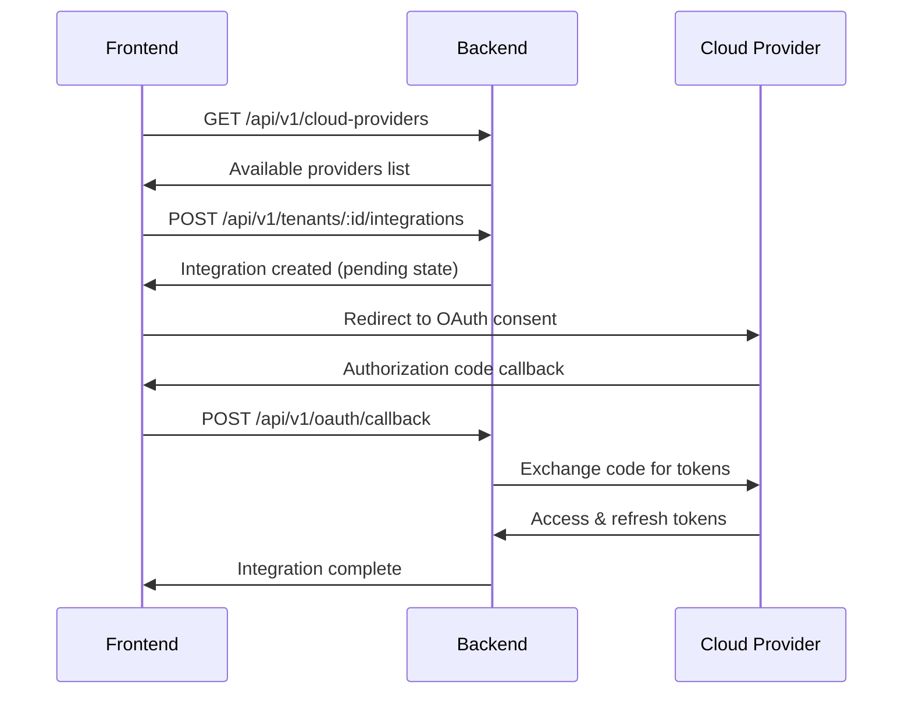
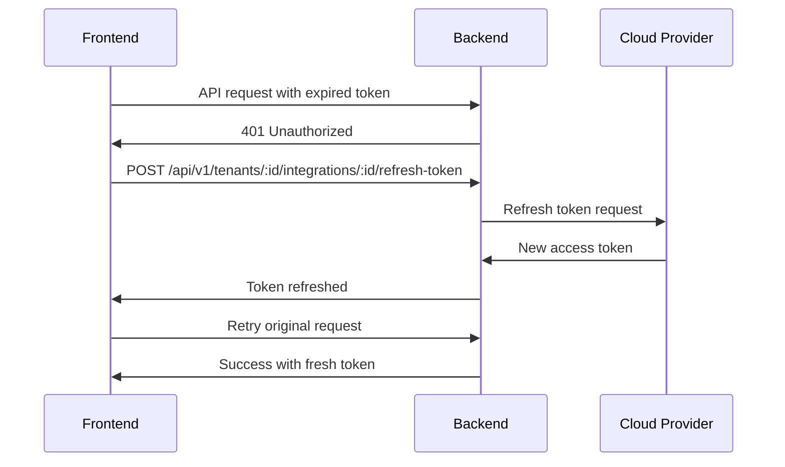

# OAuth Integration Guide

This guide shows React developers how to implement OAuth flows for cloud provider integrations with the MWAP backend.

## 🔗 Overview

MWAP supports OAuth integration with multiple cloud providers:
- **Google Drive** - Google OAuth 2.0
- **Dropbox** - Dropbox OAuth 2.0  
- **OneDrive** - Microsoft OAuth 2.0

The OAuth flow is handled by the backend, but the frontend initiates and manages the integration process.

## 🔄 OAuth Flow

### 1. Integration Setup Flow



### 2. Token Refresh Flow



## 🛠️ Implementation

### 1. List Available Providers

```tsx
import { useQuery } from 'react-query';
import { api } from '../utils/api';

interface CloudProvider {
  _id: string;
  name: string;
  slug: string;
  oauth: {
    authUrl: string;
    tokenUrl: string;
    scope: string[];
  };
}

export const useCloudProviders = () => {
  return useQuery<CloudProvider[]>('cloud-providers', async () => {
    const response = await api.get('/cloud-providers');
    return response.data.data;
  });
};

// Usage in component
function CloudProviderList() {
  const { data: providers, isLoading } = useCloudProviders();
  
  if (isLoading) return <div>Loading providers...</div>;
  
  return (
    <div>
      {providers?.map(provider => (
        <button
          key={provider._id}
          onClick={() => startOAuthFlow(provider)}
        >
          Connect {provider.name}
        </button>
      ))}
    </div>
  );
}
```

### 2. Start OAuth Flow

```tsx
import { useMutation, useQueryClient } from 'react-query';

interface CreateIntegrationData {
  providerId: string;
  name: string;
}

const useCreateIntegration = (tenantId: string) => {
  const queryClient = useQueryClient();
  
  return useMutation(
    async (data: CreateIntegrationData) => {
      const response = await api.post(
        `/tenants/${tenantId}/integrations`,
        data
      );
      return response.data.data;
    },
    {
      onSuccess: () => {
        // Invalidate integrations list
        queryClient.invalidateQueries(['integrations', tenantId]);
      }
    }
  );
};

const startOAuthFlow = async (provider: CloudProvider) => {
  try {
    // 1. Create integration record
    const integration = await createIntegration.mutateAsync({
      providerId: provider._id,
      name: `${provider.name} Integration`
    });

    // 2. Build OAuth URL
    const oauthUrl = buildOAuthUrl(provider, integration._id);
    
    // 3. Redirect to provider
    window.location.href = oauthUrl;
    
  } catch (error) {
    console.error('Failed to start OAuth flow:', error);
  }
};

const buildOAuthUrl = (provider: CloudProvider, integrationId: string) => {
  const params = new URLSearchParams({
    client_id: getClientId(provider.slug),
    response_type: 'code',
    scope: provider.oauth.scope.join(' '),
    redirect_uri: `${window.location.origin}/oauth/callback`,
    state: integrationId, // Pass integration ID as state
    access_type: 'offline', // For Google Drive
    prompt: 'consent' // Force consent screen
  });
  
  return `${provider.oauth.authUrl}?${params.toString()}`;
};
```

### 3. Handle OAuth Callback

```tsx
// src/pages/OAuthCallback.tsx
import { useEffect } from 'react';
import { useNavigate, useSearchParams } from 'react-router-dom';
import { api } from '../utils/api';

export const OAuthCallback: React.FC = () => {
  const navigate = useNavigate();
  const [searchParams] = useSearchParams();
  
  useEffect(() => {
    const handleCallback = async () => {
      const code = searchParams.get('code');
      const state = searchParams.get('state'); // integration ID
      const error = searchParams.get('error');
      
      if (error) {
        console.error('OAuth error:', error);
        navigate('/integrations?error=oauth_failed');
        return;
      }
      
      if (!code || !state) {
        console.error('Missing OAuth parameters');
        navigate('/integrations?error=invalid_callback');
        return;
      }
      
      try {
        // Send code to backend for token exchange
        await api.post('/oauth/callback', {
          code,
          integrationId: state
        });
        
        navigate('/integrations?success=integration_complete');
      } catch (error) {
        console.error('Failed to complete OAuth flow:', error);
        navigate('/integrations?error=token_exchange_failed');
      }
    };
    
    handleCallback();
  }, [searchParams, navigate]);
  
  return (
    <div className="flex items-center justify-center min-h-screen">
      <div>Completing integration...</div>
    </div>
  );
};
```

### 4. Manage Integrations

```tsx
// List tenant integrations
export const useTenantIntegrations = (tenantId: string) => {
  return useQuery(
    ['integrations', tenantId],
    async () => {
      const response = await api.get(`/tenants/${tenantId}/integrations`);
      return response.data.data;
    },
    {
      enabled: !!tenantId
    }
  );
};

// Refresh integration token
export const useRefreshIntegrationToken = () => {
  const queryClient = useQueryClient();
  
  return useMutation(
    async ({ tenantId, integrationId }: { tenantId: string; integrationId: string }) => {
      const response = await api.post(
        `/tenants/${tenantId}/integrations/${integrationId}/refresh-token`
      );
      return response.data.data;
    },
    {
      onSuccess: (_, { tenantId }) => {
        queryClient.invalidateQueries(['integrations', tenantId]);
      }
    }
  );
};

// Delete integration
export const useDeleteIntegration = () => {
  const queryClient = useQueryClient();
  
  return useMutation(
    async ({ tenantId, integrationId }: { tenantId: string; integrationId: string }) => {
      await api.delete(`/tenants/${tenantId}/integrations/${integrationId}`);
    },
    {
      onSuccess: (_, { tenantId }) => {
        queryClient.invalidateQueries(['integrations', tenantId]);
      }
    }
  );
};
```

### 5. Integration Management Component

```tsx
function IntegrationManager({ tenantId }: { tenantId: string }) {
  const { data: integrations, isLoading } = useTenantIntegrations(tenantId);
  const { data: providers } = useCloudProviders();
  const refreshToken = useRefreshIntegrationToken();
  const deleteIntegration = useDeleteIntegration();
  
  const handleRefresh = (integrationId: string) => {
    refreshToken.mutate({ tenantId, integrationId });
  };
  
  const handleDelete = (integrationId: string) => {
    if (confirm('Delete this integration?')) {
      deleteIntegration.mutate({ tenantId, integrationId });
    }
  };
  
  if (isLoading) return <div>Loading integrations...</div>;
  
  return (
    <div>
      <h2>Cloud Integrations</h2>
      
      {/* Available Providers */}
      <div className="mb-6">
        <h3>Connect New Provider</h3>
        <div className="grid grid-cols-3 gap-4">
          {providers?.map(provider => (
            <button
              key={provider._id}
              onClick={() => startOAuthFlow(provider)}
              className="p-4 border rounded hover:bg-gray-50"
            >
              Connect {provider.name}
            </button>
          ))}
        </div>
      </div>
      
      {/* Existing Integrations */}
      <div>
        <h3>Connected Providers</h3>
        {integrations?.length === 0 ? (
          <p>No integrations configured</p>
        ) : (
          <div className="space-y-4">
            {integrations?.map(integration => (
              <div key={integration._id} className="flex items-center justify-between p-4 border rounded">
                <div>
                  <h4>{integration.name}</h4>
                  <p className="text-sm text-gray-600">
                    Status: {integration.status}
                  </p>
                  {integration.lastSyncAt && (
                    <p className="text-xs text-gray-500">
                      Last sync: {new Date(integration.lastSyncAt).toLocaleString()}
                    </p>
                  )}
                </div>
                
                <div className="flex gap-2">
                  <button
                    onClick={() => handleRefresh(integration._id)}
                    disabled={refreshToken.isLoading}
                    className="px-3 py-1 text-sm bg-blue-500 text-white rounded hover:bg-blue-600"
                  >
                    Refresh
                  </button>
                  <button
                    onClick={() => handleDelete(integration._id)}
                    disabled={deleteIntegration.isLoading}
                    className="px-3 py-1 text-sm bg-red-500 text-white rounded hover:bg-red-600"
                  >
                    Delete
                  </button>
                </div>
              </div>
            ))}
          </div>
        )}
      </div>
    </div>
  );
}
```

## 🔧 Configuration

### Environment Variables

```env
# Provider Client IDs (get from provider developer consoles)
REACT_APP_GOOGLE_CLIENT_ID=your_google_client_id
REACT_APP_DROPBOX_CLIENT_ID=your_dropbox_client_id  
REACT_APP_MICROSOFT_CLIENT_ID=your_microsoft_client_id
```

### Provider Configuration Helper

```tsx
const getClientId = (providerSlug: string): string => {
  switch (providerSlug) {
    case 'google-drive':
      return process.env.REACT_APP_GOOGLE_CLIENT_ID!;
    case 'dropbox':
      return process.env.REACT_APP_DROPBOX_CLIENT_ID!;
    case 'onedrive':
      return process.env.REACT_APP_MICROSOFT_CLIENT_ID!;
    default:
      throw new Error(`Unknown provider: ${providerSlug}`);
  }
};
```

## 🚨 Error Handling

### Common OAuth Errors

```tsx
const handleOAuthError = (error: string, description?: string) => {
  switch (error) {
    case 'access_denied':
      showNotification('Integration cancelled by user', 'info');
      break;
    case 'invalid_request':
      showNotification('Invalid OAuth request', 'error');
      break;
    case 'unauthorized_client':
      showNotification('App not authorized for this provider', 'error');
      break;
    case 'unsupported_response_type':
      showNotification('OAuth configuration error', 'error');
      break;
    case 'invalid_scope':
      showNotification('Invalid permissions requested', 'error');
      break;
    default:
      showNotification(`OAuth error: ${error}`, 'error');
  }
};
```

### Token Expiry Handling

```tsx
// Automatic token refresh on API calls
api.interceptors.response.use(
  (response) => response,
  async (error) => {
    if (error.response?.status === 401) {
      // Try to refresh tokens for all integrations
      const tenantId = getCurrentTenantId();
      const integrations = await getCurrentIntegrations(tenantId);
      
      for (const integration of integrations) {
        try {
          await api.post(`/tenants/${tenantId}/integrations/${integration._id}/refresh-token`);
        } catch (refreshError) {
          console.warn(`Failed to refresh token for ${integration.name}`);
        }
      }
      
      // Retry original request
      return api.request(error.config);
    }
    
    return Promise.reject(error);
  }
);
```

## 📖 Related Documentation

- [API Integration Guide](api-integration.md) - General API usage patterns
- [Authentication Guide](authentication.md) - Auth0 and JWT handling
- [Backend OAuth Documentation](../04-Backend/API-v3.md#oauth-api) - Server-side OAuth implementation

---

*This guide covers OAuth integration from the frontend perspective. For server-side OAuth configuration, refer to the backend documentation.* 