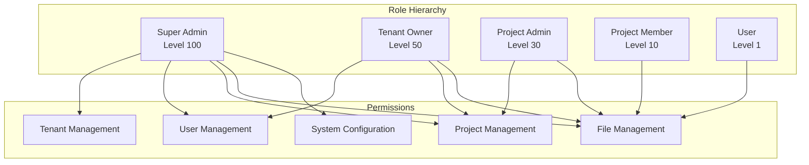

# 🛡️ MWAP RBAC Implementation

## 🎯 Overview

This document details the Role-Based Access Control (RBAC) implementation in the MWAP frontend, covering role management, permission checking, component-level access control, and integration with Auth0.

## 🏗️ RBAC Architecture

### **Role Hierarchy**


## 🔧 Role and Permission System

### **Role Definitions**
```typescript
// src/types/rbac.ts
export enum UserRole {
  SUPER_ADMIN = 'superadmin',
  TENANT_OWNER = 'tenant_owner',
  PROJECT_ADMIN = 'project_admin',
  PROJECT_MEMBER = 'project_member',
  USER = 'user'
}

export enum Permission {
  // Tenant permissions
  TENANT_CREATE = 'tenant:create',
  TENANT_READ = 'tenant:read',
  TENANT_UPDATE = 'tenant:update',
  TENANT_DELETE = 'tenant:delete',
  TENANT_ADMIN = 'tenant:admin',

  // User permissions
  USER_CREATE = 'user:create',
  USER_READ = 'user:read',
  USER_UPDATE = 'user:update',
  USER_DELETE = 'user:delete',
  USER_INVITE = 'user:invite',
  USER_ROLE_CHANGE = 'user:role_change',

  // Project permissions
  PROJECT_CREATE = 'project:create',
  PROJECT_READ = 'project:read',
  PROJECT_UPDATE = 'project:update',
  PROJECT_DELETE = 'project:delete',
  PROJECT_ADMIN = 'project:admin',

  // File permissions
  FILE_CREATE = 'file:create',
  FILE_READ = 'file:read',
  FILE_UPDATE = 'file:update',
  FILE_DELETE = 'file:delete',
  FILE_DOWNLOAD = 'file:download',
  FILE_SHARE = 'file:share',

  // System permissions
  SYSTEM_CONFIG = 'system:config',
  SYSTEM_LOGS = 'system:logs',
  SYSTEM_METRICS = 'system:metrics'
}

export interface RolePermissions {
  [UserRole.SUPER_ADMIN]: Permission[];
  [UserRole.TENANT_OWNER]: Permission[];
  [UserRole.PROJECT_ADMIN]: Permission[];
  [UserRole.PROJECT_MEMBER]: Permission[];
  [UserRole.USER]: Permission[];
}

export const ROLE_PERMISSIONS: RolePermissions = {
  [UserRole.SUPER_ADMIN]: [
    // All permissions
    ...Object.values(Permission)
  ],
  
  [UserRole.TENANT_OWNER]: [
    Permission.TENANT_READ,
    Permission.TENANT_UPDATE,
    Permission.USER_CREATE,
    Permission.USER_READ,
    Permission.USER_UPDATE,
    Permission.USER_DELETE,
    Permission.USER_INVITE,
    Permission.USER_ROLE_CHANGE,
    Permission.PROJECT_CREATE,
    Permission.PROJECT_READ,
    Permission.PROJECT_UPDATE,
    Permission.PROJECT_DELETE,
    Permission.PROJECT_ADMIN,
    Permission.FILE_CREATE,
    Permission.FILE_READ,
    Permission.FILE_UPDATE,
    Permission.FILE_DELETE,
    Permission.FILE_DOWNLOAD,
    Permission.FILE_SHARE
  ],
  
  [UserRole.PROJECT_ADMIN]: [
    Permission.PROJECT_READ,
    Permission.PROJECT_UPDATE,
    Permission.PROJECT_ADMIN,
    Permission.FILE_CREATE,
    Permission.FILE_READ,
    Permission.FILE_UPDATE,
    Permission.FILE_DELETE,
    Permission.FILE_DOWNLOAD,
    Permission.FILE_SHARE
  ],
  
  [UserRole.PROJECT_MEMBER]: [
    Permission.PROJECT_READ,
    Permission.FILE_CREATE,
    Permission.FILE_READ,
    Permission.FILE_UPDATE,
    Permission.FILE_DOWNLOAD
  ],
  
  [UserRole.USER]: [
    Permission.FILE_READ,
    Permission.FILE_DOWNLOAD
  ]
};
```

### **RBAC Context Provider**
```tsx
// src/contexts/RBACContext.tsx
import React, { createContext, useContext, useCallback, useMemo } from 'react';
import { useAuth } from '../hooks/useAuth';
import { UserRole, Permission, ROLE_PERMISSIONS } from '../types/rbac';

interface RBACContextValue {
  userRole: UserRole | null;
  permissions: Permission[];
  hasPermission: (permission: Permission) => boolean;
  hasRole: (role: UserRole) => boolean;
  hasAnyPermission: (permissions: Permission[]) => boolean;
  hasAllPermissions: (permissions: Permission[]) => boolean;
  canAccessResource: (resourceType: string, action: string) => boolean;
}

const RBACContext = createContext<RBACContextValue | undefined>(undefined);

export const RBACProvider: React.FC<{ children: React.ReactNode }> = ({ children }) => {
  const { getUserClaims } = useAuth();
  const [userRole, setUserRole] = React.useState<UserRole | null>(null);
  const [permissions, setPermissions] = React.useState<Permission[]>([]);

  React.useEffect(() => {
    const loadUserRoleAndPermissions = async () => {
      try {
        const claims = await getUserClaims();
        const role = claims.role as UserRole;
        const userPermissions = ROLE_PERMISSIONS[role] || [];
        
        setUserRole(role);
        setPermissions(userPermissions);
      } catch (error) {
        console.error('Failed to load user role and permissions:', error);
        setUserRole(null);
        setPermissions([]);
      }
    };

    loadUserRoleAndPermissions();
  }, [getUserClaims]);

  const hasPermission = useCallback((permission: Permission): boolean => {
    return permissions.includes(permission);
  }, [permissions]);

  const hasRole = useCallback((role: UserRole): boolean => {
    return userRole === role;
  }, [userRole]);

  const hasAnyPermission = useCallback((requiredPermissions: Permission[]): boolean => {
    return requiredPermissions.some(permission => permissions.includes(permission));
  }, [permissions]);

  const hasAllPermissions = useCallback((requiredPermissions: Permission[]): boolean => {
    return requiredPermissions.every(permission => permissions.includes(permission));
  }, [permissions]);

  const canAccessResource = useCallback((resourceType: string, action: string): boolean => {
    const permission = `${resourceType}:${action}` as Permission;
    return hasPermission(permission);
  }, [hasPermission]);

  const value = useMemo(() => ({
    userRole,
    permissions,
    hasPermission,
    hasRole,
    hasAnyPermission,
    hasAllPermissions,
    canAccessResource
  }), [
    userRole,
    permissions,
    hasPermission,
    hasRole,
    hasAnyPermission,
    hasAllPermissions,
    canAccessResource
  ]);

  return (
    <RBACContext.Provider value={value}>
      {children}
    </RBACContext.Provider>
  );
};

export const useRBAC = (): RBACContextValue => {
  const context = useContext(RBACContext);
  if (!context) {
    throw new Error('useRBAC must be used within an RBACProvider');
  }
  return context;
};
```

## 🔒 Permission-Based Components

### **Protected Component Wrapper**
```tsx
// src/components/rbac/ProtectedComponent.tsx
import React from 'react';
import { useRBAC } from '../../contexts/RBACContext';
import { Permission, UserRole } from '../../types/rbac';
import { Alert } from '@mantine/core';

interface ProtectedComponentProps {
  children: React.ReactNode;
  requiredPermission?: Permission;
  requiredPermissions?: Permission[];
  requiredRole?: UserRole;
  requireAll?: boolean;
  fallback?: React.ReactNode;
  showFallback?: boolean;
}

export const ProtectedComponent: React.FC<ProtectedComponentProps> = ({
  children,
  requiredPermission,
  requiredPermissions = [],
  requiredRole,
  requireAll = false,
  fallback,
  showFallback = true
}) => {
  const { hasPermission, hasRole, hasAnyPermission, hasAllPermissions } = useRBAC();

  // Check role requirement
  if (requiredRole && !hasRole(requiredRole)) {
    return showFallback ? (
      fallback || (
        <Alert color="red" title="Access Denied">
          You don't have the required role to access this content.
        </Alert>
      )
    ) : null;
  }

  // Check single permission
  if (requiredPermission && !hasPermission(requiredPermission)) {
    return showFallback ? (
      fallback || (
        <Alert color="red" title="Access Denied">
          You don't have permission to access this content.
        </Alert>
      )
    ) : null;
  }

  // Check multiple permissions
  if (requiredPermissions.length > 0) {
    const hasAccess = requireAll 
      ? hasAllPermissions(requiredPermissions)
      : hasAnyPermission(requiredPermissions);

    if (!hasAccess) {
      return showFallback ? (
        fallback || (
          <Alert color="red" title="Access Denied">
            You don't have the required permissions to access this content.
          </Alert>
        )
      ) : null;
    }
  }

  return <>{children}</>;
};
```

### **Permission-Based Button**
```tsx
// src/components/rbac/PermissionButton.tsx
import React from 'react';
import { Button, ButtonProps, Tooltip } from '@mantine/core';
import { useRBAC } from '../../contexts/RBACContext';
import { Permission } from '../../types/rbac';

interface PermissionButtonProps extends ButtonProps {
  requiredPermission: Permission;
  tooltipMessage?: string;
  hideIfNoPermission?: boolean;
}

export const PermissionButton: React.FC<PermissionButtonProps> = ({
  requiredPermission,
  tooltipMessage = 'You don\'t have permission to perform this action',
  hideIfNoPermission = false,
  children,
  ...buttonProps
}) => {
  const { hasPermission } = useRBAC();
  const canPerformAction = hasPermission(requiredPermission);

  if (hideIfNoPermission && !canPerformAction) {
    return null;
  }

  const button = (
    <Button
      {...buttonProps}
      disabled={!canPerformAction || buttonProps.disabled}
    >
      {children}
    </Button>
  );

  if (!canPerformAction) {
    return (
      <Tooltip label={tooltipMessage}>
        {button}
      </Tooltip>
    );
  }

  return button;
};
```

### **Role-Based Navigation**
```tsx
// src/components/navigation/RoleBasedNavigation.tsx
import React from 'react';
import { NavLink } from '@mantine/core';
import { useRBAC } from '../../contexts/RBACContext';
import { Permission, UserRole } from '../../types/rbac';

interface NavigationItem {
  label: string;
  href: string;
  icon?: React.ReactNode;
  requiredPermission?: Permission;
  requiredRole?: UserRole;
  children?: NavigationItem[];
}

interface RoleBasedNavigationProps {
  items: NavigationItem[];
}

export const RoleBasedNavigation: React.FC<RoleBasedNavigationProps> = ({ items }) => {
  const { hasPermission, hasRole } = useRBAC();

  const filterNavigationItems = (items: NavigationItem[]): NavigationItem[] => {
    return items.filter(item => {
      // Check role requirement
      if (item.requiredRole && !hasRole(item.requiredRole)) {
        return false;
      }

      // Check permission requirement
      if (item.requiredPermission && !hasPermission(item.requiredPermission)) {
        return false;
      }

      // Filter children recursively
      if (item.children) {
        item.children = filterNavigationItems(item.children);
      }

      return true;
    });
  };

  const renderNavigationItem = (item: NavigationItem) => (
    <NavLink
      key={item.href}
      label={item.label}
      href={item.href}
      leftSection={item.icon}
    >
      {item.children?.map(renderNavigationItem)}
    </NavLink>
  );

  const filteredItems = filterNavigationItems(items);

  return (
    <div>
      {filteredItems.map(renderNavigationItem)}
    </div>
  );
};
```

## 🎯 Resource-Level Access Control

### **Project Access Control**
```tsx
// src/components/projects/ProjectAccessControl.tsx
import React from 'react';
import { useRBAC } from '../../contexts/RBACContext';
import { useAuth } from '../../hooks/useAuth';
import { Permission } from '../../types/rbac';

interface ProjectAccessControlProps {
  projectId: string;
  ownerId: string;
  children: React.ReactNode;
  requiredPermission: Permission;
  fallback?: React.ReactNode;
}

export const ProjectAccessControl: React.FC<ProjectAccessControlProps> = ({
  projectId,
  ownerId,
  children,
  requiredPermission,
  fallback
}) => {
  const { hasPermission } = useRBAC();
  const { user } = useAuth();

  // Check if user has the required permission
  if (!hasPermission(requiredPermission)) {
    return fallback || <div>Access denied</div>;
  }

  // Additional check: if it's a write operation, ensure user is owner or has admin role
  if (requiredPermission.includes('update') || requiredPermission.includes('delete')) {
    const isOwner = user?.sub === ownerId;
    const hasAdminPermission = hasPermission(Permission.PROJECT_ADMIN);
    
    if (!isOwner && !hasAdminPermission) {
      return fallback || <div>Only project owners or admins can perform this action</div>;
    }
  }

  return <>{children}</>;
};
```

### **Tenant-Level Access Control**
```tsx
// src/components/tenants/TenantAccessControl.tsx
import React from 'react';
import { useRBAC } from '../../contexts/RBACContext';
import { useAuth } from '../../hooks/useAuth';
import { Permission, UserRole } from '../../types/rbac';

interface TenantAccessControlProps {
  children: React.ReactNode;
  requiredPermission?: Permission;
  requiredRole?: UserRole;
  fallback?: React.ReactNode;
}

export const TenantAccessControl: React.FC<TenantAccessControlProps> = ({
  children,
  requiredPermission,
  requiredRole,
  fallback
}) => {
  const { hasPermission, hasRole } = useRBAC();
  const { getUserClaims } = useAuth();
  const [tenantId, setTenantId] = React.useState<string | null>(null);

  React.useEffect(() => {
    const loadTenantId = async () => {
      try {
        const claims = await getUserClaims();
        setTenantId(claims.tenantId || null);
      } catch (error) {
        console.error('Failed to load tenant ID:', error);
        setTenantId(null);
      }
    };

    loadTenantId();
  }, [getUserClaims]);

  // Check if user belongs to a tenant
  if (!tenantId) {
    return fallback || <div>You must be associated with a tenant to access this content</div>;
  }

  // Check role requirement
  if (requiredRole && !hasRole(requiredRole)) {
    return fallback || <div>You don't have the required role to access this content</div>;
  }

  // Check permission requirement
  if (requiredPermission && !hasPermission(requiredPermission)) {
    return fallback || <div>You don't have permission to access this content</div>;
  }

  return <>{children}</>;
};
```

## 🔧 RBAC Hooks

### **usePermissions Hook**
```tsx
// src/hooks/usePermissions.ts
import { useCallback } from 'react';
import { useRBAC } from '../contexts/RBACContext';
import { Permission } from '../types/rbac';

export const usePermissions = () => {
  const { hasPermission, hasAnyPermission, hasAllPermissions } = useRBAC();

  const canCreateProject = useCallback(() => {
    return hasPermission(Permission.PROJECT_CREATE);
  }, [hasPermission]);

  const canEditProject = useCallback((projectOwnerId: string, currentUserId: string) => {
    return hasPermission(Permission.PROJECT_UPDATE) && 
           (projectOwnerId === currentUserId || hasPermission(Permission.PROJECT_ADMIN));
  }, [hasPermission]);

  const canDeleteProject = useCallback((projectOwnerId: string, currentUserId: string) => {
    return hasPermission(Permission.PROJECT_DELETE) && 
           (projectOwnerId === currentUserId || hasPermission(Permission.PROJECT_ADMIN));
  }, [hasPermission]);

  const canManageUsers = useCallback(() => {
    return hasAnyPermission([
      Permission.USER_CREATE,
      Permission.USER_UPDATE,
      Permission.USER_DELETE,
      Permission.USER_INVITE
    ]);
  }, [hasAnyPermission]);

  const canManageTenant = useCallback(() => {
    return hasAnyPermission([
      Permission.TENANT_UPDATE,
      Permission.TENANT_ADMIN
    ]);
  }, [hasAnyPermission]);

  const canAccessSystemSettings = useCallback(() => {
    return hasAnyPermission([
      Permission.SYSTEM_CONFIG,
      Permission.SYSTEM_LOGS,
      Permission.SYSTEM_METRICS
    ]);
  }, [hasAnyPermission]);

  return {
    canCreateProject,
    canEditProject,
    canDeleteProject,
    canManageUsers,
    canManageTenant,
    canAccessSystemSettings
  };
};
```

### **useResourceAccess Hook**
```tsx
// src/hooks/useResourceAccess.ts
import { useCallback } from 'react';
import { useRBAC } from '../contexts/RBACContext';
import { useAuth } from './useAuth';

interface ResourceAccessOptions {
  resourceType: 'project' | 'file' | 'user' | 'tenant';
  resourceId: string;
  ownerId?: string;
  action: 'create' | 'read' | 'update' | 'delete' | 'admin';
}

export const useResourceAccess = () => {
  const { canAccessResource, hasPermission } = useRBAC();
  const { user } = useAuth();

  const checkResourceAccess = useCallback(async (options: ResourceAccessOptions): Promise<boolean> => {
    const { resourceType, resourceId, ownerId, action } = options;

    // Check basic permission
    const hasBasicPermission = canAccessResource(resourceType, action);
    if (!hasBasicPermission) {
      return false;
    }

    // For write operations, check ownership or admin permissions
    if (['update', 'delete'].includes(action)) {
      const isOwner = ownerId && user?.sub === ownerId;
      const hasAdminPermission = hasPermission(`${resourceType}:admin` as any);
      
      return isOwner || hasAdminPermission;
    }

    return true;
  }, [canAccessResource, hasPermission, user]);

  const canReadResource = useCallback((resourceType: string, resourceId: string) => {
    return checkResourceAccess({ resourceType: resourceType as any, resourceId, action: 'read' });
  }, [checkResourceAccess]);

  const canUpdateResource = useCallback((resourceType: string, resourceId: string, ownerId: string) => {
    return checkResourceAccess({ 
      resourceType: resourceType as any, 
      resourceId, 
      ownerId, 
      action: 'update' 
    });
  }, [checkResourceAccess]);

  const canDeleteResource = useCallback((resourceType: string, resourceId: string, ownerId: string) => {
    return checkResourceAccess({ 
      resourceType: resourceType as any, 
      resourceId, 
      ownerId, 
      action: 'delete' 
    });
  }, [checkResourceAccess]);

  return {
    checkResourceAccess,
    canReadResource,
    canUpdateResource,
    canDeleteResource
  };
};
```

## 🧪 RBAC Testing

### **RBAC Component Tests**
```tsx
// src/components/rbac/__tests__/ProtectedComponent.test.tsx
import React from 'react';
import { render, screen } from '@testing-library/react';
import { ProtectedComponent } from '../ProtectedComponent';
import { RBACProvider } from '../../../contexts/RBACContext';
import { Permission, UserRole } from '../../../types/rbac';

// Mock the useAuth hook
jest.mock('../../../hooks/useAuth', () => ({
  useAuth: () => ({
    getUserClaims: jest.fn().mockResolvedValue({
      role: UserRole.PROJECT_ADMIN,
      permissions: [Permission.PROJECT_READ, Permission.PROJECT_UPDATE]
    })
  })
}));

const renderWithRBAC = (component: React.ReactElement) => {
  return render(
    <RBACProvider>
      {component}
    </RBACProvider>
  );
};

describe('ProtectedComponent', () => {
  it('should render children when user has required permission', async () => {
    renderWithRBAC(
      <ProtectedComponent requiredPermission={Permission.PROJECT_READ}>
        <div>Protected Content</div>
      </ProtectedComponent>
    );

    expect(await screen.findByText('Protected Content')).toBeInTheDocument();
  });

  it('should show access denied when user lacks required permission', async () => {
    renderWithRBAC(
      <ProtectedComponent requiredPermission={Permission.TENANT_ADMIN}>
        <div>Protected Content</div>
      </ProtectedComponent>
    );

    expect(await screen.findByText(/access denied/i)).toBeInTheDocument();
    expect(screen.queryByText('Protected Content')).not.toBeInTheDocument();
  });

  it('should render custom fallback when provided', async () => {
    renderWithRBAC(
      <ProtectedComponent 
        requiredPermission={Permission.TENANT_ADMIN}
        fallback={<div>Custom Fallback</div>}
      >
        <div>Protected Content</div>
      </ProtectedComponent>
    );

    expect(await screen.findByText('Custom Fallback')).toBeInTheDocument();
  });

  it('should handle multiple permissions with requireAll=true', async () => {
    renderWithRBAC(
      <ProtectedComponent 
        requiredPermissions={[Permission.PROJECT_READ, Permission.PROJECT_UPDATE]}
        requireAll={true}
      >
        <div>Protected Content</div>
      </ProtectedComponent>
    );

    expect(await screen.findByText('Protected Content')).toBeInTheDocument();
  });

  it('should handle multiple permissions with requireAll=false', async () => {
    renderWithRBAC(
      <ProtectedComponent 
        requiredPermissions={[Permission.PROJECT_READ, Permission.TENANT_ADMIN]}
        requireAll={false}
      >
        <div>Protected Content</div>
      </ProtectedComponent>
    );

    expect(await screen.findByText('Protected Content')).toBeInTheDocument();
  });
});
```

## 🔗 Integration with Backend

### **API Permission Validation**
```tsx
// src/services/apiPermissionValidator.ts
import { Permission } from '../types/rbac';
import { useRBAC } from '../contexts/RBACContext';

export class ApiPermissionValidator {
  private rbac: ReturnType<typeof useRBAC>;

  constructor(rbac: ReturnType<typeof useRBAC>) {
    this.rbac = rbac;
  }

  async validateApiCall(endpoint: string, method: string): Promise<boolean> {
    const permissionMap: Record<string, Permission> = {
      'GET /api/v1/projects': Permission.PROJECT_READ,
      'POST /api/v1/projects': Permission.PROJECT_CREATE,
      'PUT /api/v1/projects/:id': Permission.PROJECT_UPDATE,
      'DELETE /api/v1/projects/:id': Permission.PROJECT_DELETE,
      'GET /api/v1/users': Permission.USER_READ,
      'POST /api/v1/users': Permission.USER_CREATE,
      'PUT /api/v1/users/:id': Permission.USER_UPDATE,
      'DELETE /api/v1/users/:id': Permission.USER_DELETE,
      'GET /api/v1/tenants': Permission.TENANT_READ,
      'PUT /api/v1/tenants/:id': Permission.TENANT_UPDATE
    };

    const key = `${method} ${endpoint}`;
    const requiredPermission = permissionMap[key];

    if (!requiredPermission) {
      console.warn(`No permission mapping found for ${key}`);
      return true; // Allow if no mapping found
    }

    return this.rbac.hasPermission(requiredPermission);
  }
}

// Hook to use API permission validator
export const useApiPermissionValidator = () => {
  const rbac = useRBAC();
  return new ApiPermissionValidator(rbac);
};
```

## 🔗 Related Documentation

- **[🔐 Auth0 Integration](./auth0-integration.md)** - Authentication setup
- **[🔒 Auth Middleware](../04-Backend/auth-middleware.md)** - Backend authentication
- **[🛡️ Security Patterns](../04-Backend/security-patterns.md)** - Security implementation patterns
- **[🏗️ Frontend Architecture](./README.md)** - Frontend structure overview
- **[🧪 Testing Strategy](./testing-strategy.md)** - Frontend testing approaches

---

*This RBAC implementation provides comprehensive role-based access control for the MWAP frontend, ensuring secure and granular permission management throughout the application.*