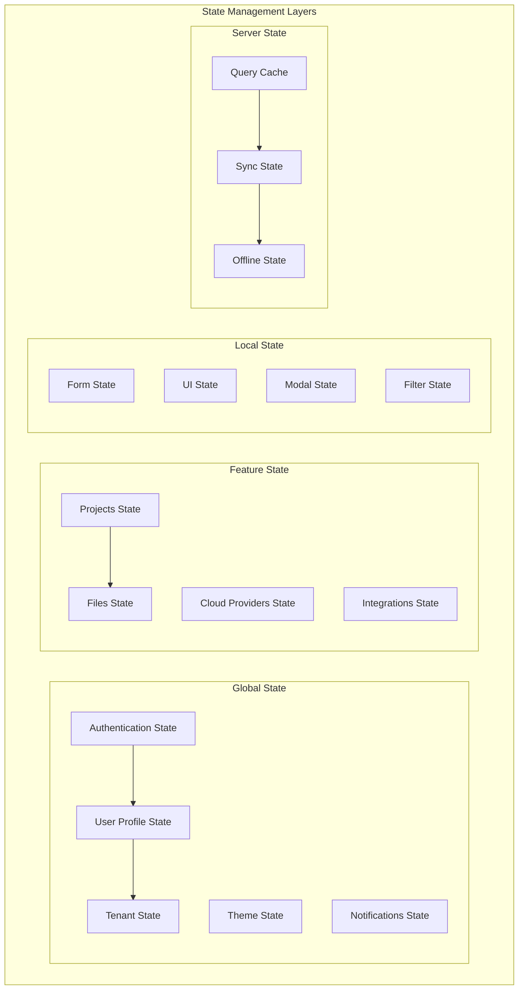

# 🔄 MWAP State Management

## 🎯 Overview

This document outlines the state management strategy for the MWAP frontend application, covering global state, local state, data fetching, caching, and synchronization patterns using modern React patterns and libraries.

## 🏗️ State Management Architecture

### **State Layers**


## 🔧 Global State Management

### **Context-Based State Management**
```tsx
// src/contexts/AppStateContext.tsx
import React, { createContext, useContext, useReducer, useCallback } from 'react';

// State Types
interface AppState {
  user: UserState;
  tenant: TenantState;
  ui: UIState;
  notifications: NotificationState;
}

interface UserState {
  profile: UserProfile | null;
  preferences: UserPreferences;
  isLoading: boolean;
  error: string | null;
}

interface TenantState {
  current: Tenant | null;
  members: TenantMember[];
  settings: TenantSettings;
  isLoading: boolean;
  error: string | null;
}

interface UIState {
  theme: 'light' | 'dark' | 'auto';
  sidebarCollapsed: boolean;
  activeModal: string | null;
  breadcrumbs: Breadcrumb[];
}

interface NotificationState {
  items: Notification[];
  unreadCount: number;
}

// Action Types
type AppAction =
  | { type: 'SET_USER_PROFILE'; payload: UserProfile }
  | { type: 'SET_USER_LOADING'; payload: boolean }
  | { type: 'SET_USER_ERROR'; payload: string | null }
  | { type: 'SET_TENANT'; payload: Tenant }
  | { type: 'SET_TENANT_MEMBERS'; payload: TenantMember[] }
  | { type: 'SET_THEME'; payload: 'light' | 'dark' | 'auto' }
  | { type: 'TOGGLE_SIDEBAR' }
  | { type: 'SET_ACTIVE_MODAL'; payload: string | null }
  | { type: 'ADD_NOTIFICATION'; payload: Notification }
  | { type: 'REMOVE_NOTIFICATION'; payload: string }
  | { type: 'MARK_NOTIFICATION_READ'; payload: string };

// Initial State
const initialState: AppState = {
  user: {
    profile: null,
    preferences: {
      language: 'en',
      timezone: 'UTC',
      emailNotifications: true,
      pushNotifications: true
    },
    isLoading: false,
    error: null
  },
  tenant: {
    current: null,
    members: [],
    settings: {
      name: '',
      domain: '',
      features: [],
      limits: {}
    },
    isLoading: false,
    error: null
  },
  ui: {
    theme: 'auto',
    sidebarCollapsed: false,
    activeModal: null,
    breadcrumbs: []
  },
  notifications: {
    items: [],
    unreadCount: 0
  }
};

// Reducer
const appReducer = (state: AppState, action: AppAction): AppState => {
  switch (action.type) {
    case 'SET_USER_PROFILE':
      return {
        ...state,
        user: {
          ...state.user,
          profile: action.payload,
          isLoading: false,
          error: null
        }
      };

    case 'SET_USER_LOADING':
      return {
        ...state,
        user: {
          ...state.user,
          isLoading: action.payload
        }
      };

    case 'SET_USER_ERROR':
      return {
        ...state,
        user: {
          ...state.user,
          error: action.payload,
          isLoading: false
        }
      };

    case 'SET_TENANT':
      return {
        ...state,
        tenant: {
          ...state.tenant,
          current: action.payload,
          isLoading: false,
          error: null
        }
      };

    case 'SET_TENANT_MEMBERS':
      return {
        ...state,
        tenant: {
          ...state.tenant,
          members: action.payload
        }
      };

    case 'SET_THEME':
      return {
        ...state,
        ui: {
          ...state.ui,
          theme: action.payload
        }
      };

    case 'TOGGLE_SIDEBAR':
      return {
        ...state,
        ui: {
          ...state.ui,
          sidebarCollapsed: !state.ui.sidebarCollapsed
        }
      };

    case 'SET_ACTIVE_MODAL':
      return {
        ...state,
        ui: {
          ...state.ui,
          activeModal: action.payload
        }
      };

    case 'ADD_NOTIFICATION':
      return {
        ...state,
        notifications: {
          items: [action.payload, ...state.notifications.items],
          unreadCount: state.notifications.unreadCount + 1
        }
      };

    case 'REMOVE_NOTIFICATION':
      const filteredItems = state.notifications.items.filter(
        item => item.id !== action.payload
      );
      return {
        ...state,
        notifications: {
          items: filteredItems,
          unreadCount: Math.max(0, state.notifications.unreadCount - 1)
        }
      };

    case 'MARK_NOTIFICATION_READ':
      const updatedItems = state.notifications.items.map(item =>
        item.id === action.payload ? { ...item, read: true } : item
      );
      const wasUnread = state.notifications.items.find(
        item => item.id === action.payload && !item.read
      );
      return {
        ...state,
        notifications: {
          items: updatedItems,
          unreadCount: wasUnread 
            ? Math.max(0, state.notifications.unreadCount - 1)
            : state.notifications.unreadCount
        }
      };

    default:
      return state;
  }
};

// Context
interface AppStateContextValue {
  state: AppState;
  dispatch: React.Dispatch<AppAction>;
  actions: {
    setUserProfile: (profile: UserProfile) => void;
    setUserLoading: (loading: boolean) => void;
    setUserError: (error: string | null) => void;
    setTenant: (tenant: Tenant) => void;
    setTenantMembers: (members: TenantMember[]) => void;
    setTheme: (theme: 'light' | 'dark' | 'auto') => void;
    toggleSidebar: () => void;
    setActiveModal: (modal: string | null) => void;
    addNotification: (notification: Omit<Notification, 'id'>) => void;
    removeNotification: (id: string) => void;
    markNotificationRead: (id: string) => void;
  };
}

const AppStateContext = createContext<AppStateContextValue | undefined>(undefined);

// Provider
export const AppStateProvider: React.FC<{ children: React.ReactNode }> = ({ children }) => {
  const [state, dispatch] = useReducer(appReducer, initialState);

  const actions = {
    setUserProfile: useCallback((profile: UserProfile) => {
      dispatch({ type: 'SET_USER_PROFILE', payload: profile });
    }, []),

    setUserLoading: useCallback((loading: boolean) => {
      dispatch({ type: 'SET_USER_LOADING', payload: loading });
    }, []),

    setUserError: useCallback((error: string | null) => {
      dispatch({ type: 'SET_USER_ERROR', payload: error });
    }, []),

    setTenant: useCallback((tenant: Tenant) => {
      dispatch({ type: 'SET_TENANT', payload: tenant });
    }, []),

    setTenantMembers: useCallback((members: TenantMember[]) => {
      dispatch({ type: 'SET_TENANT_MEMBERS', payload: members });
    }, []),

    setTheme: useCallback((theme: 'light' | 'dark' | 'auto') => {
      dispatch({ type: 'SET_THEME', payload: theme });
      localStorage.setItem('mwap-theme', theme);
    }, []),

    toggleSidebar: useCallback(() => {
      dispatch({ type: 'TOGGLE_SIDEBAR' });
    }, []),

    setActiveModal: useCallback((modal: string | null) => {
      dispatch({ type: 'SET_ACTIVE_MODAL', payload: modal });
    }, []),

    addNotification: useCallback((notification: Omit<Notification, 'id'>) => {
      const fullNotification: Notification = {
        ...notification,
        id: `notification-${Date.now()}-${Math.random()}`,
        timestamp: new Date(),
        read: false
      };
      dispatch({ type: 'ADD_NOTIFICATION', payload: fullNotification });
    }, []),

    removeNotification: useCallback((id: string) => {
      dispatch({ type: 'REMOVE_NOTIFICATION', payload: id });
    }, []),

    markNotificationRead: useCallback((id: string) => {
      dispatch({ type: 'MARK_NOTIFICATION_READ', payload: id });
    }, [])
  };

  return (
    <AppStateContext.Provider value={{ state, dispatch, actions }}>
      {children}
    </AppStateContext.Provider>
  );
};

// Hook
export const useAppState = (): AppStateContextValue => {
  const context = useContext(AppStateContext);
  if (!context) {
    throw new Error('useAppState must be used within an AppStateProvider');
  }
  return context;
};
```

## 📊 Data Fetching and Caching

### **React Query Integration**
```tsx
// src/hooks/useQuery.ts
import { useQuery, useMutation, useQueryClient, QueryKey } from '@tanstack/react-query';
import { useApiClient } from './useApiClient';
import { useAppState } from '../contexts/AppStateContext';

// Query Keys
export const queryKeys = {
  users: ['users'] as const,
  user: (id: string) => ['users', id] as const,
  projects: ['projects'] as const,
  project: (id: string) => ['projects', id] as const,
  tenants: ['tenants'] as const,
  tenant: (id: string) => ['tenants', id] as const,
  files: (projectId: string) => ['files', projectId] as const,
  cloudProviders: ['cloudProviders'] as const
};

// Custom Query Hooks
export const useUserProfile = () => {
  const apiClient = useApiClient();
  const { actions } = useAppState();

  return useQuery({
    queryKey: queryKeys.users,
    queryFn: async () => {
      const response = await apiClient.get<{ data: UserProfile }>('/users/profile');
      return response.data;
    },
    onSuccess: (data) => {
      actions.setUserProfile(data);
    },
    onError: (error) => {
      actions.setUserError(error.message);
    },
    staleTime: 5 * 60 * 1000, // 5 minutes
    cacheTime: 10 * 60 * 1000, // 10 minutes
    retry: 2
  });
};

export const useProjects = (filters?: ProjectFilters) => {
  const apiClient = useApiClient();

  return useQuery({
    queryKey: [...queryKeys.projects, filters],
    queryFn: async () => {
      const params = new URLSearchParams();
      if (filters?.search) params.append('search', filters.search);
      if (filters?.status) params.append('status', filters.status);
      if (filters?.limit) params.append('limit', filters.limit.toString());
      if (filters?.offset) params.append('offset', filters.offset.toString());

      const response = await apiClient.get<{ data: Project[] }>(`/projects?${params}`);
      return response.data;
    },
    staleTime: 2 * 60 * 1000, // 2 minutes
    cacheTime: 5 * 60 * 1000, // 5 minutes
    keepPreviousData: true
  });
};

export const useProject = (projectId: string) => {
  const apiClient = useApiClient();

  return useQuery({
    queryKey: queryKeys.project(projectId),
    queryFn: async () => {
      const response = await apiClient.get<{ data: Project }>(`/projects/${projectId}`);
      return response.data;
    },
    enabled: !!projectId,
    staleTime: 5 * 60 * 1000,
    cacheTime: 10 * 60 * 1000
  });
};

// Mutation Hooks
export const useCreateProject = () => {
  const apiClient = useApiClient();
  const queryClient = useQueryClient();
  const { actions } = useAppState();

  return useMutation({
    mutationFn: async (projectData: CreateProjectRequest) => {
      const response = await apiClient.post<{ data: Project }>('/projects', projectData);
      return response.data;
    },
    onSuccess: (newProject) => {
      // Invalidate and refetch projects list
      queryClient.invalidateQueries({ queryKey: queryKeys.projects });
      
      // Add the new project to the cache
      queryClient.setQueryData(queryKeys.project(newProject.id), newProject);
      
      // Show success notification
      actions.addNotification({
        type: 'success',
        title: 'Project Created',
        message: `Project "${newProject.name}" has been created successfully.`
      });
    },
    onError: (error) => {
      actions.addNotification({
        type: 'error',
        title: 'Failed to Create Project',
        message: error.message
      });
    }
  });
};

export const useUpdateProject = () => {
  const apiClient = useApiClient();
  const queryClient = useQueryClient();
  const { actions } = useAppState();

  return useMutation({
    mutationFn: async ({ id, data }: { id: string; data: UpdateProjectRequest }) => {
      const response = await apiClient.put<{ data: Project }>(`/projects/${id}`, data);
      return response.data;
    },
    onSuccess: (updatedProject) => {
      // Update the specific project in cache
      queryClient.setQueryData(queryKeys.project(updatedProject.id), updatedProject);
      
      // Update the project in the projects list
      queryClient.setQueryData(queryKeys.projects, (oldData: Project[] | undefined) => {
        if (!oldData) return oldData;
        return oldData.map(project => 
          project.id === updatedProject.id ? updatedProject : project
        );
      });
      
      actions.addNotification({
        type: 'success',
        title: 'Project Updated',
        message: `Project "${updatedProject.name}" has been updated successfully.`
      });
    },
    onError: (error) => {
      actions.addNotification({
        type: 'error',
        title: 'Failed to Update Project',
        message: error.message
      });
    }
  });
};

export const useDeleteProject = () => {
  const apiClient = useApiClient();
  const queryClient = useQueryClient();
  const { actions } = useAppState();

  return useMutation({
    mutationFn: async (projectId: string) => {
      await apiClient.delete(`/projects/${projectId}`);
      return projectId;
    },
    onSuccess: (deletedProjectId) => {
      // Remove from projects list
      queryClient.setQueryData(queryKeys.projects, (oldData: Project[] | undefined) => {
        if (!oldData) return oldData;
        return oldData.filter(project => project.id !== deletedProjectId);
      });
      
      // Remove the specific project from cache
      queryClient.removeQueries({ queryKey: queryKeys.project(deletedProjectId) });
      
      actions.addNotification({
        type: 'success',
        title: 'Project Deleted',
        message: 'Project has been deleted successfully.'
      });
    },
    onError: (error) => {
      actions.addNotification({
        type: 'error',
        title: 'Failed to Delete Project',
        message: error.message
      });
    }
  });
};
```

### **Optimistic Updates**
```tsx
// src/hooks/useOptimisticUpdates.ts
import { useMutation, useQueryClient } from '@tanstack/react-query';
import { useApiClient } from './useApiClient';
import { queryKeys } from './useQuery';

export const useOptimisticProjectUpdate = () => {
  const apiClient = useApiClient();
  const queryClient = useQueryClient();

  return useMutation({
    mutationFn: async ({ id, data }: { id: string; data: UpdateProjectRequest }) => {
      const response = await apiClient.put<{ data: Project }>(`/projects/${id}`, data);
      return response.data;
    },
    onMutate: async ({ id, data }) => {
      // Cancel any outgoing refetches
      await queryClient.cancelQueries({ queryKey: queryKeys.project(id) });

      // Snapshot the previous value
      const previousProject = queryClient.getQueryData(queryKeys.project(id));

      // Optimistically update to the new value
      queryClient.setQueryData(queryKeys.project(id), (old: Project | undefined) => {
        if (!old) return old;
        return { ...old, ...data };
      });

      // Return a context object with the snapshotted value
      return { previousProject };
    },
    onError: (err, variables, context) => {
      // If the mutation fails, use the context returned from onMutate to roll back
      if (context?.previousProject) {
        queryClient.setQueryData(queryKeys.project(variables.id), context.previousProject);
      }
    },
    onSettled: (data, error, variables) => {
      // Always refetch after error or success
      queryClient.invalidateQueries({ queryKey: queryKeys.project(variables.id) });
    }
  });
};
```

## 🎯 Local State Management

### **Form State Management**
```tsx
// src/hooks/useFormState.ts
import { useState, useCallback, useReducer } from 'react';
import { z } from 'zod';

interface FormState<T> {
  values: T;
  errors: Partial<Record<keyof T, string>>;
  touched: Partial<Record<keyof T, boolean>>;
  isSubmitting: boolean;
  isValid: boolean;
}

type FormAction<T> =
  | { type: 'SET_VALUE'; field: keyof T; value: any }
  | { type: 'SET_ERROR'; field: keyof T; error: string }
  | { type: 'CLEAR_ERROR'; field: keyof T }
  | { type: 'SET_TOUCHED'; field: keyof T }
  | { type: 'SET_SUBMITTING'; isSubmitting: boolean }
  | { type: 'RESET'; initialValues: T };

function formReducer<T>(state: FormState<T>, action: FormAction<T>): FormState<T> {
  switch (action.type) {
    case 'SET_VALUE':
      return {
        ...state,
        values: {
          ...state.values,
          [action.field]: action.value
        }
      };

    case 'SET_ERROR':
      return {
        ...state,
        errors: {
          ...state.errors,
          [action.field]: action.error
        },
        isValid: false
      };

    case 'CLEAR_ERROR':
      const newErrors = { ...state.errors };
      delete newErrors[action.field];
      return {
        ...state,
        errors: newErrors,
        isValid: Object.keys(newErrors).length === 0
      };

    case 'SET_TOUCHED':
      return {
        ...state,
        touched: {
          ...state.touched,
          [action.field]: true
        }
      };

    case 'SET_SUBMITTING':
      return {
        ...state,
        isSubmitting: action.isSubmitting
      };

    case 'RESET':
      return {
        values: action.initialValues,
        errors: {},
        touched: {},
        isSubmitting: false,
        isValid: true
      };

    default:
      return state;
  }
}

export const useFormState = <T extends Record<string, any>>(
  initialValues: T,
  validationSchema?: z.ZodSchema<T>
) => {
  const [state, dispatch] = useReducer(formReducer<T>, {
    values: initialValues,
    errors: {},
    touched: {},
    isSubmitting: false,
    isValid: true
  });

  const setValue = useCallback((field: keyof T, value: any) => {
    dispatch({ type: 'SET_VALUE', field, value });
    
    // Clear error when value changes
    if (state.errors[field]) {
      dispatch({ type: 'CLEAR_ERROR', field });
    }
    
    // Validate if schema is provided
    if (validationSchema) {
      try {
        validationSchema.parse({ ...state.values, [field]: value });
        dispatch({ type: 'CLEAR_ERROR', field });
      } catch (error) {
        if (error instanceof z.ZodError) {
          const fieldError = error.errors.find(err => err.path.includes(field as string));
          if (fieldError) {
            dispatch({ type: 'SET_ERROR', field, error: fieldError.message });
          }
        }
      }
    }
  }, [state.values, state.errors, validationSchema]);

  const setTouched = useCallback((field: keyof T) => {
    dispatch({ type: 'SET_TOUCHED', field });
  }, []);

  const setSubmitting = useCallback((isSubmitting: boolean) => {
    dispatch({ type: 'SET_SUBMITTING', isSubmitting });
  }, []);

  const reset = useCallback(() => {
    dispatch({ type: 'RESET', initialValues });
  }, [initialValues]);

  const validate = useCallback(() => {
    if (!validationSchema) return true;

    try {
      validationSchema.parse(state.values);
      return true;
    } catch (error) {
      if (error instanceof z.ZodError) {
        error.errors.forEach(err => {
          const field = err.path[0] as keyof T;
          dispatch({ type: 'SET_ERROR', field, error: err.message });
        });
      }
      return false;
    }
  }, [state.values, validationSchema]);

  const handleSubmit = useCallback((onSubmit: (values: T) => Promise<void> | void) => {
    return async (e?: React.FormEvent) => {
      e?.preventDefault();
      
      if (!validate()) return;
      
      setSubmitting(true);
      try {
        await onSubmit(state.values);
      } catch (error) {
        console.error('Form submission error:', error);
      } finally {
        setSubmitting(false);
      }
    };
  }, [state.values, validate, setSubmitting]);

  return {
    values: state.values,
    errors: state.errors,
    touched: state.touched,
    isSubmitting: state.isSubmitting,
    isValid: state.isValid,
    setValue,
    setTouched,
    setSubmitting,
    reset,
    validate,
    handleSubmit
  };
};
```

### **Modal State Management**
```tsx
// src/hooks/useModal.ts
import { useState, useCallback } from 'react';
import { useAppState } from '../contexts/AppStateContext';

interface ModalOptions {
  closeOnEscape?: boolean;
  closeOnClickOutside?: boolean;
  persistent?: boolean;
}

export const useModal = (modalId: string, options: ModalOptions = {}) => {
  const { state, actions } = useAppState();
  const [data, setData] = useState<any>(null);

  const isOpen = state.ui.activeModal === modalId;

  const open = useCallback((modalData?: any) => {
    setData(modalData);
    actions.setActiveModal(modalId);
  }, [modalId, actions]);

  const close = useCallback(() => {
    if (!options.persistent) {
      setData(null);
      actions.setActiveModal(null);
    }
  }, [options.persistent, actions]);

  const toggle = useCallback((modalData?: any) => {
    if (isOpen) {
      close();
    } else {
      open(modalData);
    }
  }, [isOpen, open, close]);

  // Handle escape key
  React.useEffect(() => {
    if (!isOpen || !options.closeOnEscape) return;

    const handleEscape = (e: KeyboardEvent) => {
      if (e.key === 'Escape') {
        close();
      }
    };

    document.addEventListener('keydown', handleEscape);
    return () => document.removeEventListener('keydown', handleEscape);
  }, [isOpen, options.closeOnEscape, close]);

  return {
    isOpen,
    data,
    open,
    close,
    toggle
  };
};

// Specific modal hooks
export const useCreateProjectModal = () => {
  return useModal('create-project', {
    closeOnEscape: true,
    closeOnClickOutside: true
  });
};

export const useDeleteConfirmModal = () => {
  return useModal('delete-confirm', {
    closeOnEscape: true,
    closeOnClickOutside: false,
    persistent: false
  });
};

export const useUserSettingsModal = () => {
  return useModal('user-settings', {
    closeOnEscape: true,
    closeOnClickOutside: false
  });
};
```

## 🔄 State Synchronization

### **Real-time Updates**
```tsx
// src/hooks/useRealTimeSync.ts
import { useEffect, useCallback } from 'react';
import { useQueryClient } from '@tanstack/react-query';
import { useAuth } from './useAuth';
import { queryKeys } from './useQuery';

interface WebSocketMessage {
  type: string;
  payload: any;
  timestamp: string;
}

export const useRealTimeSync = () => {
  const queryClient = useQueryClient();
  const { getAccessToken } = useAuth();
  const [socket, setSocket] = useState<WebSocket | null>(null);

  const connect = useCallback(async () => {
    try {
      const token = await getAccessToken();
      const wsUrl = `${process.env.REACT_APP_WS_URL}?token=${token}`;
      const ws = new WebSocket(wsUrl);

      ws.onopen = () => {
        console.log('WebSocket connected');
        setSocket(ws);
      };

      ws.onmessage = (event) => {
        const message: WebSocketMessage = JSON.parse(event.data);
        handleMessage(message);
      };

      ws.onclose = () => {
        console.log('WebSocket disconnected');
        setSocket(null);
        // Attempt to reconnect after 5 seconds
        setTimeout(connect, 5000);
      };

      ws.onerror = (error) => {
        console.error('WebSocket error:', error);
      };

    } catch (error) {
      console.error('Failed to connect to WebSocket:', error);
    }
  }, [getAccessToken]);

  const handleMessage = useCallback((message: WebSocketMessage) => {
    switch (message.type) {
      case 'PROJECT_UPDATED':
        queryClient.setQueryData(
          queryKeys.project(message.payload.id),
          message.payload
        );
        queryClient.invalidateQueries({ queryKey: queryKeys.projects });
        break;

      case 'PROJECT_DELETED':
        queryClient.removeQueries({ 
          queryKey: queryKeys.project(message.payload.id) 
        });
        queryClient.invalidateQueries({ queryKey: queryKeys.projects });
        break;

      case 'FILE_UPLOADED':
        queryClient.invalidateQueries({ 
          queryKey: queryKeys.files(message.payload.projectId) 
        });
        break;

      case 'USER_JOINED_TENANT':
        queryClient.invalidateQueries({ queryKey: queryKeys.tenants });
        break;

      default:
        console.log('Unknown message type:', message.type);
    }
  }, [queryClient]);

  useEffect(() => {
    connect();
    
    return () => {
      if (socket) {
        socket.close();
      }
    };
  }, [connect]);

  return {
    isConnected: socket?.readyState === WebSocket.OPEN,
    socket
  };
};
```

### **Offline State Management**
```tsx
// src/hooks/useOfflineSync.ts
import { useState, useEffect, useCallback } from 'react';
import { useQueryClient } from '@tanstack/react-query';

interface OfflineAction {
  id: string;
  type: string;
  payload: any;
  timestamp: number;
  retryCount: number;
}

export const useOfflineSync = () => {
  const [isOnline, setIsOnline] = useState(navigator.onLine);
  const [pendingActions, setPendingActions] = useState<OfflineAction[]>([]);
  const queryClient = useQueryClient();

  // Monitor online/offline status
  useEffect(() => {
    const handleOnline = () => setIsOnline(true);
    const handleOffline = () => setIsOnline(false);

    window.addEventListener('online', handleOnline);
    window.addEventListener('offline', handleOffline);

    return () => {
      window.removeEventListener('online', handleOnline);
      window.removeEventListener('offline', handleOffline);
    };
  }, []);

  // Load pending actions from localStorage
  useEffect(() => {
    const stored = localStorage.getItem('mwap-offline-actions');
    if (stored) {
      try {
        setPendingActions(JSON.parse(stored));
      } catch (error) {
        console.error('Failed to parse offline actions:', error);
      }
    }
  }, []);

  // Save pending actions to localStorage
  useEffect(() => {
    localStorage.setItem('mwap-offline-actions', JSON.stringify(pendingActions));
  }, [pendingActions]);

  const addOfflineAction = useCallback((action: Omit<OfflineAction, 'id' | 'timestamp' | 'retryCount'>) => {
    const offlineAction: OfflineAction = {
      ...action,
      id: `offline-${Date.now()}-${Math.random()}`,
      timestamp: Date.now(),
      retryCount: 0
    };

    setPendingActions(prev => [...prev, offlineAction]);
  }, []);

  const removeOfflineAction = useCallback((actionId: string) => {
    setPendingActions(prev => prev.filter(action => action.id !== actionId));
  }, []);

  const syncPendingActions = useCallback(async () => {
    if (!isOnline || pendingActions.length === 0) return;

    for (const action of pendingActions) {
      try {
        // Process the action based on its type
        await processOfflineAction(action);
        removeOfflineAction(action.id);
      } catch (error) {
        console.error('Failed to sync offline action:', error);
        
        // Increment retry count
        setPendingActions(prev => 
          prev.map(a => 
            a.id === action.id 
              ? { ...a, retryCount: a.retryCount + 1 }
              : a
          )
        );

        // Remove action if retry limit exceeded
        if (action.retryCount >= 3) {
          removeOfflineAction(action.id);
        }
      }
    }
  }, [isOnline, pendingActions, removeOfflineAction]);

  const processOfflineAction = async (action: OfflineAction) => {
    switch (action.type) {
      case 'CREATE_PROJECT':
        // Process create project action
        break;
      case 'UPDATE_PROJECT':
        // Process update project action
        break;
      case 'DELETE_PROJECT':
        // Process delete project action
        break;
      default:
        throw new Error(`Unknown offline action type: ${action.type}`);
    }
  };

  // Sync when coming back online
  useEffect(() => {
    if (isOnline) {
      syncPendingActions();
    }
  }, [isOnline, syncPendingActions]);

  return {
    isOnline,
    pendingActions,
    addOfflineAction,
    syncPendingActions
  };
};
```

## 🧪 State Testing

### **State Management Tests**
```tsx
// src/contexts/__tests__/AppStateContext.test.tsx
import React from 'react';
import { renderHook, act } from '@testing-library/react';
import { AppStateProvider, useAppState } from '../AppStateContext';

const wrapper = ({ children }: { children: React.ReactNode }) => (
  <AppStateProvider>{children}</AppStateProvider>
);

describe('AppStateContext', () => {
  it('should initialize with default state', () => {
    const { result } = renderHook(() => useAppState(), { wrapper });

    expect(result.current.state.user.profile).toBeNull();
    expect(result.current.state.user.isLoading).toBe(false);
    expect(result.current.state.tenant.current).toBeNull();
    expect(result.current.state.ui.theme).toBe('auto');
    expect(result.current.state.notifications.items).toHaveLength(0);
  });

  it('should update user profile', () => {
    const { result } = renderHook(() => useAppState(), { wrapper });
    const mockProfile = {
      id: 'user123',
      name: 'Test User',
      email: 'test@example.com'
    };

    act(() => {
      result.current.actions.setUserProfile(mockProfile);
    });

    expect(result.current.state.user.profile).toEqual(mockProfile);
    expect(result.current.state.user.isLoading).toBe(false);
    expect(result.current.state.user.error).toBeNull();
  });

  it('should handle user loading state', () => {
    const { result } = renderHook(() => useAppState(), { wrapper });

    act(() => {
      result.current.actions.setUserLoading(true);
    });

    expect(result.current.state.user.isLoading).toBe(true);

    act(() => {
      result.current.actions.setUserLoading(false);
    });

    expect(result.current.state.user.isLoading).toBe(false);
  });

  it('should add and remove notifications', () => {
    const { result } = renderHook(() => useAppState(), { wrapper });
    const notification = {
      type: 'success' as const,
      title: 'Test Notification',
      message: 'This is a test notification'
    };

    act(() => {
      result.current.actions.addNotification(notification);
    });

    expect(result.current.state.notifications.items).toHaveLength(1);
    expect(result.current.state.notifications.unreadCount).toBe(1);
    expect(result.current.state.notifications.items[0]).toMatchObject(notification);

    const notificationId = result.current.state.notifications.items[0].id;

    act(() => {
      result.current.actions.removeNotification(notificationId);
    });

    expect(result.current.state.notifications.items).toHaveLength(0);
    expect(result.current.state.notifications.unreadCount).toBe(0);
  });

  it('should toggle sidebar', () => {
    const { result } = renderHook(() => useAppState(), { wrapper });

    expect(result.current.state.ui.sidebarCollapsed).toBe(false);

    act(() => {
      result.current.actions.toggleSidebar();
    });

    expect(result.current.state.ui.sidebarCollapsed).toBe(true);

    act(() => {
      result.current.actions.toggleSidebar();
    });

    expect(result.current.state.ui.sidebarCollapsed).toBe(false);
  });
});
```

## 🔗 Related Documentation

- **[🏗️ Frontend Architecture](./README.md)** - Frontend structure overview
- **[🛡️ RBAC Implementation](./rbac-implementation.md)** - Role-based access control
- **[🔐 Auth0 Integration](./auth0-integration.md)** - Authentication integration
- **[🧪 Testing Strategy](./testing-strategy.md)** - Frontend testing approaches
- **[🎨 Component Library](./components.md)** - Reusable components

---

*This state management system provides a robust, scalable foundation for managing application state in the MWAP frontend, with proper separation of concerns, caching strategies, and real-time synchronization capabilities.*