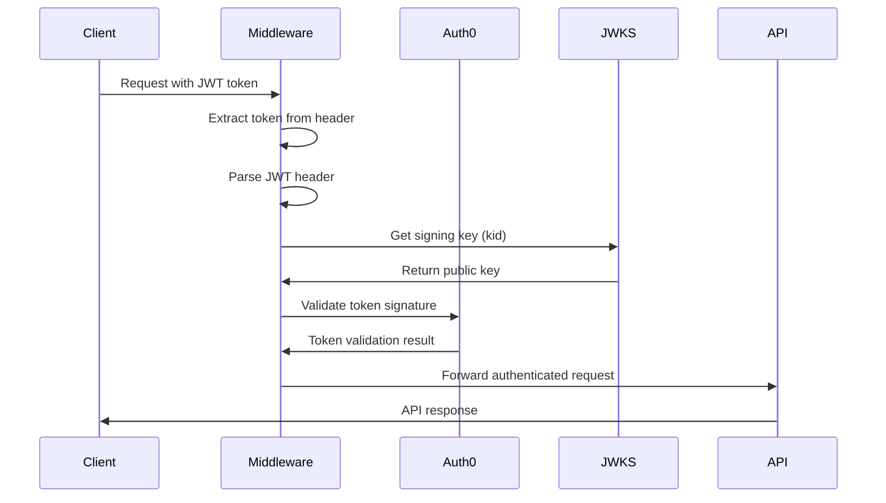

# 🔒 MWAP Authentication Middleware

## 🎯 Overview

This document details the authentication middleware implementation in MWAP, covering JWT token validation, Auth0 integration, error handling, and security best practices.

## 🏗️ Middleware Architecture

### **Authentication Flow**


## 🔧 Implementation

### **Core Authentication Middleware**
```typescript
// src/middleware/auth.ts
import { expressjwt as jwt } from 'express-jwt';
import { Request, Response, NextFunction } from 'express';
import { env } from '../config/env';
import { jwksClient } from '../config/auth0';
import { logInfo, logError } from '../utils/logger';

export const authenticateJWT = () => {
  const middleware = jwt({
    secret: async (req) => {
      try {
        const token = req.headers.authorization?.split(' ')[1] || '';
        
        // Log token information (without the actual token for security)
        logInfo('Processing JWT authentication', {
          endpoint: req.originalUrl,
          method: req.method,
          hasToken: !!token,
          tokenLength: token ? token.length : 0
        });
        
        if (!token) {
          logError('Missing authorization token', { endpoint: req.originalUrl });
          throw new Error('Missing authorization token');
        }
        
        const header = JSON.parse(Buffer.from(token.split('.')[0], 'base64').toString());
        
        logInfo('JWT header parsed', {
          kid: header.kid,
          alg: header.alg
        });
        
        const key = await jwksClient.getSigningKey(header.kid);
        return key.getPublicKey();
      } catch (error) {
        logError('Error processing JWT', {
          error: error instanceof Error ? error.message : String(error),
          stack: error instanceof Error ? error.stack : undefined,
          endpoint: req.originalUrl
        });
        throw error;
      }
    },
    audience: env.AUTH0_AUDIENCE,
    issuer: `https://${env.AUTH0_DOMAIN}/`,
    algorithms: ['RS256']
  });

  return (req: Request, res: Response, next: NextFunction) => {
    middleware(req, res, (err) => {
      if (err) {
        if (err.name === 'UnauthorizedError') {
          logError('Authentication failed', {
            error: err.message,
            code: err.code,
            endpoint: req.originalUrl,
            method: req.method,
            ip: req.ip
          });
          
          return res.status(401).json({
            success: false,
            error: {
              code: 'auth/unauthorized',
              message: 'Invalid or expired token'
            }
          });
        }
        
        logError('Authentication error', {
          error: err.message,
          name: err.name,
          endpoint: req.originalUrl
        });
        
        return next(err);
      }
      
      // Log successful authentication
      logInfo('Authentication successful', {
        user: req.auth?.sub,
        endpoint: req.originalUrl
      });
      
      next();
    });
  };
};
```

### **Auth0 Configuration**
```typescript
// src/config/auth0.ts
import jwksClient from 'jwks-rsa';
import { env } from './env';

export const jwksClient = jwksClient({
  jwksUri: `https://${env.AUTH0_DOMAIN}/.well-known/jwks.json`,
  cache: true,
  cacheMaxEntries: 5,
  cacheMaxAge: 600000, // 10 minutes
  rateLimit: true,
  jwksRequestsPerMinute: 5
});
```

### **Environment Configuration**
```typescript
// src/config/env.ts
import { z } from 'zod';

const envSchema = z.object({
  AUTH0_DOMAIN: z.string().min(1, 'Auth0 domain is required'),
  AUTH0_AUDIENCE: z.string().min(1, 'Auth0 audience is required'),
  NODE_ENV: z.enum(['development', 'staging', 'production']).default('development')
});

export const env = envSchema.parse(process.env);
```

## 🛡️ Security Features

### **Token Validation**
```typescript
interface JWTPayload {
  sub: string;           // Auth0 user ID
  iss: string;           // Issuer (Auth0 domain)
  aud: string;           // Audience (API identifier)
  exp: number;           // Expiration timestamp
  iat: number;           // Issued at timestamp
  azp: string;           // Authorized party
  scope?: string;        // OAuth scopes
  
  // Custom claims (added by Auth0 rules)
  'https://mwap.local/tenant_id'?: string;
  'https://mwap.local/role'?: string;
  'https://mwap.local/permissions'?: string[];
}
```

### **Error Handling**
```typescript
interface AuthError {
  name: string;
  message: string;
  code?: string;
  status?: number;
}

const handleAuthError = (error: AuthError, req: Request, res: Response) => {
  const errorMap = {
    'UnauthorizedError': {
      status: 401,
      code: 'auth/unauthorized',
      message: 'Invalid or expired token'
    },
    'TokenExpiredError': {
      status: 401,
      code: 'auth/token-expired',
      message: 'Token has expired'
    },
    'JsonWebTokenError': {
      status: 401,
      code: 'auth/invalid-token',
      message: 'Invalid token format'
    },
    'NotBeforeError': {
      status: 401,
      code: 'auth/token-not-active',
      message: 'Token not active yet'
    }
  };

  const errorInfo = errorMap[error.name as keyof typeof errorMap] || {
    status: 500,
    code: 'auth/unknown-error',
    message: 'Authentication error occurred'
  };

  logError('Authentication error handled', {
    errorName: error.name,
    errorMessage: error.message,
    endpoint: req.originalUrl,
    ip: req.ip
  });

  return res.status(errorInfo.status).json({
    success: false,
    error: {
      code: errorInfo.code,
      message: errorInfo.message
    }
  });
};
```

## 🔍 Logging and Monitoring

### **Authentication Logging**
```typescript
// Authentication success logging
const logAuthSuccess = (req: Request) => {
  logInfo('Authentication successful', {
    user: req.auth?.sub,
    endpoint: req.originalUrl,
    method: req.method,
    ip: req.ip,
    userAgent: req.get('User-Agent'),
    timestamp: new Date().toISOString()
  });
};

// Authentication failure logging
const logAuthFailure = (error: Error, req: Request) => {
  logError('Authentication failed', {
    error: error.message,
    errorName: error.name,
    endpoint: req.originalUrl,
    method: req.method,
    ip: req.ip,
    userAgent: req.get('User-Agent'),
    timestamp: new Date().toISOString()
  });
};
```

### **Security Monitoring**
```typescript
// Track authentication patterns
const trackAuthPattern = (req: Request, success: boolean) => {
  const pattern = {
    ip: req.ip,
    endpoint: req.originalUrl,
    method: req.method,
    success,
    timestamp: new Date(),
    userAgent: req.get('User-Agent')
  };

  // Store in monitoring system
  // This could be sent to external monitoring service
  if (!success) {
    // Track failed attempts for rate limiting
    trackFailedAttempt(req.ip);
  }
};

const trackFailedAttempt = (ip: string) => {
  // Implementation would track failed attempts
  // and potentially block IPs with too many failures
  logError('Failed authentication attempt tracked', { ip });
};
```

## 🚀 Usage Patterns

### **Route Protection**
```typescript
// src/app.ts
import { authenticateJWT } from './middleware/auth';

const app = express();

// Public routes (no authentication required)
app.get('/health', (req, res) => {
  res.json({ status: 'ok' });
});

// Apply authentication to all routes below this line
app.use(authenticateJWT());

// Protected routes
app.use('/api/v1/tenants', tenantRoutes);
app.use('/api/v1/projects', projectRoutes);
app.use('/api/v1/users', userRoutes);
```

### **Accessing User Information**
```typescript
// In route handlers, access authenticated user info
app.get('/api/v1/profile', (req: Request, res: Response) => {
  const userId = req.auth?.sub;
  const tenantId = req.auth?.['https://mwap.local/tenant_id'];
  const role = req.auth?.['https://mwap.local/role'];
  
  res.json({
    success: true,
    data: {
      userId,
      tenantId,
      role
    }
  });
});
```

### **Custom Claims Extraction**
```typescript
// Utility function to extract custom claims
export const extractUserContext = (req: Request) => {
  const auth = req.auth;
  if (!auth) {
    throw new Error('No authentication context');
  }

  return {
    userId: auth.sub,
    tenantId: auth['https://mwap.local/tenant_id'],
    role: auth['https://mwap.local/role'],
    permissions: auth['https://mwap.local/permissions'] || []
  };
};

// Usage in route handlers
app.get('/api/v1/projects', (req: Request, res: Response) => {
  try {
    const { userId, tenantId, role } = extractUserContext(req);
    
    // Use extracted context for business logic
    const projects = await getProjectsForTenant(tenantId, userId);
    
    res.json({
      success: true,
      data: projects
    });
  } catch (error) {
    res.status(401).json({
      success: false,
      error: {
        code: 'auth/context-missing',
        message: 'Authentication context required'
      }
    });
  }
});
```

## 🧪 Testing

### **Middleware Testing**
```typescript
// src/middleware/__tests__/auth.test.ts
import { Request, Response } from 'express';
import { authenticateJWT } from '../auth';

describe('Authentication Middleware', () => {
  let req: Partial<Request>;
  let res: Partial<Response>;
  let next: jest.Mock;

  beforeEach(() => {
    req = {
      headers: {},
      originalUrl: '/api/v1/test',
      method: 'GET',
      ip: '127.0.0.1'
    };
    res = {
      status: jest.fn().mockReturnThis(),
      json: jest.fn()
    };
    next = jest.fn();
  });

  it('should reject requests without authorization header', async () => {
    const middleware = authenticateJWT();
    
    await middleware(req as Request, res as Response, next);
    
    expect(res.status).toHaveBeenCalledWith(401);
    expect(res.json).toHaveBeenCalledWith({
      success: false,
      error: {
        code: 'auth/unauthorized',
        message: 'Invalid or expired token'
      }
    });
  });

  it('should validate valid JWT tokens', async () => {
    req.headers = {
      authorization: 'Bearer valid-jwt-token'
    };

    // Mock JWKS client response
    jest.mock('../config/auth0', () => ({
      jwksClient: {
        getSigningKey: jest.fn().mockResolvedValue({
          getPublicKey: () => 'mock-public-key'
        })
      }
    }));

    const middleware = authenticateJWT();
    
    await middleware(req as Request, res as Response, next);
    
    expect(next).toHaveBeenCalled();
  });
});
```

## 🔗 Related Documentation

- **[🏛️ Security Architecture](./security-architecture.md)** - Overall security design
- **[🛡️ Security Patterns](./security-patterns.md)** - Security implementation patterns
- **[🏗️ Express Structure](./express-structure.md)** - Server architecture
- **[🔐 Frontend Auth Integration](../03-Frontend/auth0-integration.md)** - Client-side authentication
- **[🔐 Auth0 Integration Guide](../06-Guides/how-to-integrate-auth0.md)** - Complete setup guide

---

*This authentication middleware provides secure, scalable JWT token validation for the MWAP platform with comprehensive logging, error handling, and monitoring capabilities.*