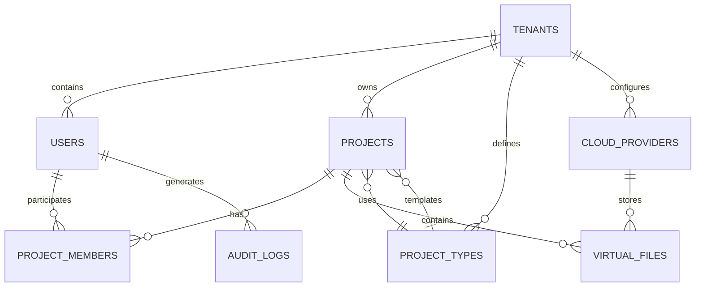

# 🗃️ MWAP Database Models

## 🎯 Overview

This document provides comprehensive documentation of MongoDB models used in the MWAP platform, including schemas, relationships, indexes, and data access patterns with multi-tenant security considerations.

## 🏗️ Database Architecture

### **Multi-Tenant Data Model**
```typescript
interface MultiTenantDocument {
  tenantId: ObjectId;     // Required for all tenant-scoped documents
  createdAt: Date;        // Audit timestamp
  updatedAt: Date;        // Audit timestamp
  createdBy: string;      // Auth0 user ID
  updatedBy?: string;     // Auth0 user ID
}

// Base query pattern for all tenant-scoped operations
const baseTenantQuery = { tenantId: new ObjectId(userTenantId) };
```

### **Database Collections Overview**


## 📊 Core Models

### **Tenant Model**
```typescript
// src/features/tenants/tenant.model.ts
import { Schema, model, Document, ObjectId } from 'mongoose';

export interface ITenant extends Document {
  _id: ObjectId;
  name: string;
  domain: string;
  status: 'active' | 'suspended' | 'archived';
  ownerId: string; // Auth0 user ID
  settings: {
    maxUsers: number;
    maxProjects: number;
    maxStorageGB: number;
    features: string[];
  };
  billing: {
    plan: 'free' | 'pro' | 'enterprise';
    subscriptionId?: string;
    billingEmail: string;
  };
  createdAt: Date;
  updatedAt: Date;
  createdBy: string;
}

const tenantSchema = new Schema<ITenant>({
  name: {
    type: String,
    required: true,
    trim: true,
    maxlength: 100
  },
  domain: {
    type: String,
    required: true,
    unique: true,
    lowercase: true,
    match: /^[a-z0-9-]+$/
  },
  status: {
    type: String,
    enum: ['active', 'suspended', 'archived'],
    default: 'active'
  },
  ownerId: {
    type: String,
    required: true,
    index: true
  },
  settings: {
    maxUsers: { type: Number, default: 10 },
    maxProjects: { type: Number, default: 5 },
    maxStorageGB: { type: Number, default: 1 },
    features: [{ type: String }]
  },
  billing: {
    plan: {
      type: String,
      enum: ['free', 'pro', 'enterprise'],
      default: 'free'
    },
    subscriptionId: String,
    billingEmail: {
      type: String,
      required: true,
      lowercase: true
    }
  }
}, {
  timestamps: true,
  toJSON: { virtuals: true },
  toObject: { virtuals: true }
});

// Indexes
tenantSchema.index({ domain: 1 }, { unique: true });
tenantSchema.index({ ownerId: 1 });
tenantSchema.index({ status: 1 });
tenantSchema.index({ 'billing.plan': 1 });

// Virtual for user count
tenantSchema.virtual('userCount', {
  ref: 'User',
  localField: '_id',
  foreignField: 'tenantId',
  count: true
});

export const Tenant = model<ITenant>('Tenant', tenantSchema);
```

### **User Model**
```typescript
// src/features/users/user.model.ts
import { Schema, model, Document, ObjectId } from 'mongoose';

export interface IUser extends Document {
  auth0Id: string; // Primary identifier from Auth0
  email: string;
  name: string;
  tenantId: ObjectId;
  role: 'superadmin' | 'tenant_owner' | 'project_member';
  isActive: boolean;
  profile: {
    avatar?: string;
    bio?: string;
    timezone: string;
    language: string;
  };
  preferences: {
    notifications: {
      email: boolean;
      push: boolean;
      digest: boolean;
    };
    theme: 'light' | 'dark' | 'auto';
  };
  lastLogin?: Date;
  createdAt: Date;
  updatedAt: Date;
  createdBy: string;
}

const userSchema = new Schema<IUser>({
  auth0Id: {
    type: String,
    required: true,
    unique: true,
    index: true
  },
  email: {
    type: String,
    required: true,
    lowercase: true,
    trim: true
  },
  name: {
    type: String,
    required: true,
    trim: true,
    maxlength: 100
  },
  tenantId: {
    type: Schema.Types.ObjectId,
    ref: 'Tenant',
    required: true,
    index: true
  },
  role: {
    type: String,
    enum: ['superadmin', 'tenant_owner', 'project_member'],
    default: 'project_member'
  },
  isActive: {
    type: Boolean,
    default: true
  },
  profile: {
    avatar: String,
    bio: { type: String, maxlength: 500 },
    timezone: { type: String, default: 'UTC' },
    language: { type: String, default: 'en' }
  },
  preferences: {
    notifications: {
      email: { type: Boolean, default: true },
      push: { type: Boolean, default: true },
      digest: { type: Boolean, default: false }
    },
    theme: {
      type: String,
      enum: ['light', 'dark', 'auto'],
      default: 'light'
    }
  },
  lastLogin: Date
}, {
  timestamps: true,
  toJSON: { virtuals: true },
  toObject: { virtuals: true }
});

// Compound indexes for multi-tenant queries
userSchema.index({ tenantId: 1, email: 1 }, { unique: true });
userSchema.index({ tenantId: 1, role: 1 });
userSchema.index({ tenantId: 1, isActive: 1 });
userSchema.index({ tenantId: 1, lastLogin: -1 });

// Virtual for project memberships
userSchema.virtual('projectMemberships', {
  ref: 'ProjectMember',
  localField: 'auth0Id',
  foreignField: 'userId'
});

export const User = model<IUser>('User', userSchema);
```

### **Project Model**
```typescript
// src/features/projects/project.model.ts
import { Schema, model, Document, ObjectId } from 'mongoose';

export interface IProject extends Document {
  name: string;
  description?: string;
  tenantId: ObjectId;
  projectTypeId: ObjectId;
  status: 'active' | 'archived' | 'draft';
  visibility: 'private' | 'team' | 'public';
  settings: {
    allowFileUpload: boolean;
    maxFileSize: number;
    allowedFileTypes: string[];
    autoBackup: boolean;
  };
  metadata: {
    tags: string[];
    category?: string;
    priority: 'low' | 'medium' | 'high';
  };
  stats: {
    fileCount: number;
    totalSize: number;
    memberCount: number;
    lastActivity: Date;
  };
  createdAt: Date;
  updatedAt: Date;
  createdBy: string;
}

const projectSchema = new Schema<IProject>({
  name: {
    type: String,
    required: true,
    trim: true,
    maxlength: 100
  },
  description: {
    type: String,
    maxlength: 1000
  },
  tenantId: {
    type: Schema.Types.ObjectId,
    ref: 'Tenant',
    required: true,
    index: true
  },
  projectTypeId: {
    type: Schema.Types.ObjectId,
    ref: 'ProjectType',
    required: true
  },
  status: {
    type: String,
    enum: ['active', 'archived', 'draft'],
    default: 'active'
  },
  visibility: {
    type: String,
    enum: ['private', 'team', 'public'],
    default: 'team'
  },
  settings: {
    allowFileUpload: { type: Boolean, default: true },
    maxFileSize: { type: Number, default: 10485760 }, // 10MB
    allowedFileTypes: [{ type: String }],
    autoBackup: { type: Boolean, default: false }
  },
  metadata: {
    tags: [{ type: String, trim: true }],
    category: String,
    priority: {
      type: String,
      enum: ['low', 'medium', 'high'],
      default: 'medium'
    }
  },
  stats: {
    fileCount: { type: Number, default: 0 },
    totalSize: { type: Number, default: 0 },
    memberCount: { type: Number, default: 0 },
    lastActivity: { type: Date, default: Date.now }
  }
}, {
  timestamps: true,
  toJSON: { virtuals: true },
  toObject: { virtuals: true }
});

// Compound indexes for multi-tenant queries
projectSchema.index({ tenantId: 1, status: 1 });
projectSchema.index({ tenantId: 1, createdBy: 1 });
projectSchema.index({ tenantId: 1, projectTypeId: 1 });
projectSchema.index({ tenantId: 1, 'metadata.tags': 1 });
projectSchema.index({ tenantId: 1, 'stats.lastActivity': -1 });

// Text search index
projectSchema.index({
  name: 'text',
  description: 'text',
  'metadata.tags': 'text'
});

// Virtual for members
projectSchema.virtual('members', {
  ref: 'ProjectMember',
  localField: '_id',
  foreignField: 'projectId'
});

// Virtual for files
projectSchema.virtual('files', {
  ref: 'VirtualFile',
  localField: '_id',
  foreignField: 'projectId'
});

export const Project = model<IProject>('Project', projectSchema);
```

### **Project Member Model**
```typescript
// src/features/projects/project-member.model.ts
import { Schema, model, Document, ObjectId } from 'mongoose';

export interface IProjectMember extends Document {
  projectId: ObjectId;
  userId: string; // Auth0 user ID
  tenantId: ObjectId; // For tenant isolation
  role: 'owner' | 'admin' | 'member' | 'viewer';
  permissions: string[];
  status: 'active' | 'inactive' | 'pending';
  joinedAt: Date;
  invitedBy: string;
  createdAt: Date;
  updatedAt: Date;
}

const projectMemberSchema = new Schema<IProjectMember>({
  projectId: {
    type: Schema.Types.ObjectId,
    ref: 'Project',
    required: true,
    index: true
  },
  userId: {
    type: String,
    required: true,
    index: true
  },
  tenantId: {
    type: Schema.Types.ObjectId,
    ref: 'Tenant',
    required: true,
    index: true
  },
  role: {
    type: String,
    enum: ['owner', 'admin', 'member', 'viewer'],
    default: 'member'
  },
  permissions: [{ type: String }],
  status: {
    type: String,
    enum: ['active', 'inactive', 'pending'],
    default: 'active'
  },
  joinedAt: {
    type: Date,
    default: Date.now
  },
  invitedBy: {
    type: String,
    required: true
  }
}, {
  timestamps: true
});

// Compound indexes for multi-tenant queries
projectMemberSchema.index({ tenantId: 1, projectId: 1, userId: 1 }, { unique: true });
projectMemberSchema.index({ tenantId: 1, userId: 1 });
projectMemberSchema.index({ tenantId: 1, projectId: 1, status: 1 });
projectMemberSchema.index({ tenantId: 1, projectId: 1, role: 1 });

export const ProjectMember = model<IProjectMember>('ProjectMember', projectMemberSchema);
```

### **Virtual File Model**
```typescript
// src/features/files/virtual-file.model.ts
import { Schema, model, Document, ObjectId } from 'mongoose';

export interface IVirtualFile extends Document {
  name: string;
  originalName: string;
  path: string;
  size: number;
  mimeType: string;
  projectId: ObjectId;
  tenantId: ObjectId;
  cloudProviderId?: ObjectId;
  cloudPath?: string;
  metadata: {
    description?: string;
    tags: string[];
    version: number;
    checksum: string;
  };
  access: {
    isPublic: boolean;
    allowedUsers: string[];
    expiresAt?: Date;
  };
  stats: {
    downloadCount: number;
    lastAccessed?: Date;
  };
  createdAt: Date;
  updatedAt: Date;
  createdBy: string;
}

const virtualFileSchema = new Schema<IVirtualFile>({
  name: {
    type: String,
    required: true,
    trim: true,
    maxlength: 255
  },
  originalName: {
    type: String,
    required: true,
    maxlength: 255
  },
  path: {
    type: String,
    required: true
  },
  size: {
    type: Number,
    required: true,
    min: 0
  },
  mimeType: {
    type: String,
    required: true
  },
  projectId: {
    type: Schema.Types.ObjectId,
    ref: 'Project',
    required: true,
    index: true
  },
  tenantId: {
    type: Schema.Types.ObjectId,
    ref: 'Tenant',
    required: true,
    index: true
  },
  cloudProviderId: {
    type: Schema.Types.ObjectId,
    ref: 'CloudProvider'
  },
  cloudPath: String,
  metadata: {
    description: { type: String, maxlength: 500 },
    tags: [{ type: String, trim: true }],
    version: { type: Number, default: 1 },
    checksum: { type: String, required: true }
  },
  access: {
    isPublic: { type: Boolean, default: false },
    allowedUsers: [{ type: String }],
    expiresAt: Date
  },
  stats: {
    downloadCount: { type: Number, default: 0 },
    lastAccessed: Date
  }
}, {
  timestamps: true,
  toJSON: { virtuals: true },
  toObject: { virtuals: true }
});

// Compound indexes for multi-tenant queries
virtualFileSchema.index({ tenantId: 1, projectId: 1 });
virtualFileSchema.index({ tenantId: 1, createdBy: 1 });
virtualFileSchema.index({ tenantId: 1, mimeType: 1 });
virtualFileSchema.index({ tenantId: 1, 'metadata.tags': 1 });
virtualFileSchema.index({ tenantId: 1, createdAt: -1 });

// Text search index
virtualFileSchema.index({
  name: 'text',
  originalName: 'text',
  'metadata.description': 'text',
  'metadata.tags': 'text'
});

export const VirtualFile = model<IVirtualFile>('VirtualFile', virtualFileSchema);
```

## 🔒 Security & Access Patterns

### **Tenant Isolation Repository Pattern**
```typescript
// src/shared/repositories/base.repository.ts
import { Model, Document, FilterQuery, UpdateQuery, ObjectId } from 'mongoose';
import { AppError } from '../errors/AppError';

export abstract class BaseRepository<T extends Document> {
  constructor(
    protected model: Model<T>,
    protected requiresTenantId: boolean = true
  ) {}

  async findByTenant(
    tenantId: string,
    filter: FilterQuery<T> = {},
    options: any = {}
  ): Promise<T[]> {
    const query = this.requiresTenantId 
      ? { ...filter, tenantId: new ObjectId(tenantId) }
      : filter;

    return this.model.find(query, null, options);
  }

  async findOneByTenant(
    tenantId: string,
    filter: FilterQuery<T>,
    options: any = {}
  ): Promise<T | null> {
    const query = this.requiresTenantId 
      ? { ...filter, tenantId: new ObjectId(tenantId) }
      : filter;

    return this.model.findOne(query, null, options);
  }

  async createWithTenant(
    tenantId: string,
    data: Partial<T>,
    createdBy: string
  ): Promise<T> {
    const document = this.requiresTenantId 
      ? { ...data, tenantId: new ObjectId(tenantId), createdBy }
      : { ...data, createdBy };

    return this.model.create(document);
  }

  async updateByTenant(
    tenantId: string,
    filter: FilterQuery<T>,
    update: UpdateQuery<T>,
    updatedBy: string
  ): Promise<T | null> {
    const query = this.requiresTenantId 
      ? { ...filter, tenantId: new ObjectId(tenantId) }
      : filter;

    return this.model.findOneAndUpdate(
      query,
      { ...update, updatedBy, updatedAt: new Date() },
      { new: true }
    );
  }

  async deleteByTenant(
    tenantId: string,
    filter: FilterQuery<T>
  ): Promise<boolean> {
    const query = this.requiresTenantId 
      ? { ...filter, tenantId: new ObjectId(tenantId) }
      : filter;

    const result = await this.model.deleteOne(query);
    return result.deletedCount > 0;
  }

  async countByTenant(
    tenantId: string,
    filter: FilterQuery<T> = {}
  ): Promise<number> {
    const query = this.requiresTenantId 
      ? { ...filter, tenantId: new ObjectId(tenantId) }
      : filter;

    return this.model.countDocuments(query);
  }
}
```

### **Project Repository Implementation**
```typescript
// src/features/projects/project.repository.ts
import { BaseRepository } from '../../shared/repositories/base.repository';
import { Project, IProject } from './project.model';

export class ProjectRepository extends BaseRepository<IProject> {
  constructor() {
    super(Project, true); // Requires tenant ID
  }

  async findActiveProjects(tenantId: string): Promise<IProject[]> {
    return this.findByTenant(tenantId, { status: 'active' }, {
      sort: { 'stats.lastActivity': -1 }
    });
  }

  async findProjectsByType(
    tenantId: string,
    projectTypeId: string
  ): Promise<IProject[]> {
    return this.findByTenant(tenantId, {
      projectTypeId: new ObjectId(projectTypeId),
      status: 'active'
    });
  }

  async searchProjects(
    tenantId: string,
    searchTerm: string
  ): Promise<IProject[]> {
    return this.findByTenant(tenantId, {
      $text: { $search: searchTerm },
      status: 'active'
    }, {
      score: { $meta: 'textScore' },
      sort: { score: { $meta: 'textScore' } }
    });
  }

  async updateProjectStats(
    tenantId: string,
    projectId: string,
    stats: Partial<IProject['stats']>
  ): Promise<IProject | null> {
    return this.updateByTenant(
      tenantId,
      { _id: new ObjectId(projectId) },
      { $set: { 'stats': stats, 'stats.lastActivity': new Date() } },
      'system'
    );
  }
}
```

## 📊 Data Access Patterns

### **Service Layer Pattern**
```typescript
// src/features/projects/project.service.ts
import { ProjectRepository } from './project.repository';
import { ProjectMemberRepository } from './project-member.repository';
import { AppError } from '../../shared/errors/AppError';
import { logger } from '../../shared/utils/logger';

export class ProjectService {
  constructor(
    private projectRepository: ProjectRepository,
    private projectMemberRepository: ProjectMemberRepository
  ) {}

  async createProject(
    tenantId: string,
    userId: string,
    projectData: CreateProjectRequest
  ): Promise<IProject> {
    try {
      // Validate tenant limits
      await this.validateTenantLimits(tenantId);

      // Create project
      const project = await this.projectRepository.createWithTenant(
        tenantId,
        {
          ...projectData,
          stats: {
            fileCount: 0,
            totalSize: 0,
            memberCount: 1,
            lastActivity: new Date()
          }
        },
        userId
      );

      // Add creator as project owner
      await this.projectMemberRepository.createWithTenant(
        tenantId,
        {
          projectId: project._id,
          userId,
          role: 'owner',
          permissions: ['project:*'],
          status: 'active',
          invitedBy: userId
        },
        userId
      );

      logger.info('Project created', {
        projectId: project._id,
        tenantId,
        userId
      });

      return project;
    } catch (error) {
      logger.error('Project creation failed', {
        error: error.message,
        tenantId,
        userId,
        projectData
      });
      throw error;
    }
  }

  async getProject(
    tenantId: string,
    projectId: string,
    userId: string
  ): Promise<IProject> {
    // Check project access
    const hasAccess = await this.checkProjectAccess(tenantId, projectId, userId);
    if (!hasAccess) {
      throw new AppError('Project not found or access denied', 404);
    }

    const project = await this.projectRepository.findOneByTenant(
      tenantId,
      { _id: new ObjectId(projectId) }
    );

    if (!project) {
      throw new AppError('Project not found', 404);
    }

    return project;
  }

  private async checkProjectAccess(
    tenantId: string,
    projectId: string,
    userId: string
  ): Promise<boolean> {
    const membership = await this.projectMemberRepository.findOneByTenant(
      tenantId,
      {
        projectId: new ObjectId(projectId),
        userId,
        status: 'active'
      }
    );

    return !!membership;
  }

  private async validateTenantLimits(tenantId: string): Promise<void> {
    const projectCount = await this.projectRepository.countByTenant(
      tenantId,
      { status: { $ne: 'archived' } }
    );

    // Get tenant limits (simplified - would fetch from tenant settings)
    const maxProjects = 10; // This would come from tenant.settings.maxProjects

    if (projectCount >= maxProjects) {
      throw new AppError('Project limit exceeded', 400, 'LIMIT_EXCEEDED');
    }
  }
}
```

### **Aggregation Patterns**
```typescript
// src/features/analytics/analytics.service.ts
export class AnalyticsService {
  async getTenantStats(tenantId: string): Promise<TenantStats> {
    const tenantObjectId = new ObjectId(tenantId);

    // Project statistics
    const projectStats = await Project.aggregate([
      { $match: { tenantId: tenantObjectId } },
      {
        $group: {
          _id: '$status',
          count: { $sum: 1 },
          totalSize: { $sum: '$stats.totalSize' },
          totalFiles: { $sum: '$stats.fileCount' }
        }
      }
    ]);

    // User activity
    const userActivity = await User.aggregate([
      { $match: { tenantId: tenantObjectId, isActive: true } },
      {
        $group: {
          _id: {
            $dateToString: {
              format: '%Y-%m-%d',
              date: '$lastLogin'
            }
          },
          activeUsers: { $sum: 1 }
        }
      },
      { $sort: { _id: -1 } },
      { $limit: 30 }
    ]);

    // File upload trends
    const fileUploadTrends = await VirtualFile.aggregate([
      { $match: { tenantId: tenantObjectId } },
      {
        $group: {
          _id: {
            year: { $year: '$createdAt' },
            month: { $month: '$createdAt' },
            day: { $dayOfMonth: '$createdAt' }
          },
          uploads: { $sum: 1 },
          totalSize: { $sum: '$size' }
        }
      },
      { $sort: { '_id.year': -1, '_id.month': -1, '_id.day': -1 } },
      { $limit: 30 }
    ]);

    return {
      projects: projectStats,
      userActivity,
      fileUploadTrends
    };
  }
}
```

## 🔗 Related Documentation

- **[🏛️ System Architecture](../02-Architecture/diagrams/system-architecture.md)** - Overall system design
- **[🗄️ Database Schema](../02-Architecture/database-schema.md)** - Data architecture overview
- **[🏗️ Express Structure](./express-structure.md)** - Server architecture
- **[🔒 Security Architecture](./security-architecture.md)** - Security patterns
- **[📋 API Documentation](./API-v3.md)** - API endpoints and usage

---

*These database models provide a secure, scalable foundation for the MWAP platform with proper multi-tenant isolation, comprehensive indexing, and efficient data access patterns.*