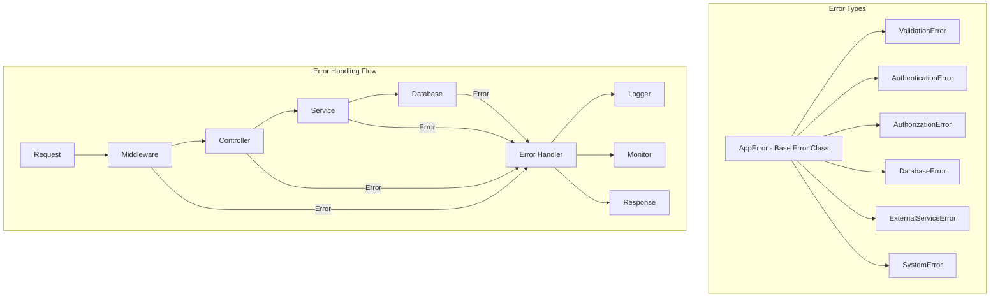

# ❌ MWAP Error Handling

## 🎯 Overview

This document outlines the comprehensive error handling strategy for the MWAP platform, covering error types, handling patterns, logging, monitoring, and user experience considerations.

## 🏗️ Error Handling Architecture

### **Error Hierarchy**


## 🔧 Core Error Classes

### **Base AppError Class**
```typescript
// src/utils/AppError.ts
export class AppError extends Error {
  public readonly statusCode: number;
  public readonly errorCode: string;
  public readonly isOperational: boolean;
  public readonly timestamp: Date;
  public readonly requestId?: string;
  public readonly userId?: string;
  public readonly context?: Record<string, any>;

  constructor(
    message: string,
    statusCode: number = 500,
    errorCode: string = 'INTERNAL_ERROR',
    isOperational: boolean = true,
    context?: Record<string, any>
  ) {
    super(message);
    
    this.name = this.constructor.name;
    this.statusCode = statusCode;
    this.errorCode = errorCode;
    this.isOperational = isOperational;
    this.timestamp = new Date();
    this.context = context;

    // Capture stack trace
    Error.captureStackTrace(this, this.constructor);
  }

  // Convert to JSON for API responses
  toJSON(): ErrorResponse {
    return {
      success: false,
      error: {
        code: this.errorCode,
        message: this.message,
        timestamp: this.timestamp.toISOString(),
        ...(process.env.NODE_ENV === 'development' && {
          stack: this.stack,
          context: this.context
        })
      }
    };
  }

  // Check if error should be reported to monitoring
  shouldReport(): boolean {
    return !this.isOperational || this.statusCode >= 500;
  }

  // Get log level based on error severity
  getLogLevel(): 'error' | 'warn' | 'info' {
    if (this.statusCode >= 500) return 'error';
    if (this.statusCode >= 400) return 'warn';
    return 'info';
  }
}
```

### **Specialized Error Classes**
```typescript
// src/utils/errors/ValidationError.ts
export class ValidationError extends AppError {
  public readonly field?: string;
  public readonly value?: any;
  public readonly validationRules?: string[];

  constructor(
    message: string,
    field?: string,
    value?: any,
    validationRules?: string[]
  ) {
    super(message, 400, 'VALIDATION_ERROR', true, {
      field,
      value,
      validationRules
    });
    
    this.field = field;
    this.value = value;
    this.validationRules = validationRules;
  }
}

// src/utils/errors/AuthenticationError.ts
export class AuthenticationError extends AppError {
  public readonly authMethod?: string;
  public readonly attemptCount?: number;

  constructor(
    message: string = 'Authentication failed',
    authMethod?: string,
    attemptCount?: number
  ) {
    super(message, 401, 'AUTHENTICATION_ERROR', true, {
      authMethod,
      attemptCount
    });
    
    this.authMethod = authMethod;
    this.attemptCount = attemptCount;
  }
}

// src/utils/errors/AuthorizationError.ts
export class AuthorizationError extends AppError {
  public readonly requiredPermission?: string;
  public readonly userRole?: string;
  public readonly resource?: string;

  constructor(
    message: string = 'Access denied',
    requiredPermission?: string,
    userRole?: string,
    resource?: string
  ) {
    super(message, 403, 'AUTHORIZATION_ERROR', true, {
      requiredPermission,
      userRole,
      resource
    });
    
    this.requiredPermission = requiredPermission;
    this.userRole = userRole;
    this.resource = resource;
  }
}

// src/utils/errors/DatabaseError.ts
export class DatabaseError extends AppError {
  public readonly operation?: string;
  public readonly collection?: string;
  public readonly query?: any;

  constructor(
    message: string,
    operation?: string,
    collection?: string,
    query?: any
  ) {
    super(message, 500, 'DATABASE_ERROR', false, {
      operation,
      collection,
      query: process.env.NODE_ENV === 'development' ? query : undefined
    });
    
    this.operation = operation;
    this.collection = collection;
    this.query = query;
  }
}

// src/utils/errors/ExternalServiceError.ts
export class ExternalServiceError extends AppError {
  public readonly service?: string;
  public readonly endpoint?: string;
  public readonly responseStatus?: number;

  constructor(
    message: string,
    service?: string,
    endpoint?: string,
    responseStatus?: number
  ) {
    super(message, 502, 'EXTERNAL_SERVICE_ERROR', true, {
      service,
      endpoint,
      responseStatus
    });
    
    this.service = service;
    this.endpoint = endpoint;
    this.responseStatus = responseStatus;
  }
}
```

## 🛡️ Error Handler Middleware

### **Global Error Handler**
```typescript
// src/middleware/errorHandler.ts
import { Request, Response, NextFunction } from 'express';
import { AppError } from '../utils/AppError';
import { logError, logWarn, logInfo } from '../utils/logger';
import { reportError } from '../utils/monitoring';

export const errorHandler = (
  error: Error,
  req: Request,
  res: Response,
  next: NextFunction
): void => {
  // Ensure error is an AppError instance
  let appError: AppError;
  
  if (error instanceof AppError) {
    appError = error;
  } else {
    // Convert unknown errors to AppError
    appError = new AppError(
      process.env.NODE_ENV === 'production' 
        ? 'Internal server error' 
        : error.message,
      500,
      'INTERNAL_ERROR',
      false,
      { originalError: error.message }
    );
  }

  // Add request context
  appError.requestId = req.id;
  appError.userId = req.auth?.sub;
  appError.context = {
    ...appError.context,
    method: req.method,
    url: req.originalUrl,
    ip: req.ip,
    userAgent: req.get('User-Agent'),
    timestamp: new Date().toISOString()
  };

  // Log error based on severity
  const logData = {
    error: appError.message,
    errorCode: appError.errorCode,
    statusCode: appError.statusCode,
    stack: appError.stack,
    context: appError.context,
    requestId: appError.requestId,
    userId: appError.userId
  };

  switch (appError.getLogLevel()) {
    case 'error':
      logError('Application error occurred', logData);
      break;
    case 'warn':
      logWarn('Application warning', logData);
      break;
    case 'info':
      logInfo('Application info', logData);
      break;
  }

  // Report to monitoring if needed
  if (appError.shouldReport()) {
    reportError(appError, req);
  }

  // Send response
  res.status(appError.statusCode).json(appError.toJSON());
};

// Async error wrapper
export const asyncHandler = (
  fn: (req: Request, res: Response, next: NextFunction) => Promise<any>
) => {
  return (req: Request, res: Response, next: NextFunction) => {
    Promise.resolve(fn(req, res, next)).catch(next);
  };
};

// 404 handler
export const notFoundHandler = (
  req: Request,
  res: Response,
  next: NextFunction
): void => {
  const error = new AppError(
    `Route not found: ${req.method} ${req.originalUrl}`,
    404,
    'ROUTE_NOT_FOUND'
  );
  next(error);
};
```

### **Validation Error Handler**
```typescript
// src/middleware/validationErrorHandler.ts
import { Request, Response, NextFunction } from 'express';
import { ZodError } from 'zod';
import { ValidationError } from '../utils/errors/ValidationError';

export const handleValidationError = (
  error: Error,
  req: Request,
  res: Response,
  next: NextFunction
): void => {
  if (error instanceof ZodError) {
    const validationErrors = error.errors.map(err => ({
      field: err.path.join('.'),
      message: err.message,
      code: err.code,
      value: err.input
    }));

    const validationError = new ValidationError(
      'Validation failed',
      undefined,
      undefined,
      validationErrors.map(e => e.message)
    );

    validationError.context = {
      ...validationError.context,
      validationErrors
    };

    return next(validationError);
  }

  next(error);
};
```

## 🔍 Error Monitoring and Reporting

### **Error Monitoring Service**
```typescript
// src/utils/monitoring.ts
import { AppError } from './AppError';
import { Request } from 'express';
import { logError } from './logger';

interface ErrorReport {
  error: AppError;
  request: {
    id?: string;
    method: string;
    url: string;
    ip: string;
    userAgent?: string;
    userId?: string;
  };
  environment: {
    nodeEnv: string;
    version: string;
    timestamp: string;
  };
}

class ErrorMonitor {
  private errorCounts = new Map<string, number>();
  private alertThresholds = {
    'AUTHENTICATION_ERROR': 10,
    'AUTHORIZATION_ERROR': 5,
    'DATABASE_ERROR': 3,
    'EXTERNAL_SERVICE_ERROR': 5,
    'VALIDATION_ERROR': 20
  };

  async reportError(error: AppError, req: Request): Promise<void> {
    const report: ErrorReport = {
      error,
      request: {
        id: req.id,
        method: req.method,
        url: req.originalUrl,
        ip: req.ip,
        userAgent: req.get('User-Agent'),
        userId: req.auth?.sub
      },
      environment: {
        nodeEnv: process.env.NODE_ENV || 'unknown',
        version: process.env.APP_VERSION || 'unknown',
        timestamp: new Date().toISOString()
      }
    };

    // Log the error report
    logError('Error report generated', report);

    // Track error frequency
    this.trackErrorFrequency(error.errorCode);

    // Send to external monitoring services
    await this.sendToMonitoringServices(report);

    // Check for alert conditions
    await this.checkAlertConditions(error.errorCode);
  }

  private trackErrorFrequency(errorCode: string): void {
    const current = this.errorCounts.get(errorCode) || 0;
    this.errorCounts.set(errorCode, current + 1);

    // Reset counters every hour
    setTimeout(() => {
      this.errorCounts.set(errorCode, 0);
    }, 60 * 60 * 1000);
  }

  private async sendToMonitoringServices(report: ErrorReport): Promise<void> {
    // Send to external monitoring services (Sentry, DataDog, etc.)
    try {
      if (process.env.SENTRY_DSN) {
        await this.sendToSentry(report);
      }

      if (process.env.DATADOG_API_KEY) {
        await this.sendToDataDog(report);
      }

      if (process.env.SLACK_WEBHOOK_URL) {
        await this.sendToSlack(report);
      }
    } catch (monitoringError) {
      logError('Failed to send error report to monitoring services', {
        error: monitoringError,
        originalReport: report
      });
    }
  }

  private async checkAlertConditions(errorCode: string): Promise<void> {
    const count = this.errorCounts.get(errorCode) || 0;
    const threshold = this.alertThresholds[errorCode];

    if (threshold && count >= threshold) {
      await this.sendAlert({
        type: 'error_threshold_exceeded',
        errorCode,
        count,
        threshold,
        timestamp: new Date().toISOString()
      });
    }
  }

  private async sendAlert(alert: any): Promise<void> {
    // Send alert to appropriate channels
    logError('Error threshold exceeded', alert);
    
    // Send to alerting systems
    if (process.env.PAGERDUTY_API_KEY) {
      await this.sendToPagerDuty(alert);
    }
  }
}

export const errorMonitor = new ErrorMonitor();
export const reportError = errorMonitor.reportError.bind(errorMonitor);
```

### **Error Analytics**
```typescript
// src/utils/errorAnalytics.ts
interface ErrorMetrics {
  totalErrors: number;
  errorsByType: Record<string, number>;
  errorsByEndpoint: Record<string, number>;
  errorsByUser: Record<string, number>;
  errorTrends: {
    hourly: number[];
    daily: number[];
    weekly: number[];
  };
}

class ErrorAnalytics {
  private metrics: ErrorMetrics = {
    totalErrors: 0,
    errorsByType: {},
    errorsByEndpoint: {},
    errorsByUser: {},
    errorTrends: {
      hourly: new Array(24).fill(0),
      daily: new Array(7).fill(0),
      weekly: new Array(52).fill(0)
    }
  };

  recordError(error: AppError, req: Request): void {
    this.metrics.totalErrors++;
    
    // Track by error type
    this.metrics.errorsByType[error.errorCode] = 
      (this.metrics.errorsByType[error.errorCode] || 0) + 1;
    
    // Track by endpoint
    const endpoint = `${req.method} ${req.route?.path || req.path}`;
    this.metrics.errorsByEndpoint[endpoint] = 
      (this.metrics.errorsByEndpoint[endpoint] || 0) + 1;
    
    // Track by user (if authenticated)
    if (req.auth?.sub) {
      this.metrics.errorsByUser[req.auth.sub] = 
        (this.metrics.errorsByUser[req.auth.sub] || 0) + 1;
    }
    
    // Update trends
    this.updateTrends();
  }

  private updateTrends(): void {
    const now = new Date();
    const hour = now.getHours();
    const day = now.getDay();
    const week = this.getWeekOfYear(now);
    
    this.metrics.errorTrends.hourly[hour]++;
    this.metrics.errorTrends.daily[day]++;
    this.metrics.errorTrends.weekly[week % 52]++;
  }

  getMetrics(): ErrorMetrics {
    return { ...this.metrics };
  }

  getTopErrors(limit: number = 10): Array<{ type: string; count: number }> {
    return Object.entries(this.metrics.errorsByType)
      .sort(([, a], [, b]) => b - a)
      .slice(0, limit)
      .map(([type, count]) => ({ type, count }));
  }

  getErrorRate(timeWindow: number = 60 * 60 * 1000): number {
    // Calculate error rate per hour
    const totalRequests = this.getTotalRequests(timeWindow);
    const totalErrors = this.metrics.totalErrors;
    
    return totalRequests > 0 ? (totalErrors / totalRequests) * 100 : 0;
  }

  private getTotalRequests(timeWindow: number): number {
    // This would typically come from request metrics
    // For now, return a placeholder
    return 1000;
  }

  private getWeekOfYear(date: Date): number {
    const start = new Date(date.getFullYear(), 0, 1);
    const diff = date.getTime() - start.getTime();
    return Math.floor(diff / (7 * 24 * 60 * 60 * 1000));
  }
}

export const errorAnalytics = new ErrorAnalytics();
```

## 🎯 Error Response Patterns

### **Standardized Error Responses**
```typescript
// src/types/responses.ts
export interface ErrorResponse {
  success: false;
  error: {
    code: string;
    message: string;
    timestamp: string;
    details?: any;
    stack?: string;
    context?: Record<string, any>;
  };
}

export interface ValidationErrorResponse extends ErrorResponse {
  error: ErrorResponse['error'] & {
    validationErrors: Array<{
      field: string;
      message: string;
      code: string;
      value?: any;
    }>;
  };
}

// src/utils/responseHelpers.ts
export const createErrorResponse = (
  error: AppError,
  includeStack: boolean = false
): ErrorResponse => {
  return {
    success: false,
    error: {
      code: error.errorCode,
      message: error.message,
      timestamp: error.timestamp.toISOString(),
      ...(includeStack && { stack: error.stack }),
      ...(error.context && { context: error.context })
    }
  };
};

export const createValidationErrorResponse = (
  error: ValidationError
): ValidationErrorResponse => {
  return {
    success: false,
    error: {
      code: error.errorCode,
      message: error.message,
      timestamp: error.timestamp.toISOString(),
      validationErrors: error.context?.validationErrors || []
    }
  };
};
```

### **Error Recovery Patterns**
```typescript
// src/utils/errorRecovery.ts
export class ErrorRecovery {
  static async withRetry<T>(
    operation: () => Promise<T>,
    maxRetries: number = 3,
    delay: number = 1000
  ): Promise<T> {
    let lastError: Error;
    
    for (let attempt = 1; attempt <= maxRetries; attempt++) {
      try {
        return await operation();
      } catch (error) {
        lastError = error as Error;
        
        if (attempt === maxRetries) {
          throw new AppError(
            `Operation failed after ${maxRetries} attempts: ${lastError.message}`,
            500,
            'RETRY_EXHAUSTED',
            false,
            { attempts: maxRetries, lastError: lastError.message }
          );
        }
        
        // Wait before retry
        await new Promise(resolve => setTimeout(resolve, delay * attempt));
      }
    }
    
    throw lastError!;
  }

  static async withFallback<T>(
    primary: () => Promise<T>,
    fallback: () => Promise<T>
  ): Promise<T> {
    try {
      return await primary();
    } catch (error) {
      logWarn('Primary operation failed, using fallback', {
        error: error instanceof Error ? error.message : String(error)
      });
      
      try {
        return await fallback();
      } catch (fallbackError) {
        throw new AppError(
          'Both primary and fallback operations failed',
          500,
          'FALLBACK_FAILED',
          false,
          {
            primaryError: error instanceof Error ? error.message : String(error),
            fallbackError: fallbackError instanceof Error ? fallbackError.message : String(fallbackError)
          }
        );
      }
    }
  }

  static async withCircuitBreaker<T>(
    operation: () => Promise<T>,
    circuitBreaker: CircuitBreaker
  ): Promise<T> {
    if (circuitBreaker.isOpen()) {
      throw new AppError(
        'Circuit breaker is open',
        503,
        'CIRCUIT_BREAKER_OPEN',
        true,
        { circuitBreakerState: 'open' }
      );
    }

    try {
      const result = await operation();
      circuitBreaker.recordSuccess();
      return result;
    } catch (error) {
      circuitBreaker.recordFailure();
      throw error;
    }
  }
}

// Circuit breaker implementation
class CircuitBreaker {
  private failures = 0;
  private lastFailureTime = 0;
  private state: 'closed' | 'open' | 'half-open' = 'closed';

  constructor(
    private failureThreshold: number = 5,
    private timeout: number = 60000
  ) {}

  isOpen(): boolean {
    if (this.state === 'open') {
      if (Date.now() - this.lastFailureTime > this.timeout) {
        this.state = 'half-open';
        return false;
      }
      return true;
    }
    return false;
  }

  recordSuccess(): void {
    this.failures = 0;
    this.state = 'closed';
  }

  recordFailure(): void {
    this.failures++;
    this.lastFailureTime = Date.now();
    
    if (this.failures >= this.failureThreshold) {
      this.state = 'open';
    }
  }
}
```

## 🧪 Error Testing

### **Error Testing Utilities**
```typescript
// src/utils/testing/errorTestHelpers.ts
export class ErrorTestHelpers {
  static createMockError(
    type: 'validation' | 'authentication' | 'authorization' | 'database' | 'external',
    customProps?: Partial<AppError>
  ): AppError {
    const errorMap = {
      validation: () => new ValidationError('Test validation error', 'testField'),
      authentication: () => new AuthenticationError('Test auth error'),
      authorization: () => new AuthorizationError('Test authz error'),
      database: () => new DatabaseError('Test DB error', 'find', 'users'),
      external: () => new ExternalServiceError('Test external error', 'testService')
    };

    const error = errorMap[type]();
    return Object.assign(error, customProps);
  }

  static async testErrorHandler(
    error: Error,
    mockReq: Partial<Request>,
    mockRes: Partial<Response>
  ): Promise<void> {
    const req = mockReq as Request;
    const res = mockRes as Response;
    const next = jest.fn();

    await errorHandler(error, req, res, next);
  }

  static expectErrorResponse(
    response: any,
    expectedCode: string,
    expectedStatus: number
  ): void {
    expect(response.success).toBe(false);
    expect(response.error.code).toBe(expectedCode);
    expect(response.statusCode).toBe(expectedStatus);
  }
}
```

## 🔗 Related Documentation

- **[🏛️ Security Architecture](./security-architecture.md)** - Overall security design
- **[🛡️ Security Patterns](./security-patterns.md)** - Security implementation patterns
- **[🏗️ Express Structure](./express-structure.md)** - Server architecture
- **[🧪 Testing Strategy](../06-Guides/testing-strategy.md)** - Testing approaches
- **[📊 Performance Monitoring](../06-Guides/performance-monitoring.md)** - Monitoring and alerting

---

*This comprehensive error handling system ensures robust error management, proper logging, monitoring, and user experience across the MWAP platform.*