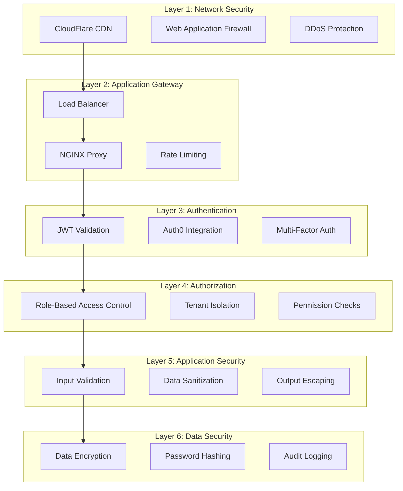

# 🔒 MWAP Security Architecture

## 🎯 Overview

This document outlines the comprehensive security architecture of the MWAP platform, detailing security principles, implementation patterns, threat mitigation strategies, and compliance requirements.

## 🏛️ Security Architecture Principles

### **1. Zero Trust Model**
```typescript
interface ZeroTrustPrinciples {
  authentication: 'Every request must be authenticated';
  authorization: 'Every action must be authorized';
  validation: 'Every input must be validated';
  isolation: 'Every tenant must be isolated';
  encryption: 'Every data transmission must be encrypted';
  auditing: 'Every action must be logged';
}
```

### **2. Defense in Depth**


### **3. Multi-Tenant Security Model**
```typescript
interface MultiTenantSecurity {
  dataIsolation: {
    strategy: 'Row-Level Security';
    implementation: 'tenantId in all queries';
    validation: 'Middleware enforcement';
  };
  
  accessControl: {
    authentication: 'Auth0 JWT tokens';
    authorization: 'Role-based permissions';
    tenantBoundary: 'Strict tenant isolation';
  };
  
  auditTrail: {
    scope: 'All tenant actions';
    retention: '7 years for compliance';
    integrity: 'Immutable audit logs';
  };
}
```

## 🔐 Authentication Architecture

### **Auth0 Integration**
```typescript
interface Auth0Configuration {
  domain: string;
  clientId: string;
  clientSecret: string;
  audience: string;
  algorithms: ['RS256'];
  
  features: {
    multiFactorAuth: boolean;
    socialLogins: string[];
    passwordPolicy: PasswordPolicy;
    sessionManagement: SessionConfig;
  };
}

class AuthenticationService {
  async validateJWT(token: string): Promise<JWTPayload> {
    try {
      // Verify token signature with Auth0 public key
      const decoded = jwt.verify(token, this.getPublicKey(), {
        algorithms: ['RS256'],
        audience: this.config.audience,
        issuer: `https://${this.config.domain}/`
      });
      
      // Validate token claims
      this.validateClaims(decoded);
      
      return decoded as JWTPayload;
    } catch (error) {
      throw new AppError('Invalid authentication token', 401);
    }
  }
  
  private validateClaims(payload: any): void {
    const required = ['sub', 'email', 'exp', 'iat'];
    for (const claim of required) {
      if (!payload[claim]) {
        throw new AppError(`Missing required claim: ${claim}`, 401);
      }
    }
    
    // Check token expiration
    if (payload.exp < Date.now() / 1000) {
      throw new AppError('Token expired', 401);
    }
  }
}
```

### **JWT Token Structure**
```typescript
interface JWTPayload {
  // Standard claims
  sub: string;           // Auth0 user ID
  iss: string;           // Issuer (Auth0 domain)
  aud: string;           // Audience (API identifier)
  exp: number;           // Expiration timestamp
  iat: number;           // Issued at timestamp
  
  // Custom claims
  email: string;         // User email
  name: string;          // User display name
  tenantId: string;      // Tenant identifier
  role: UserRole;        // User role
  permissions: string[]; // Specific permissions
  
  // Security claims
  azp: string;           // Authorized party
  scope: string;         // OAuth scopes
}
```

### **Authentication Middleware**
```typescript
class AuthenticationMiddleware {
  static authenticate = async (req: Request, res: Response, next: NextFunction) => {
    try {
      // Extract token from Authorization header
      const token = this.extractToken(req);
      if (!token) {
        throw new AppError('Authentication token required', 401);
      }
      
      // Validate JWT token
      const payload = await authService.validateJWT(token);
      
      // Resolve user information
      const user = await userService.findByAuth0Id(payload.sub);
      if (!user || !user.isActive) {
        throw new AppError('User not found or inactive', 401);
      }
      
      // Attach user context to request
      req.user = {
        userId: user.auth0Id,
        tenantId: user.tenantId.toString(),
        role: user.role,
        permissions: user.permissions,
        email: user.email,
        name: user.name
      };
      
      // Log authentication event
      logger.info('User authenticated', {
        userId: req.user.userId,
        tenantId: req.user.tenantId,
        ip: req.ip,
        userAgent: req.get('User-Agent')
      });
      
      next();
    } catch (error) {
      logger.warn('Authentication failed', {
        error: error.message,
        ip: req.ip,
        userAgent: req.get('User-Agent')
      });
      next(error);
    }
  };
  
  private static extractToken(req: Request): string | null {
    const authHeader = req.headers.authorization;
    if (authHeader && authHeader.startsWith('Bearer ')) {
      return authHeader.substring(7);
    }
    return null;
  }
}
```

## 🛡️ Authorization Architecture

### **Role-Based Access Control (RBAC)**
```typescript
enum UserRole {
  SUPERADMIN = 'superadmin',
  TENANT_OWNER = 'tenant_owner',
  PROJECT_MEMBER = 'project_member'
}

interface RolePermissions {
  [UserRole.SUPERADMIN]: [
    'tenant:*',
    'user:*',
    'project:*',
    'file:*',
    'system:*'
  ];
  
  [UserRole.TENANT_OWNER]: [
    'tenant:read',
    'tenant:update',
    'user:*',
    'project:*',
    'file:*'
  ];
  
  [UserRole.PROJECT_MEMBER]: [
    'project:read',
    'project:update',
    'file:read',
    'file:create',
    'file:update'
  ];
}

class AuthorizationService {
  hasPermission(userRole: UserRole, permission: string): boolean {
    const rolePermissions = this.getRolePermissions(userRole);
    
    return rolePermissions.some(rolePermission => {
      if (rolePermission.endsWith('*')) {
        const prefix = rolePermission.slice(0, -1);
        return permission.startsWith(prefix);
      }
      return rolePermission === permission;
    });
  }
  
  checkTenantAccess(userTenantId: string, resourceTenantId: string): void {
    if (userTenantId !== resourceTenantId) {
      throw new AppError('Access denied: tenant boundary violation', 403);
    }
  }
}
```

### **Authorization Middleware**
```typescript
class AuthorizationMiddleware {
  static requirePermission(permission: string) {
    return (req: Request, res: Response, next: NextFunction) => {
      if (!req.user) {
        return next(new AppError('Authentication required', 401));
      }
      
      if (!authorizationService.hasPermission(req.user.role, permission)) {
        logger.warn('Authorization failed', {
          userId: req.user.userId,
          tenantId: req.user.tenantId,
          requiredPermission: permission,
          userRole: req.user.role
        });
        return next(new AppError('Insufficient permissions', 403));
      }
      
      next();
    };
  }
  
  static requireRole(role: UserRole) {
    return (req: Request, res: Response, next: NextFunction) => {
      if (!req.user) {
        return next(new AppError('Authentication required', 401));
      }
      
      if (!this.hasRole(req.user.role, role)) {
        return next(new AppError('Insufficient role privileges', 403));
      }
      
      next();
    };
  }
  
  static tenantIsolation = (req: Request, res: Response, next: NextFunction) => {
    if (!req.user) {
      return next(new AppError('Authentication required', 401));
    }
    
    // Add tenant context to all database queries
    req.tenantFilter = { tenantId: new ObjectId(req.user.tenantId) };
    
    next();
  };
  
  private static hasRole(userRole: UserRole, requiredRole: UserRole): boolean {
    const roleHierarchy = {
      [UserRole.SUPERADMIN]: 3,
      [UserRole.TENANT_OWNER]: 2,
      [UserRole.PROJECT_MEMBER]: 1
    };
    
    return roleHierarchy[userRole] >= roleHierarchy[requiredRole];
  }
}
```

## 🔒 Data Security

### **Encryption at Rest**
```typescript
interface EncryptionConfiguration {
  database: {
    provider: 'MongoDB Atlas';
    encryption: 'AES-256';
    keyManagement: 'AWS KMS';
    fieldLevel: string[];
  };
  
  files: {
    provider: 'AWS S3';
    encryption: 'AES-256-GCM';
    keyRotation: '90 days';
  };
  
  secrets: {
    provider: 'Environment Variables';
    encryption: 'AES-256-CBC';
    keySource: 'ENCRYPTION_KEY environment variable';
  };
}

class EncryptionService {
  private readonly algorithm = 'aes-256-cbc';
  private readonly key: Buffer;
  
  constructor() {
    this.key = Buffer.from(process.env.ENCRYPTION_KEY!, 'hex');
  }
  
  encrypt(text: string): string {
    const iv = crypto.randomBytes(16);
    const cipher = crypto.createCipher(this.algorithm, this.key);
    cipher.setAutoPadding(true);
    
    let encrypted = cipher.update(text, 'utf8', 'hex');
    encrypted += cipher.final('hex');
    
    return iv.toString('hex') + ':' + encrypted;
  }
  
  decrypt(encryptedText: string): string {
    const [ivHex, encrypted] = encryptedText.split(':');
    const iv = Buffer.from(ivHex, 'hex');
    
    const decipher = crypto.createDecipher(this.algorithm, this.key);
    decipher.setAutoPadding(true);
    
    let decrypted = decipher.update(encrypted, 'hex', 'utf8');
    decrypted += decipher.final('utf8');
    
    return decrypted;
  }
}
```

### **Sensitive Data Handling**
```typescript
class SensitiveDataHandler {
  // Fields that require encryption
  private static readonly ENCRYPTED_FIELDS = [
    'cloudProviders.config.secretAccessKey',
    'cloudProviders.config.clientSecret',
    'cloudProviders.config.refreshToken',
    'cloudProviders.config.accessToken'
  ];
  
  // Fields that should be masked in logs
  private static readonly MASKED_FIELDS = [
    'password',
    'token',
    'secret',
    'key',
    'credential'
  ];
  
  static sanitizeForLogging(data: any): any {
    const sanitized = { ...data };
    
    for (const field of this.MASKED_FIELDS) {
      if (sanitized[field]) {
        sanitized[field] = '***MASKED***';
      }
    }
    
    return sanitized;
  }
  
  static encryptSensitiveFields(document: any): any {
    const encrypted = { ...document };
    
    for (const fieldPath of this.ENCRYPTED_FIELDS) {
      const value = this.getNestedValue(encrypted, fieldPath);
      if (value) {
        this.setNestedValue(encrypted, fieldPath, encryptionService.encrypt(value));
      }
    }
    
    return encrypted;
  }
}
```

## 🛡️ Input Validation & Sanitization

### **Comprehensive Input Validation**
```typescript
class ValidationService {
  // SQL injection prevention
  static sanitizeInput(input: string): string {
    return input
      .replace(/['"\\]/g, '') // Remove quotes and backslashes
      .replace(/[<>]/g, '')   // Remove HTML brackets
      .trim();
  }
  
  // XSS prevention
  static escapeHtml(input: string): string {
    return input
      .replace(/&/g, '&amp;')
      .replace(/</g, '&lt;')
      .replace(/>/g, '&gt;')
      .replace(/"/g, '&quot;')
      .replace(/'/g, '&#x27;');
  }
  
  // File upload validation
  static validateFileUpload(file: Express.Multer.File): void {
    const allowedTypes = [
      'image/jpeg',
      'image/png',
      'image/gif',
      'application/pdf',
      'text/plain'
    ];
    
    const maxSize = 10 * 1024 * 1024; // 10MB
    
    if (!allowedTypes.includes(file.mimetype)) {
      throw new AppError('File type not allowed', 400);
    }
    
    if (file.size > maxSize) {
      throw new AppError('File size exceeds limit', 400);
    }
    
    // Check for malicious content
    this.scanFileContent(file);
  }
  
  private static scanFileContent(file: Express.Multer.File): void {
    // Basic malware signature detection
    const maliciousPatterns = [
      /<script/i,
      /javascript:/i,
      /vbscript:/i,
      /onload=/i,
      /onerror=/i
    ];
    
    const content = file.buffer.toString();
    for (const pattern of maliciousPatterns) {
      if (pattern.test(content)) {
        throw new AppError('Malicious content detected', 400);
      }
    }
  }
}
```

### **Request Validation Middleware**
```typescript
class ValidationMiddleware {
  static validateRequest(schema: z.ZodSchema) {
    return (req: Request, res: Response, next: NextFunction) => {
      try {
        // Validate and sanitize request body
        const sanitizedBody = this.sanitizeObject(req.body);
        req.validatedBody = schema.parse(sanitizedBody);
        
        // Validate query parameters
        if (req.query) {
          req.validatedQuery = this.sanitizeObject(req.query);
        }
        
        // Validate path parameters
        if (req.params) {
          req.validatedParams = this.sanitizeObject(req.params);
        }
        
        next();
      } catch (error) {
        if (error instanceof z.ZodError) {
          const validationErrors = error.errors.map(err => ({
            field: err.path.join('.'),
            message: err.message,
            code: err.code
          }));
          
          return next(new AppError('Validation failed', 400, 'VALIDATION_ERROR', {
            errors: validationErrors
          }));
        }
        
        next(error);
      }
    };
  }
  
  private static sanitizeObject(obj: any): any {
    if (typeof obj !== 'object' || obj === null) {
      return obj;
    }
    
    const sanitized: any = {};
    for (const [key, value] of Object.entries(obj)) {
      if (typeof value === 'string') {
        sanitized[key] = ValidationService.sanitizeInput(value);
      } else if (typeof value === 'object') {
        sanitized[key] = this.sanitizeObject(value);
      } else {
        sanitized[key] = value;
      }
    }
    
    return sanitized;
  }
}
```

## 🔍 Security Monitoring & Auditing

### **Audit Logging**
```typescript
interface AuditLogEntry {
  timestamp: Date;
  userId: string;
  tenantId: string;
  action: string;
  resource: string;
  resourceId: string;
  changes?: {
    before: any;
    after: any;
  };
  metadata: {
    ip: string;
    userAgent: string;
    sessionId?: string;
  };
  result: 'success' | 'failure';
  errorMessage?: string;
}

class AuditLogger {
  static async logAction(
    user: UserContext,
    action: string,
    resource: string,
    resourceId: string,
    changes?: { before: any; after: any },
    metadata?: any
  ): Promise<void> {
    const auditEntry: AuditLogEntry = {
      timestamp: new Date(),
      userId: user.userId,
      tenantId: user.tenantId,
      action,
      resource,
      resourceId,
      changes,
      metadata: {
        ip: metadata?.ip || 'unknown',
        userAgent: metadata?.userAgent || 'unknown',
        sessionId: metadata?.sessionId
      },
      result: 'success'
    };
    
    try {
      await AuditLog.create(auditEntry);
    } catch (error) {
      logger.error('Failed to create audit log', {
        error: error.message,
        auditEntry
      });
    }
  }
  
  static async logFailure(
    user: UserContext | null,
    action: string,
    resource: string,
    error: Error,
    metadata?: any
  ): Promise<void> {
    const auditEntry: Partial<AuditLogEntry> = {
      timestamp: new Date(),
      userId: user?.userId || 'anonymous',
      tenantId: user?.tenantId || 'unknown',
      action,
      resource,
      metadata: {
        ip: metadata?.ip || 'unknown',
        userAgent: metadata?.userAgent || 'unknown'
      },
      result: 'failure',
      errorMessage: error.message
    };
    
    try {
      await AuditLog.create(auditEntry);
    } catch (auditError) {
      logger.error('Failed to create failure audit log', {
        error: auditError.message,
        originalError: error.message,
        auditEntry
      });
    }
  }
}
```

### **Security Event Detection**
```typescript
class SecurityMonitor {
  private static readonly SUSPICIOUS_PATTERNS = {
    BRUTE_FORCE: {
      threshold: 5,
      timeWindow: 300000, // 5 minutes
      action: 'block_ip'
    },
    
    PRIVILEGE_ESCALATION: {
      pattern: /admin|root|superuser/i,
      action: 'alert_security_team'
    },
    
    DATA_EXFILTRATION: {
      threshold: 1000, // requests per minute
      action: 'rate_limit'
    }
  };
  
  static async detectSuspiciousActivity(req: Request, user?: UserContext): Promise<void> {
    const ip = req.ip;
    const userAgent = req.get('User-Agent') || '';
    
    // Check for brute force attacks
    await this.checkBruteForce(ip, user?.userId);
    
    // Check for privilege escalation attempts
    await this.checkPrivilegeEscalation(req, user);
    
    // Check for unusual access patterns
    await this.checkAccessPatterns(ip, user?.userId);
    
    // Check for data exfiltration
    await this.checkDataExfiltration(ip, user?.userId);
  }
  
  private static async checkBruteForce(ip: string, userId?: string): Promise<void> {
    const key = `failed_attempts:${ip}:${userId || 'anonymous'}`;
    const attempts = await redis.get(key);
    
    if (attempts && parseInt(attempts) >= this.SUSPICIOUS_PATTERNS.BRUTE_FORCE.threshold) {
      await this.triggerSecurityAlert('BRUTE_FORCE_DETECTED', {
        ip,
        userId,
        attempts: parseInt(attempts)
      });
      
      // Block IP temporarily
      await redis.setex(`blocked_ip:${ip}`, 3600, 'brute_force'); // 1 hour block
    }
  }
  
  private static async triggerSecurityAlert(type: string, data: any): Promise<void> {
    logger.error(`Security alert: ${type}`, data);
    
    // Send alert to security team
    await notificationService.sendSecurityAlert({
      type,
      data,
      timestamp: new Date(),
      severity: 'high'
    });
  }
}
```

## 🔗 Related Documentation

- **[🛡️ Security Patterns](./security-patterns.md)** - Security implementation patterns
- **[⚙️ Security Configuration](./security-configuration.md)** - Security setup guide
- **[🔒 Auth Middleware](./auth-middleware.md)** - Authentication middleware details
- **[🏗️ System Architecture](../02-Architecture/diagrams/system-architecture.md)** - Overall system design

---

*This security architecture provides comprehensive protection for the MWAP platform through multiple layers of defense, ensuring data protection, access control, and compliance with security best practices.*