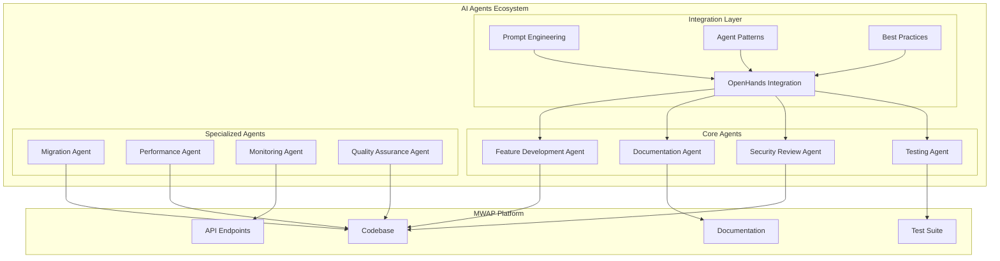

# 🤖 MWAP AI Agents System

## 🎯 Overview

The MWAP AI Agents system provides intelligent automation and assistance for development workflows, code generation, documentation maintenance, and quality assurance. This system leverages OpenHands integration and custom microagents to enhance developer productivity and maintain code quality.

## 🏗️ AI Agents Architecture

### **System Components**


## 🔧 Core AI Agents

### **1. Feature Development Agent**
```typescript
interface FeatureDevelopmentAgent {
  name: 'feature-developer';
  purpose: 'Complete feature implementation following MWAP patterns';
  
  capabilities: [
    'requirements-analysis',
    'architecture-design',
    'database-modeling',
    'api-development',
    'frontend-components',
    'test-generation',
    'documentation-creation'
  ];
  
  inputs: {
    featureName: string;
    requirements: FeatureRequirements;
    existingPatterns: string[];
    securityRequirements: SecurityRequirements;
  };
  
  outputs: {
    backendFiles: BackendFeatureFiles;
    frontendFiles: FrontendFeatureFiles;
    tests: TestSuite;
    documentation: DocumentationSet;
    apiSpec: OpenAPISpec;
  };
}
```

**Usage Example:**
```typescript
const featureAgent = new FeatureDevelopmentAgent({
  featureName: 'user-profile-management',
  requirements: {
    crud: ['create', 'read', 'update', 'delete'],
    authentication: 'required',
    authorization: 'role-based',
    validation: 'comprehensive',
    audit: 'full-logging'
  },
  existingPatterns: ['/src/features/projects/'],
  securityRequirements: {
    tenantIsolation: true,
    inputValidation: true,
    outputSanitization: true,
    auditLogging: true
  }
});

const result = await featureAgent.generate();
```

### **2. Documentation Agent**
```typescript
interface DocumentationAgent {
  name: 'documentation-generator';
  purpose: 'Generate and maintain comprehensive documentation';
  
  capabilities: [
    'api-documentation',
    'code-documentation',
    'user-guides',
    'architecture-diagrams',
    'cross-reference-linking',
    'content-validation'
  ];
  
  inputs: {
    codeFiles: string[];
    existingDocs: string[];
    documentationType: DocumentationType;
    targetAudience: Audience;
  };
  
  outputs: {
    documentation: DocumentationFiles;
    diagrams: DiagramFiles;
    crossReferences: CrossReferenceMap;
    validationReport: ValidationReport;
  };
}
```

### **3. Security Review Agent**
```typescript
interface SecurityReviewAgent {
  name: 'security-reviewer';
  purpose: 'Comprehensive security analysis and vulnerability detection';
  
  capabilities: [
    'vulnerability-scanning',
    'code-security-analysis',
    'dependency-audit',
    'configuration-review',
    'compliance-checking',
    'threat-modeling'
  ];
  
  securityChecks: [
    'tenant-isolation-verification',
    'authentication-validation',
    'authorization-checks',
    'input-sanitization',
    'sql-injection-prevention',
    'xss-protection',
    'sensitive-data-handling',
    'crypto-implementation',
    'session-management',
    'error-handling-security'
  ];
  
  outputs: {
    securityReport: SecurityReport;
    vulnerabilities: Vulnerability[];
    recommendations: SecurityRecommendation[];
    complianceStatus: ComplianceReport;
  };
}
```

### **4. Testing Agent**
```typescript
interface TestingAgent {
  name: 'test-generator';
  purpose: 'Generate comprehensive test suites for MWAP features';
  
  capabilities: [
    'unit-test-generation',
    'integration-test-creation',
    'security-test-development',
    'performance-test-setup',
    'e2e-test-automation',
    'test-data-generation'
  ];
  
  testTypes: [
    'unit-tests',
    'integration-tests',
    'security-tests',
    'performance-tests',
    'api-tests',
    'frontend-tests'
  ];
  
  outputs: {
    unitTests: UnitTestSuite;
    integrationTests: IntegrationTestSuite;
    securityTests: SecurityTestSuite;
    testFixtures: TestFixtures;
    mockDefinitions: MockDefinitions;
    testDocumentation: TestDocumentation;
  };
}
```

## 🎯 Specialized Agents

### **Migration Agent**
```typescript
interface MigrationAgent {
  name: 'migration-assistant';
  purpose: 'Handle database and API migrations safely';
  
  capabilities: [
    'schema-migration-generation',
    'data-migration-scripts',
    'rollback-procedures',
    'migration-testing',
    'compatibility-checking',
    'performance-impact-analysis'
  ];
  
  safetyChecks: [
    'backup-verification',
    'rollback-testing',
    'data-integrity-validation',
    'performance-impact-analysis',
    'dependency-analysis'
  ];
  
  outputs: {
    migrationScripts: MigrationScript[];
    rollbackScripts: RollbackScript[];
    testSuite: MigrationTestSuite;
    documentation: MigrationDocumentation;
    validationReport: MigrationValidationReport;
  };
}
```

### **Performance Agent**
```typescript
interface PerformanceAgent {
  name: 'performance-optimizer';
  purpose: 'Analyze and optimize MWAP performance';
  
  analysisAreas: [
    'database-query-optimization',
    'api-response-times',
    'memory-usage-patterns',
    'caching-opportunities',
    'frontend-performance',
    'network-optimization'
  ];
  
  optimizations: [
    'index-recommendations',
    'query-optimization',
    'caching-strategies',
    'code-optimization',
    'bundle-optimization',
    'cdn-configuration'
  ];
  
  outputs: {
    performanceReport: PerformanceReport;
    optimizationRecommendations: OptimizationRecommendation[];
    benchmarkResults: BenchmarkResults;
    monitoringSetup: MonitoringConfiguration;
  };
}
```

## 🤝 OpenHands Integration

### **OpenHands Configuration**
```typescript
// src/ai-agents/openhands.config.ts
export const openHandsConfig = {
  apiEndpoint: process.env.OPENHANDS_API_ENDPOINT,
  apiKey: process.env.OPENHANDS_API_KEY,
  
  defaultSettings: {
    model: 'claude-3-sonnet',
    temperature: 0.1,
    maxTokens: 4000,
    timeout: 30000
  },
  
  mwapContext: {
    platform: 'MWAP',
    architecture: 'multi-tenant-saas',
    stack: ['Node.js', 'Express', 'MongoDB', 'Auth0', 'TypeScript'],
    patterns: 'feature-based-architecture',
    security: 'zero-trust-model'
  }
};
```

### **Agent Orchestration**
```typescript
// src/ai-agents/orchestrator.ts
export class AgentOrchestrator {
  private agents: Map<string, AIAgent> = new Map();
  
  constructor() {
    this.registerAgents();
  }
  
  private registerAgents(): void {
    this.agents.set('feature-developer', new FeatureDevelopmentAgent());
    this.agents.set('documentation-generator', new DocumentationAgent());
    this.agents.set('security-reviewer', new SecurityReviewAgent());
    this.agents.set('test-generator', new TestingAgent());
    this.agents.set('migration-assistant', new MigrationAgent());
    this.agents.set('performance-optimizer', new PerformanceAgent());
  }
  
  async executeWorkflow(workflow: AgentWorkflow): Promise<WorkflowResult> {
    const results: WorkflowStepResult[] = [];
    
    for (const step of workflow.steps) {
      const agent = this.agents.get(step.agentName);
      if (!agent) {
        throw new Error(`Agent not found: ${step.agentName}`);
      }
      
      const stepResult = await agent.execute(step.inputs);
      results.push({
        step: step.name,
        agent: step.agentName,
        result: stepResult,
        timestamp: new Date()
      });
      
      // Pass results to next step if needed
      if (step.passToNext) {
        workflow.steps[workflow.steps.indexOf(step) + 1].inputs = {
          ...workflow.steps[workflow.steps.indexOf(step) + 1].inputs,
          previousResult: stepResult
        };
      }
    }
    
    return {
      workflowId: workflow.id,
      status: 'completed',
      results,
      completedAt: new Date()
    };
  }
}
```

## 🎨 Prompt Engineering Integration

### **MWAP-Specific Prompts**
```typescript
// src/ai-agents/prompts/mwap-prompts.ts
export const mwapPrompts = {
  featureDevelopment: `
    Context: MWAP multi-tenant SaaS platform
    Stack: Node.js, Express, MongoDB, Auth0, TypeScript
    Pattern: Feature-based architecture in /src/features/
    Security: JWT authentication, tenant isolation, RBAC
    Quality: >90% test coverage, comprehensive error handling
    
    Task: {task}
    Requirements: {requirements}
    Reference: {referencePattern}
    
    Output: Complete feature implementation with:
    - Database models with tenant isolation
    - API endpoints with authentication/authorization
    - Input validation with Zod schemas
    - Comprehensive error handling
    - Unit and integration tests
    - API documentation
  `,
  
  securityReview: `
    Context: MWAP security review for multi-tenant platform
    Focus: Zero-trust security model implementation
    
    Code to review: {code}
    
    Check for:
    - Tenant isolation in all database queries
    - Authentication middleware on protected routes
    - Authorization checks for user actions
    - Input validation and sanitization
    - SQL injection prevention
    - XSS protection
    - Sensitive data handling
    - Error message security
    
    Output: Security assessment with specific recommendations
  `,
  
  documentation: `
    Context: MWAP documentation generation
    Audience: {audience}
    Type: {documentationType}
    
    Source: {sourceFiles}
    
    Generate comprehensive documentation including:
    - Clear explanations with examples
    - Code snippets with proper syntax highlighting
    - Cross-references to related documentation
    - Security considerations
    - Best practices
    - Troubleshooting guides
    
    Follow MWAP documentation standards and patterns
  `
};
```

## 📊 Quality Metrics and Monitoring

### **Agent Performance Tracking**
```typescript
interface AgentMetrics {
  agentName: string;
  executionCount: number;
  successRate: number;
  averageExecutionTime: number;
  qualityScore: number;
  
  qualityMetrics: {
    codeQuality: number;
    testCoverage: number;
    securityScore: number;
    documentationCompleteness: number;
  };
  
  errorPatterns: {
    pattern: string;
    frequency: number;
    lastOccurrence: Date;
  }[];
}

class AgentMonitor {
  async trackExecution(
    agentName: string,
    inputs: any,
    outputs: any,
    executionTime: number,
    success: boolean
  ): Promise<void> {
    const metrics = await this.getAgentMetrics(agentName);
    
    // Update execution metrics
    metrics.executionCount++;
    metrics.successRate = this.calculateSuccessRate(metrics, success);
    metrics.averageExecutionTime = this.updateAverageTime(metrics, executionTime);
    
    // Assess quality
    if (success) {
      metrics.qualityScore = await this.assessQuality(outputs);
    }
    
    await this.saveMetrics(metrics);
  }
  
  private async assessQuality(outputs: any): Promise<number> {
    // Implement quality assessment logic
    return 0.85; // Example score
  }
}
```

## 🚀 Usage Examples

### **Feature Development Workflow**
```typescript
// Example: Implementing user notification system
const workflow: AgentWorkflow = {
  id: 'user-notifications-feature',
  name: 'User Notifications System',
  steps: [
    {
      name: 'requirements-analysis',
      agentName: 'feature-developer',
      inputs: {
        featureName: 'user-notifications',
        requirements: {
          realTimeNotifications: true,
          emailNotifications: true,
          pushNotifications: true,
          notificationHistory: true,
          userPreferences: true
        }
      },
      passToNext: true
    },
    {
      name: 'security-review',
      agentName: 'security-reviewer',
      inputs: {
        focus: 'notification-security',
        checkPersonalData: true
      },
      passToNext: true
    },
    {
      name: 'test-generation',
      agentName: 'test-generator',
      inputs: {
        testTypes: ['unit', 'integration', 'security'],
        coverageTarget: 95
      },
      passToNext: true
    },
    {
      name: 'documentation',
      agentName: 'documentation-generator',
      inputs: {
        documentationType: 'feature-complete',
        audience: ['developers', 'users']
      }
    }
  ]
};

const orchestrator = new AgentOrchestrator();
const result = await orchestrator.executeWorkflow(workflow);
```

### **Code Review Automation**
```typescript
// Automated code review for pull requests
const reviewWorkflow: AgentWorkflow = {
  id: 'pr-review-automation',
  name: 'Pull Request Review',
  steps: [
    {
      name: 'security-analysis',
      agentName: 'security-reviewer',
      inputs: {
        changedFiles: pullRequest.changedFiles,
        securityFocus: 'comprehensive'
      }
    },
    {
      name: 'test-validation',
      agentName: 'test-generator',
      inputs: {
        validateExisting: true,
        generateMissing: true,
        changedFiles: pullRequest.changedFiles
      }
    },
    {
      name: 'documentation-update',
      agentName: 'documentation-generator',
      inputs: {
        updateExisting: true,
        changedFiles: pullRequest.changedFiles
      }
    }
  ]
};
```

## 🔗 Related Documentation

- **[🔧 Microagents System](./microagents.md)** - Microagent architecture and implementation
- **[🤝 OpenHands Integration](./openhands-integration.md)** - OpenHands AI development tools
- **[💬 Prompt Engineering](./prompt-engineering.md)** - Effective prompting patterns
- **[🎯 Agent Patterns](./agent-patterns.md)** - Common AI agent design patterns
- **[✨ Best Practices](./best-practices.md)** - AI development best practices

---

*The MWAP AI Agents system provides intelligent automation and assistance throughout the development lifecycle, ensuring consistent quality, security, and maintainability while accelerating development velocity.*