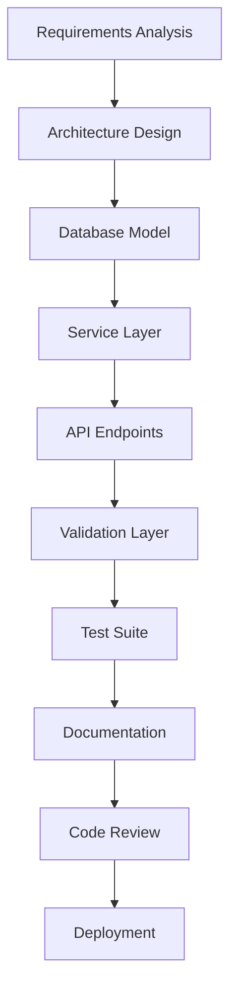
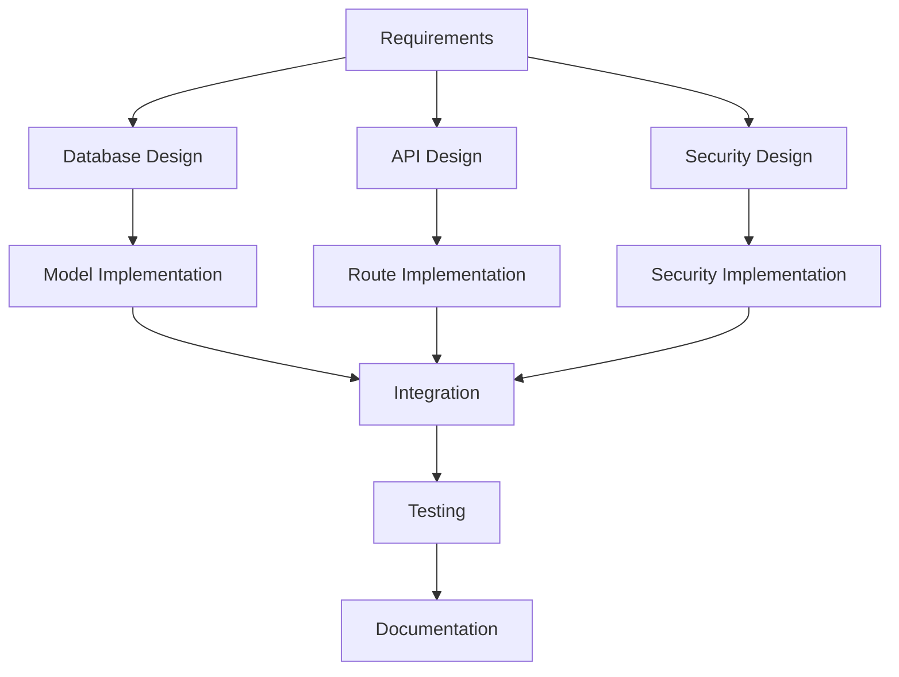
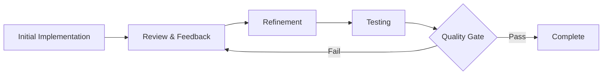
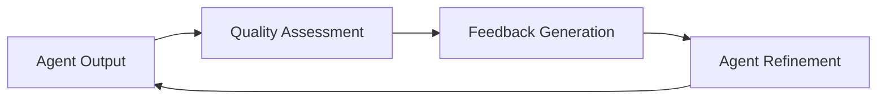

# 🎯 MWAP AI Agent Patterns

## 🎯 Overview

This document outlines common AI agent design patterns used in MWAP development, providing reusable templates and approaches for consistent AI-assisted development workflows.

## 🏗️ Core Agent Patterns

### **1. Feature Development Agent**
```typescript
interface FeatureDevelopmentAgent {
  name: 'feature-developer';
  purpose: 'Complete feature implementation following MWAP patterns';
  
  inputs: {
    featureName: string;
    requirements: FeatureRequirements;
    existingPatterns: string[]; // Reference features
  };
  
  workflow: [
    'analyze-requirements',
    'design-architecture',
    'implement-database-model',
    'create-service-layer',
    'build-api-endpoints',
    'add-validation',
    'implement-tests',
    'generate-documentation'
  ];
  
  outputs: {
    files: FeatureFiles[];
    tests: TestSuite[];
    documentation: string[];
  };
}
```

**Usage Pattern:**
```
Agent: feature-developer
Task: Implement user profile management
Reference: /src/features/projects/
Requirements:
- CRUD operations for user profiles
- Tenant isolation
- Role-based permissions
- Profile image upload
- Audit logging
```

### **2. API Documentation Agent**
```typescript
interface APIDocumentationAgent {
  name: 'api-documenter';
  purpose: 'Generate comprehensive API documentation from code';
  
  inputs: {
    routeFiles: string[];
    modelFiles: string[];
    validationSchemas: string[];
  };
  
  workflow: [
    'analyze-routes',
    'extract-schemas',
    'generate-openapi-spec',
    'create-examples',
    'validate-documentation'
  ];
  
  outputs: {
    openApiSpec: OpenAPISpec;
    examples: APIExample[];
    postmanCollection: PostmanCollection;
  };
}
```

**Usage Pattern:**
```
Agent: api-documenter
Input: /src/features/projects/
Task: Generate complete API documentation
Include: Request/response schemas, examples, error codes
Format: OpenAPI 3.0 specification
```

### **3. Security Review Agent**
```typescript
interface SecurityReviewAgent {
  name: 'security-reviewer';
  purpose: 'Comprehensive security analysis of MWAP code';
  
  inputs: {
    codeFiles: string[];
    securityStandards: SecurityStandard[];
  };
  
  checks: [
    'tenant-isolation-verification',
    'authentication-validation',
    'authorization-checks',
    'input-sanitization',
    'sql-injection-prevention',
    'xss-protection',
    'sensitive-data-handling'
  ];
  
  outputs: {
    securityReport: SecurityReport;
    vulnerabilities: Vulnerability[];
    recommendations: SecurityRecommendation[];
  };
}
```

**Usage Pattern:**
```
Agent: security-reviewer
Target: /src/features/users/
Focus: Multi-tenant security compliance
Check: Authentication, authorization, data isolation
Report: Vulnerabilities and remediation steps
```

### **4. Test Generation Agent**
```typescript
interface TestGenerationAgent {
  name: 'test-generator';
  purpose: 'Generate comprehensive test suites for MWAP features';
  
  inputs: {
    sourceFiles: string[];
    testingStrategy: TestingStrategy;
    coverageRequirements: CoverageRequirements;
  };
  
  testTypes: [
    'unit-tests',
    'integration-tests',
    'security-tests',
    'performance-tests'
  ];
  
  outputs: {
    unitTests: UnitTest[];
    integrationTests: IntegrationTest[];
    fixtures: TestFixture[];
    mocks: MockDefinition[];
  };
}
```

**Usage Pattern:**
```
Agent: test-generator
Source: /src/features/projects/
Coverage: >90% line coverage
Include: Happy path, error cases, edge cases, security tests
Framework: Vitest with MongoDB Memory Server
```

## 🔄 Workflow Patterns

### **1. Sequential Development Pattern**


**Implementation:**
```
Phase 1: Requirements & Design
- Analyze requirements
- Design data model
- Plan API structure
- Define security requirements

Phase 2: Core Implementation
- Create database models
- Implement service layer
- Build API endpoints
- Add validation middleware

Phase 3: Quality Assurance
- Generate comprehensive tests
- Security review
- Performance testing
- Documentation generation

Phase 4: Deployment
- Code review
- Integration testing
- Deployment preparation
- Monitoring setup
```

### **2. Parallel Development Pattern**


**Implementation:**
```
Parallel Tracks:
1. Database Track: Models, schemas, migrations
2. API Track: Routes, controllers, validation
3. Security Track: Authentication, authorization, audit

Synchronization Points:
- Design review
- Integration testing
- Security validation
- Final documentation
```

### **3. Iterative Refinement Pattern**


**Implementation:**
```
Iteration 1: Basic functionality
- Core CRUD operations
- Basic validation
- Simple tests

Iteration 2: Enhanced features
- Advanced validation
- Error handling
- Security hardening

Iteration 3: Optimization
- Performance improvements
- Comprehensive testing
- Documentation polish
```

## 🧩 Specialized Agent Patterns

### **1. Migration Agent**
```typescript
interface MigrationAgent {
  name: 'migration-assistant';
  purpose: 'Handle database and API migrations safely';
  
  capabilities: [
    'schema-migration-generation',
    'data-migration-scripts',
    'rollback-procedures',
    'migration-testing'
  ];
  
  safetyChecks: [
    'backup-verification',
    'rollback-testing',
    'data-integrity-validation',
    'performance-impact-analysis'
  ];
}
```

**Usage Pattern:**
```
Agent: migration-assistant
Task: Migrate user schema to include profile fields
Safety: Generate rollback scripts, test on staging
Validation: Data integrity checks, performance impact
Documentation: Migration guide and troubleshooting
```

### **2. Performance Optimization Agent**
```typescript
interface PerformanceAgent {
  name: 'performance-optimizer';
  purpose: 'Analyze and optimize MWAP performance';
  
  analysisAreas: [
    'database-query-optimization',
    'api-response-times',
    'memory-usage-patterns',
    'caching-opportunities'
  ];
  
  optimizations: [
    'index-recommendations',
    'query-optimization',
    'caching-strategies',
    'code-optimization'
  ];
}
```

**Usage Pattern:**
```
Agent: performance-optimizer
Target: /src/features/projects/
Focus: Database query performance
Analyze: Slow queries, missing indexes, N+1 problems
Recommend: Index strategies, query optimization, caching
```

### **3. Monitoring Agent**
```typescript
interface MonitoringAgent {
  name: 'monitoring-setup';
  purpose: 'Configure comprehensive monitoring for MWAP features';
  
  monitoringTypes: [
    'application-metrics',
    'business-metrics',
    'security-metrics',
    'performance-metrics'
  ];
  
  outputs: [
    'prometheus-metrics',
    'grafana-dashboards',
    'alert-rules',
    'log-aggregation'
  ];
}
```

**Usage Pattern:**
```
Agent: monitoring-setup
Feature: User management
Metrics: Registration rates, login failures, profile updates
Alerts: High error rates, slow response times, security events
Dashboard: User activity, system health, performance trends
```

## 🎨 Prompt Design Patterns

### **1. Context-Rich Prompting**
```
Pattern: Comprehensive Context
Structure:
- System context (MWAP platform details)
- Technical context (stack, patterns, constraints)
- Business context (requirements, goals)
- Security context (tenant isolation, auth requirements)
- Quality context (testing, documentation standards)

Example:
Context: MWAP multi-tenant SaaS platform
Stack: Node.js, Express, MongoDB, Auth0, TypeScript
Pattern: Feature-based architecture in /src/features/
Security: JWT auth, tenant isolation, RBAC
Quality: >90% test coverage, comprehensive documentation
Task: [Specific development task]
```

### **2. Reference-Driven Development**
```
Pattern: Existing Code Reference
Structure:
- Reference implementation path
- Adaptation requirements
- Consistency requirements
- Innovation boundaries

Example:
Reference: /src/features/projects/project.service.ts
Adapt for: User profile management
Maintain: Error handling patterns, logging, validation
Modify: Business logic for user-specific operations
Add: Profile image handling, preference management
```

### **3. Constraint-Based Design**
```
Pattern: Clear Constraints
Structure:
- Technical constraints
- Security constraints
- Performance constraints
- Business constraints

Example:
Constraints:
- Must use existing Auth0 integration
- Require tenant isolation in all queries
- Response time <200ms for 95th percentile
- Support 10,000+ concurrent users
- Maintain backward compatibility
```

## 📊 Agent Performance Patterns

### **1. Quality Metrics**
```typescript
interface AgentQualityMetrics {
  codeQuality: {
    typeScriptCompliance: number;
    testCoverage: number;
    eslintScore: number;
    securityScore: number;
  };
  
  consistency: {
    patternAdherence: number;
    namingConsistency: number;
    architectureAlignment: number;
  };
  
  completeness: {
    requirementsCoverage: number;
    documentationCompleteness: number;
    testCompleteness: number;
  };
}
```

### **2. Feedback Loop Pattern**


**Implementation:**
```
1. Automated Quality Checks
   - Code analysis (ESLint, TypeScript)
   - Test coverage measurement
   - Security scanning
   - Performance benchmarking

2. Human Review Integration
   - Code review feedback
   - Business requirement validation
   - User experience assessment
   - Architecture review

3. Continuous Improvement
   - Pattern refinement
   - Template updates
   - Best practice evolution
   - Agent capability enhancement
```

## 🔗 Related Documentation

- **[🤖 AI Agents Overview](./README.md)** - AI system overview
- **[🔧 Microagents System](./microagents.md)** - Microagent architecture
- **[🤝 OpenHands Integration](./openhands-integration.md)** - AI development tools
- **[💬 Prompt Engineering](./prompt-engineering.md)** - Effective prompting patterns
- **[✨ Best Practices](./best-practices.md)** - AI development best practices

---

*These agent patterns provide structured approaches for consistent, high-quality AI-assisted development in the MWAP platform, ensuring maintainable and secure code generation.*