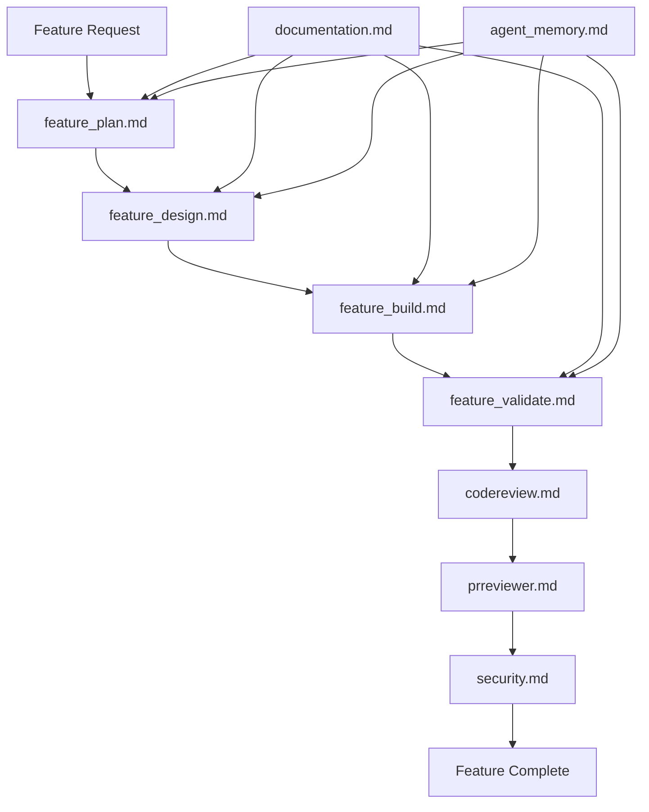

# 🤖 MWAP Microagents System

## 🎯 Overview

The MWAP project utilizes a comprehensive microagents system built on OpenHands to accelerate development through AI-assisted workflows. This system provides specialized agents for different aspects of development, from feature planning to code review.

## 📁 Microagent Architecture

### Core Microagents

#### 🏗️ **Development Workflow Agents**

**1. Feature Planning (`feature_plan.md`)**
- **Purpose**: Creates detailed implementation plans for new features
- **Input**: Feature requirements and specifications
- **Output**: Phased development plan with tasks and acceptance criteria
- **Usage**: `/plan feature-name` to generate comprehensive project plans

**2. Feature Design (`feature_design.md`)**
- **Purpose**: Designs system architecture and component structure
- **Input**: Feature requirements and existing system context
- **Output**: Technical design documents with architecture decisions
- **Usage**: `/design feature-name` for architectural planning

**3. Feature Build (`feature_build.md`)**
- **Purpose**: Implements features according to established plans
- **Input**: Design documents and implementation specifications
- **Output**: Working code with proper error handling and validation
- **Usage**: `/build issue-number phase-name` for implementation

**4. Feature Validation (`feature_validate.md`)**
- **Purpose**: Validates implementations against requirements
- **Input**: Completed features and acceptance criteria
- **Output**: Validation reports and quality assessments
- **Usage**: `/validate feature-name` for quality assurance

#### 🔒 **Security & Quality Agents**

**5. Security Review (`security.md`)**
- **Purpose**: Performs security audits and vulnerability assessments
- **Input**: Code changes and security requirements
- **Output**: Security analysis with recommendations
- **Usage**: Integrated into PR review process

**6. Code Review (`codereview.md`)**
- **Purpose**: Automated code quality and standards enforcement
- **Input**: Pull requests and code changes
- **Output**: Code review comments and improvement suggestions
- **Usage**: Automatic PR review integration

**7. PR Reviewer (`prreviewer.md`)**
- **Purpose**: Comprehensive pull request analysis
- **Input**: GitHub pull requests
- **Output**: Detailed review with security and style validation
- **Usage**: Automatic GitHub webhook integration

#### 🔧 **Infrastructure & Integration Agents**

**8. Auth0 Integration (`auth0.md`)**
- **Purpose**: Manages Auth0 authentication and authorization
- **Input**: Authentication requirements and user management needs
- **Output**: Auth0 configuration and integration code
- **Usage**: `/auth0 task-description` for authentication tasks

**9. GitHub Integration (`github.md`)**
- **Purpose**: Manages GitHub operations and repository tasks
- **Input**: Repository management requirements
- **Output**: GitHub API integrations and workflow automation
- **Usage**: Integrated with repository operations

**10. Documentation (`documentation.md`)**
- **Purpose**: Creates and maintains project documentation
- **Input**: Code changes and documentation requirements
- **Output**: Comprehensive documentation updates
- **Usage**: `/docs topic-name` for documentation tasks

#### 🧠 **Specialized Agents**

**11. Agent Memory (`agent_memory.md`)**
- **Purpose**: Maintains context and learning across sessions
- **Input**: Previous interactions and project history
- **Output**: Contextual awareness for better decision making
- **Usage**: Automatic context preservation

**12. Add Agent (`add_agent.md`)**
- **Purpose**: Creates new microagents for specific needs
- **Input**: Agent requirements and specifications
- **Output**: New microagent definitions and configurations
- **Usage**: `/add-agent agent-name purpose` for agent creation

**13. Schema Generator (`schema.generator/`)**
- **Purpose**: Generates database schemas and API specifications
- **Input**: Data model requirements
- **Output**: MongoDB schemas and OpenAPI specifications
- **Usage**: Integrated with feature development

## 🔄 Microagent Workflow

### Development Lifecycle Integration



### Quality Assurance Pipeline

1. **Planning Phase**: `feature_plan.md` creates comprehensive implementation strategy
2. **Design Phase**: `feature_design.md` establishes architecture and patterns
3. **Implementation Phase**: `feature_build.md` executes development with standards
4. **Validation Phase**: `feature_validate.md` ensures quality and completeness
5. **Review Phase**: `codereview.md` and `prreviewer.md` enforce standards
6. **Security Phase**: `security.md` validates security compliance
7. **Documentation Phase**: `documentation.md` maintains current documentation

## 🛠️ Usage Patterns

### Common Microagent Commands

```bash
# Feature Development Workflow
/plan new-feature-name          # Create implementation plan
/design new-feature-name        # Design architecture
/build 42 phase-1              # Implement specific phase
/validate new-feature-name      # Validate implementation

# Documentation and Maintenance
/docs api-endpoints            # Update API documentation
/auth0 user-management         # Configure Auth0 features
/add-agent custom-agent        # Create specialized agent
```

### Integration with MWAP Standards

All microagents are configured to enforce MWAP coding standards:

- **TypeScript-first**: Strict typing and ESM modules
- **Security-first**: Auth0 JWT validation and RBAC
- **Zero Trust**: API rate limiting and validation
- **DRY Principle**: No code duplication
- **Feature-based Structure**: Modular organization

## 🔒 Security Considerations

### Agent Security Model

- **Sandboxed Execution**: Each agent operates in isolated environment
- **Credential Management**: Secure handling of API keys and tokens
- **Audit Trail**: All agent actions are logged and traceable
- **Permission Model**: Agents have minimal required permissions

### Compliance Integration

- **GDPR Compliance**: Data handling follows privacy regulations
- **Security Standards**: OWASP guidelines integrated into review process
- **Code Quality**: Automated enforcement of security patterns

## 📊 Performance and Monitoring

### Agent Metrics

- **Execution Time**: Track agent performance and optimization
- **Success Rate**: Monitor agent effectiveness and accuracy
- **Error Handling**: Comprehensive error tracking and resolution
- **Resource Usage**: Monitor computational resource consumption

### Continuous Improvement

- **Learning Integration**: Agents improve through usage patterns
- **Feedback Loops**: Developer feedback enhances agent capabilities
- **Version Control**: Agent definitions are versioned and tracked
- **A/B Testing**: Compare agent performance across versions

## 🚀 Best Practices

### Effective Microagent Usage

1. **Clear Context**: Provide comprehensive context for better results
2. **Incremental Tasks**: Break complex tasks into manageable phases
3. **Validation Loops**: Always validate agent outputs before proceeding
4. **Documentation**: Keep agent interactions documented for team awareness

### Development Workflow Integration

1. **Start with Planning**: Always begin with `feature_plan.md`
2. **Follow Phases**: Execute phases sequentially for best results
3. **Validate Early**: Use `feature_validate.md` throughout development
4. **Security First**: Integrate `security.md` reviews at each phase

### Troubleshooting Common Issues

**Agent Context Loss**
- Use `agent_memory.md` to maintain context across sessions
- Provide comprehensive background in each interaction

**Inconsistent Outputs**
- Ensure clear, specific prompts and requirements
- Validate outputs against project standards

**Integration Failures**
- Check agent permissions and API access
- Verify configuration alignment with project requirements

---

## 📚 Related Documentation

- [OpenHands Integration](./openhands-integration.md) - OpenHands platform integration
- [Prompt Engineering](./prompt-engineering.md) - Effective prompting strategies
- [Agent Patterns](./agent-patterns.md) - Common usage patterns
- [Best Practices](./best-practices.md) - Development guidelines

---

*This microagents system enables rapid, high-quality development while maintaining MWAP's security-first and TypeScript-strict standards.*