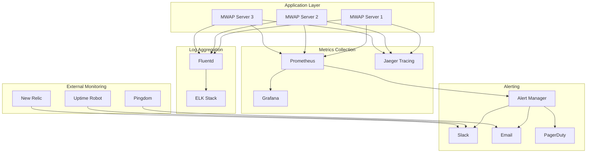

# 📊 MWAP Performance Monitoring

## 🎯 Overview

This document outlines the comprehensive performance monitoring strategy for the MWAP platform, covering metrics collection, alerting, performance optimization, and observability best practices.

## 🏗️ Monitoring Architecture

### **Monitoring Stack**


## 📈 Metrics Collection

### **Application Metrics**
```typescript
// src/middleware/metrics.ts
import { Request, Response, NextFunction } from 'express';
import { register, Counter, Histogram, Gauge, Summary } from 'prom-client';

// HTTP Metrics
export const httpRequestsTotal = new Counter({
  name: 'http_requests_total',
  help: 'Total number of HTTP requests',
  labelNames: ['method', 'route', 'status_code', 'user_agent']
});

export const httpRequestDuration = new Histogram({
  name: 'http_request_duration_seconds',
  help: 'Duration of HTTP requests in seconds',
  labelNames: ['method', 'route', 'status_code'],
  buckets: [0.001, 0.005, 0.01, 0.05, 0.1, 0.5, 1, 2, 5, 10]
});

export const httpRequestSize = new Summary({
  name: 'http_request_size_bytes',
  help: 'Size of HTTP requests in bytes',
  labelNames: ['method', 'route']
});

export const httpResponseSize = new Summary({
  name: 'http_response_size_bytes',
  help: 'Size of HTTP responses in bytes',
  labelNames: ['method', 'route', 'status_code']
});

// Application Metrics
export const activeConnections = new Gauge({
  name: 'active_connections',
  help: 'Number of active connections'
});

export const databaseConnections = new Gauge({
  name: 'database_connections_active',
  help: 'Number of active database connections'
});

export const databaseQueryDuration = new Histogram({
  name: 'database_query_duration_seconds',
  help: 'Duration of database queries in seconds',
  labelNames: ['operation', 'collection', 'status'],
  buckets: [0.001, 0.005, 0.01, 0.05, 0.1, 0.5, 1, 2, 5]
});

export const redisOperationDuration = new Histogram({
  name: 'redis_operation_duration_seconds',
  help: 'Duration of Redis operations in seconds',
  labelNames: ['operation', 'status'],
  buckets: [0.001, 0.005, 0.01, 0.05, 0.1, 0.5, 1]
});

// Business Metrics
export const userRegistrations = new Counter({
  name: 'user_registrations_total',
  help: 'Total number of user registrations',
  labelNames: ['source', 'tenant']
});

export const projectsCreated = new Counter({
  name: 'projects_created_total',
  help: 'Total number of projects created',
  labelNames: ['tenant', 'user_role']
});

export const filesUploaded = new Counter({
  name: 'files_uploaded_total',
  help: 'Total number of files uploaded',
  labelNames: ['file_type', 'tenant']
});

export const authenticationAttempts = new Counter({
  name: 'authentication_attempts_total',
  help: 'Total number of authentication attempts',
  labelNames: ['status', 'method']
});

// System Metrics
export const memoryUsage = new Gauge({
  name: 'nodejs_memory_usage_bytes',
  help: 'Node.js memory usage in bytes',
  labelNames: ['type']
});

export const cpuUsage = new Gauge({
  name: 'nodejs_cpu_usage_percent',
  help: 'Node.js CPU usage percentage'
});

export const eventLoopLag = new Histogram({
  name: 'nodejs_eventloop_lag_seconds',
  help: 'Event loop lag in seconds',
  buckets: [0.001, 0.01, 0.1, 1, 10]
});

// Metrics Middleware
export const metricsMiddleware = (req: Request, res: Response, next: NextFunction) => {
  const startTime = Date.now();
  const route = req.route?.path || req.path;
  
  // Track active connections
  activeConnections.inc();
  
  // Track request size
  const requestSize = parseInt(req.get('content-length') || '0');
  httpRequestSize.observe({ method: req.method, route }, requestSize);
  
  res.on('finish', () => {
    const duration = (Date.now() - startTime) / 1000;
    const responseSize = parseInt(res.get('content-length') || '0');
    
    // Record metrics
    httpRequestsTotal.inc({
      method: req.method,
      route,
      status_code: res.statusCode,
      user_agent: req.get('User-Agent')?.split(' ')[0] || 'unknown'
    });
    
    httpRequestDuration.observe(
      { method: req.method, route, status_code: res.statusCode },
      duration
    );
    
    httpResponseSize.observe(
      { method: req.method, route, status_code: res.statusCode },
      responseSize
    );
    
    activeConnections.dec();
  });
  
  next();
};

// System Metrics Collection
export const collectSystemMetrics = () => {
  setInterval(() => {
    const memUsage = process.memoryUsage();
    memoryUsage.set({ type: 'heap_used' }, memUsage.heapUsed);
    memoryUsage.set({ type: 'heap_total' }, memUsage.heapTotal);
    memoryUsage.set({ type: 'external' }, memUsage.external);
    memoryUsage.set({ type: 'rss' }, memUsage.rss);
    
    const cpuUsageValue = process.cpuUsage();
    cpuUsage.set((cpuUsageValue.user + cpuUsageValue.system) / 1000000);
    
    // Measure event loop lag
    const start = process.hrtime.bigint();
    setImmediate(() => {
      const lag = Number(process.hrtime.bigint() - start) / 1e9;
      eventLoopLag.observe(lag);
    });
  }, 5000); // Collect every 5 seconds
};

// Database Metrics Wrapper
export const withDatabaseMetrics = <T>(
  operation: string,
  collection: string,
  fn: () => Promise<T>
): Promise<T> => {
  const startTime = Date.now();
  
  return fn()
    .then(result => {
      const duration = (Date.now() - startTime) / 1000;
      databaseQueryDuration.observe(
        { operation, collection, status: 'success' },
        duration
      );
      return result;
    })
    .catch(error => {
      const duration = (Date.now() - startTime) / 1000;
      databaseQueryDuration.observe(
        { operation, collection, status: 'error' },
        duration
      );
      throw error;
    });
};

// Redis Metrics Wrapper
export const withRedisMetrics = <T>(
  operation: string,
  fn: () => Promise<T>
): Promise<T> => {
  const startTime = Date.now();
  
  return fn()
    .then(result => {
      const duration = (Date.now() - startTime) / 1000;
      redisOperationDuration.observe(
        { operation, status: 'success' },
        duration
      );
      return result;
    })
    .catch(error => {
      const duration = (Date.now() - startTime) / 1000;
      redisOperationDuration.observe(
        { operation, status: 'error' },
        duration
      );
      throw error;
    });
};
```

### **Custom Business Metrics**
```typescript
// src/services/metricsService.ts
import { 
  userRegistrations, 
  projectsCreated, 
  filesUploaded, 
  authenticationAttempts 
} from '../middleware/metrics';

export class MetricsService {
  static trackUserRegistration(source: string, tenantId: string): void {
    userRegistrations.inc({ source, tenant: tenantId });
  }
  
  static trackProjectCreation(tenantId: string, userRole: string): void {
    projectsCreated.inc({ tenant: tenantId, user_role: userRole });
  }
  
  static trackFileUpload(fileType: string, tenantId: string): void {
    filesUploaded.inc({ file_type: fileType, tenant: tenantId });
  }
  
  static trackAuthenticationAttempt(status: 'success' | 'failure', method: string): void {
    authenticationAttempts.inc({ status, method });
  }
  
  static async getMetricsSummary(): Promise<MetricsSummary> {
    const metrics = await register.getMetricsAsJSON();
    
    return {
      httpRequests: this.extractMetricValue(metrics, 'http_requests_total'),
      activeUsers: this.extractMetricValue(metrics, 'active_connections'),
      databaseQueries: this.extractMetricValue(metrics, 'database_query_duration_seconds'),
      memoryUsage: this.extractMetricValue(metrics, 'nodejs_memory_usage_bytes'),
      cpuUsage: this.extractMetricValue(metrics, 'nodejs_cpu_usage_percent')
    };
  }
  
  private static extractMetricValue(metrics: any[], metricName: string): any {
    const metric = metrics.find(m => m.name === metricName);
    return metric ? metric.values : null;
  }
}

interface MetricsSummary {
  httpRequests: any;
  activeUsers: any;
  databaseQueries: any;
  memoryUsage: any;
  cpuUsage: any;
}
```

## 🚨 Alerting Configuration

### **Prometheus Alert Rules**
```yaml
# prometheus/alerts.yml
groups:
  - name: mwap-alerts
    rules:
      # High Error Rate
      - alert: HighErrorRate
        expr: rate(http_requests_total{status_code=~"5.."}[5m]) > 0.1
        for: 2m
        labels:
          severity: critical
        annotations:
          summary: "High error rate detected"
          description: "Error rate is {{ $value }} errors per second"
      
      # High Response Time
      - alert: HighResponseTime
        expr: histogram_quantile(0.95, rate(http_request_duration_seconds_bucket[5m])) > 2
        for: 5m
        labels:
          severity: warning
        annotations:
          summary: "High response time detected"
          description: "95th percentile response time is {{ $value }} seconds"
      
      # High Memory Usage
      - alert: HighMemoryUsage
        expr: nodejs_memory_usage_bytes{type="heap_used"} / nodejs_memory_usage_bytes{type="heap_total"} > 0.9
        for: 5m
        labels:
          severity: warning
        annotations:
          summary: "High memory usage detected"
          description: "Memory usage is {{ $value | humanizePercentage }}"
      
      # Database Connection Issues
      - alert: DatabaseConnectionFailure
        expr: increase(database_query_duration_seconds_count{status="error"}[5m]) > 10
        for: 2m
        labels:
          severity: critical
        annotations:
          summary: "Database connection issues detected"
          description: "{{ $value }} database errors in the last 5 minutes"
      
      # High Authentication Failures
      - alert: HighAuthenticationFailures
        expr: rate(authentication_attempts_total{status="failure"}[5m]) > 0.5
        for: 3m
        labels:
          severity: warning
        annotations:
          summary: "High authentication failure rate"
          description: "Authentication failure rate is {{ $value }} per second"
      
      # Service Down
      - alert: ServiceDown
        expr: up == 0
        for: 1m
        labels:
          severity: critical
        annotations:
          summary: "Service is down"
          description: "{{ $labels.instance }} has been down for more than 1 minute"
      
      # Event Loop Lag
      - alert: HighEventLoopLag
        expr: histogram_quantile(0.95, rate(nodejs_eventloop_lag_seconds_bucket[5m])) > 0.1
        for: 5m
        labels:
          severity: warning
        annotations:
          summary: "High event loop lag detected"
          description: "95th percentile event loop lag is {{ $value }} seconds"
```

### **Alert Manager Configuration**
```yaml
# alertmanager/config.yml
global:
  smtp_smarthost: 'localhost:587'
  smtp_from: 'alerts@mwap.dev'

route:
  group_by: ['alertname']
  group_wait: 10s
  group_interval: 10s
  repeat_interval: 1h
  receiver: 'web.hook'
  routes:
    - match:
        severity: critical
      receiver: 'critical-alerts'
    - match:
        severity: warning
      receiver: 'warning-alerts'

receivers:
  - name: 'web.hook'
    webhook_configs:
      - url: 'http://localhost:5001/'
  
  - name: 'critical-alerts'
    slack_configs:
      - api_url: 'YOUR_SLACK_WEBHOOK_URL'
        channel: '#alerts-critical'
        title: 'MWAP Critical Alert'
        text: '{{ range .Alerts }}{{ .Annotations.summary }}{{ end }}'
    email_configs:
      - to: 'oncall@mwap.dev'
        subject: 'MWAP Critical Alert: {{ .GroupLabels.alertname }}'
        body: |
          {{ range .Alerts }}
          Alert: {{ .Annotations.summary }}
          Description: {{ .Annotations.description }}
          {{ end }}
    pagerduty_configs:
      - service_key: 'YOUR_PAGERDUTY_SERVICE_KEY'
        description: '{{ .GroupLabels.alertname }}: {{ .CommonAnnotations.summary }}'
  
  - name: 'warning-alerts'
    slack_configs:
      - api_url: 'YOUR_SLACK_WEBHOOK_URL'
        channel: '#alerts-warning'
        title: 'MWAP Warning Alert'
        text: '{{ range .Alerts }}{{ .Annotations.summary }}{{ end }}'

inhibit_rules:
  - source_match:
      severity: 'critical'
    target_match:
      severity: 'warning'
    equal: ['alertname', 'instance']
```

## 📊 Grafana Dashboards

### **Main Dashboard Configuration**
```json
{
  "dashboard": {
    "id": null,
    "title": "MWAP Performance Dashboard",
    "tags": ["mwap", "performance"],
    "timezone": "browser",
    "panels": [
      {
        "id": 1,
        "title": "Request Rate",
        "type": "graph",
        "targets": [
          {
            "expr": "rate(http_requests_total[5m])",
            "legendFormat": "{{method}} {{route}}"
          }
        ],
        "yAxes": [
          {
            "label": "Requests/sec",
            "min": 0
          }
        ]
      },
      {
        "id": 2,
        "title": "Response Time",
        "type": "graph",
        "targets": [
          {
            "expr": "histogram_quantile(0.50, rate(http_request_duration_seconds_bucket[5m]))",
            "legendFormat": "50th percentile"
          },
          {
            "expr": "histogram_quantile(0.95, rate(http_request_duration_seconds_bucket[5m]))",
            "legendFormat": "95th percentile"
          },
          {
            "expr": "histogram_quantile(0.99, rate(http_request_duration_seconds_bucket[5m]))",
            "legendFormat": "99th percentile"
          }
        ],
        "yAxes": [
          {
            "label": "Seconds",
            "min": 0
          }
        ]
      },
      {
        "id": 3,
        "title": "Error Rate",
        "type": "graph",
        "targets": [
          {
            "expr": "rate(http_requests_total{status_code=~\"4..\"}[5m])",
            "legendFormat": "4xx errors"
          },
          {
            "expr": "rate(http_requests_total{status_code=~\"5..\"}[5m])",
            "legendFormat": "5xx errors"
          }
        ],
        "yAxes": [
          {
            "label": "Errors/sec",
            "min": 0
          }
        ]
      },
      {
        "id": 4,
        "title": "Memory Usage",
        "type": "graph",
        "targets": [
          {
            "expr": "nodejs_memory_usage_bytes{type=\"heap_used\"}",
            "legendFormat": "Heap Used"
          },
          {
            "expr": "nodejs_memory_usage_bytes{type=\"heap_total\"}",
            "legendFormat": "Heap Total"
          }
        ],
        "yAxes": [
          {
            "label": "Bytes",
            "min": 0
          }
        ]
      },
      {
        "id": 5,
        "title": "Database Performance",
        "type": "graph",
        "targets": [
          {
            "expr": "rate(database_query_duration_seconds_count[5m])",
            "legendFormat": "Query Rate"
          },
          {
            "expr": "histogram_quantile(0.95, rate(database_query_duration_seconds_bucket[5m]))",
            "legendFormat": "95th percentile latency"
          }
        ]
      },
      {
        "id": 6,
        "title": "Active Connections",
        "type": "singlestat",
        "targets": [
          {
            "expr": "active_connections",
            "legendFormat": "Active Connections"
          }
        ]
      }
    ],
    "time": {
      "from": "now-1h",
      "to": "now"
    },
    "refresh": "5s"
  }
}
```

## 🔍 Distributed Tracing

### **Jaeger Integration**
```typescript
// src/tracing/jaeger.ts
import { initTracer } from 'jaeger-client';
import { FORMAT_HTTP_HEADERS, Tags } from 'opentracing';
import { Request, Response, NextFunction } from 'express';

const tracer = initTracer({
  serviceName: 'mwap-server',
  sampler: {
    type: 'const',
    param: 1
  },
  reporter: {
    logSpans: true,
    agentHost: process.env.JAEGER_AGENT_HOST || 'localhost',
    agentPort: parseInt(process.env.JAEGER_AGENT_PORT || '6832')
  }
}, {
  logger: console
});

export const tracingMiddleware = (req: Request, res: Response, next: NextFunction) => {
  const parentSpanContext = tracer.extract(FORMAT_HTTP_HEADERS, req.headers);
  const span = tracer.startSpan(`${req.method} ${req.route?.path || req.path}`, {
    childOf: parentSpanContext || undefined,
    tags: {
      [Tags.HTTP_METHOD]: req.method,
      [Tags.HTTP_URL]: req.originalUrl,
      [Tags.SPAN_KIND]: Tags.SPAN_KIND_RPC_SERVER
    }
  });

  // Add span to request for use in other middleware/handlers
  (req as any).span = span;

  res.on('finish', () => {
    span.setTag(Tags.HTTP_STATUS_CODE, res.statusCode);
    
    if (res.statusCode >= 400) {
      span.setTag(Tags.ERROR, true);
      span.log({
        event: 'error',
        message: `HTTP ${res.statusCode}`
      });
    }
    
    span.finish();
  });

  next();
};

export const traceDatabase = (operation: string, collection: string) => {
  return <T>(target: any, propertyName: string, descriptor: PropertyDescriptor) => {
    const method = descriptor.value;
    
    descriptor.value = async function(...args: any[]) {
      const span = tracer.startSpan(`db.${operation}`, {
        tags: {
          [Tags.DB_TYPE]: 'mongodb',
          [Tags.DB_INSTANCE]: collection,
          [Tags.DB_STATEMENT]: operation
        }
      });
      
      try {
        const result = await method.apply(this, args);
        span.setTag('db.rows_affected', Array.isArray(result) ? result.length : 1);
        return result;
      } catch (error) {
        span.setTag(Tags.ERROR, true);
        span.log({
          event: 'error',
          message: error.message
        });
        throw error;
      } finally {
        span.finish();
      }
    };
  };
};

export { tracer };
```

## 📈 Performance Optimization

### **Performance Monitoring Service**
```typescript
// src/services/performanceService.ts
import { performance, PerformanceObserver } from 'perf_hooks';
import { EventEmitter } from 'events';

export class PerformanceMonitor extends EventEmitter {
  private observer: PerformanceObserver;
  private metrics: Map<string, PerformanceMetric[]> = new Map();

  constructor() {
    super();
    this.setupObserver();
  }

  private setupObserver(): void {
    this.observer = new PerformanceObserver((list) => {
      const entries = list.getEntries();
      entries.forEach(entry => {
        this.recordMetric(entry.name, {
          duration: entry.duration,
          startTime: entry.startTime,
          timestamp: Date.now()
        });
      });
    });

    this.observer.observe({ entryTypes: ['measure', 'navigation', 'resource'] });
  }

  startMeasure(name: string): void {
    performance.mark(`${name}-start`);
  }

  endMeasure(name: string): void {
    performance.mark(`${name}-end`);
    performance.measure(name, `${name}-start`, `${name}-end`);
  }

  private recordMetric(name: string, metric: PerformanceMetric): void {
    if (!this.metrics.has(name)) {
      this.metrics.set(name, []);
    }

    const metrics = this.metrics.get(name)!;
    metrics.push(metric);

    // Keep only last 100 measurements
    if (metrics.length > 100) {
      metrics.shift();
    }

    // Emit event for real-time monitoring
    this.emit('metric', { name, metric });

    // Check for performance issues
    this.checkPerformanceThresholds(name, metric);
  }

  private checkPerformanceThresholds(name: string, metric: PerformanceMetric): void {
    const thresholds = {
      'database-query': 1000, // 1 second
      'api-request': 2000,    // 2 seconds
      'file-upload': 10000,   // 10 seconds
      'auth-check': 500       // 500ms
    };

    const threshold = thresholds[name];
    if (threshold && metric.duration > threshold) {
      this.emit('performance-warning', {
        name,
        duration: metric.duration,
        threshold,
        timestamp: metric.timestamp
      });
    }
  }

  getMetrics(name: string): PerformanceMetric[] {
    return this.metrics.get(name) || [];
  }

  getAverageMetric(name: string): number {
    const metrics = this.getMetrics(name);
    if (metrics.length === 0) return 0;

    const sum = metrics.reduce((acc, metric) => acc + metric.duration, 0);
    return sum / metrics.length;
  }

  getPercentile(name: string, percentile: number): number {
    const metrics = this.getMetrics(name);
    if (metrics.length === 0) return 0;

    const sorted = metrics.map(m => m.duration).sort((a, b) => a - b);
    const index = Math.ceil((percentile / 100) * sorted.length) - 1;
    return sorted[index];
  }

  generateReport(): PerformanceReport {
    const report: PerformanceReport = {
      timestamp: new Date(),
      metrics: {}
    };

    for (const [name, metrics] of this.metrics.entries()) {
      if (metrics.length > 0) {
        report.metrics[name] = {
          count: metrics.length,
          average: this.getAverageMetric(name),
          p50: this.getPercentile(name, 50),
          p95: this.getPercentile(name, 95),
          p99: this.getPercentile(name, 99),
          min: Math.min(...metrics.map(m => m.duration)),
          max: Math.max(...metrics.map(m => m.duration))
        };
      }
    }

    return report;
  }
}

interface PerformanceMetric {
  duration: number;
  startTime: number;
  timestamp: number;
}

interface PerformanceReport {
  timestamp: Date;
  metrics: {
    [key: string]: {
      count: number;
      average: number;
      p50: number;
      p95: number;
      p99: number;
      min: number;
      max: number;
    };
  };
}

export const performanceMonitor = new PerformanceMonitor();

// Performance decorator
export const measurePerformance = (name: string) => {
  return (target: any, propertyName: string, descriptor: PropertyDescriptor) => {
    const method = descriptor.value;
    
    descriptor.value = async function(...args: any[]) {
      performanceMonitor.startMeasure(name);
      try {
        const result = await method.apply(this, args);
        return result;
      } finally {
        performanceMonitor.endMeasure(name);
      }
    };
  };
};
```

### **Database Performance Monitoring**
```typescript
// src/middleware/databaseMonitoring.ts
import mongoose from 'mongoose';
import { databaseQueryDuration, databaseConnections } from './metrics';

export class DatabaseMonitor {
  private slowQueryThreshold = 1000; // 1 second

  setupMonitoring(): void {
    // Monitor connection pool
    mongoose.connection.on('connected', () => {
      console.log('Database connected');
      this.updateConnectionMetrics();
    });

    mongoose.connection.on('disconnected', () => {
      console.log('Database disconnected');
      this.updateConnectionMetrics();
    });

    // Monitor queries
    mongoose.set('debug', (collectionName: string, method: string, query: any, doc: any) => {
      const startTime = Date.now();
      
      // This is a simplified approach - in production, you'd want more sophisticated monitoring
      setTimeout(() => {
        const duration = Date.now() - startTime;
        
        databaseQueryDuration.observe(
          { operation: method, collection: collectionName, status: 'success' },
          duration / 1000
        );

        if (duration > this.slowQueryThreshold) {
          console.warn(`Slow query detected: ${method} on ${collectionName} took ${duration}ms`);
        }
      }, 0);
    });

    // Update connection metrics periodically
    setInterval(() => {
      this.updateConnectionMetrics();
    }, 5000);
  }

  private updateConnectionMetrics(): void {
    const connections = mongoose.connection.readyState === 1 ? 1 : 0;
    databaseConnections.set(connections);
  }

  async getConnectionStats(): Promise<any> {
    if (mongoose.connection.readyState !== 1) {
      return { status: 'disconnected' };
    }

    const admin = mongoose.connection.db.admin();
    const serverStatus = await admin.serverStatus();
    
    return {
      status: 'connected',
      connections: serverStatus.connections,
      opcounters: serverStatus.opcounters,
      memory: serverStatus.mem,
      uptime: serverStatus.uptime
    };
  }
}

export const databaseMonitor = new DatabaseMonitor();
```

## 🔍 Log Analysis

### **Structured Logging**
```typescript
// src/utils/structuredLogger.ts
import winston from 'winston';
import { ElasticsearchTransport } from 'winston-elasticsearch';

const esTransport = new ElasticsearchTransport({
  level: 'info',
  clientOpts: {
    node: process.env.ELASTICSEARCH_URL || 'http://localhost:9200'
  },
  index: 'mwap-logs'
});

export const logger = winston.createLogger({
  level: process.env.LOG_LEVEL || 'info',
  format: winston.format.combine(
    winston.format.timestamp(),
    winston.format.errors({ stack: true }),
    winston.format.json()
  ),
  defaultMeta: {
    service: 'mwap-server',
    version: process.env.APP_VERSION || '1.0.0',
    environment: process.env.NODE_ENV || 'development'
  },
  transports: [
    new winston.transports.Console({
      format: winston.format.combine(
        winston.format.colorize(),
        winston.format.simple()
      )
    }),
    new winston.transports.File({
      filename: 'logs/error.log',
      level: 'error',
      maxsize: 10485760, // 10MB
      maxFiles: 5
    }),
    new winston.transports.File({
      filename: 'logs/combined.log',
      maxsize: 10485760, // 10MB
      maxFiles: 5
    }),
    esTransport
  ]
});

// Performance logging
export const logPerformance = (operation: string, duration: number, metadata?: any) => {
  logger.info('Performance metric', {
    type: 'performance',
    operation,
    duration,
    ...metadata
  });
};

// Business event logging
export const logBusinessEvent = (event: string, data: any) => {
  logger.info('Business event', {
    type: 'business',
    event,
    data
  });
};

// Security event logging
export const logSecurityEvent = (event: string, data: any) => {
  logger.warn('Security event', {
    type: 'security',
    event,
    data,
    timestamp: new Date().toISOString()
  });
};
```

## 🚀 Performance Testing

### **Load Testing with Artillery**
```yaml
# performance/load-test.yml
config:
  target: 'https://api.mwap.dev'
  phases:
    - duration: 60
      arrivalRate: 10
      name: "Warm up"
    - duration: 300
      arrivalRate: 50
      name: "Sustained load"
    - duration: 120
      arrivalRate: 100
      name: "Peak load"
  defaults:
    headers:
      Authorization: 'Bearer {{ $processEnvironment.TEST_TOKEN }}'

scenarios:
  - name: "API Health Check"
    weight: 10
    flow:
      - get:
          url: "/health"
          expect:
            - statusCode: 200

  - name: "User Profile"
    weight: 30
    flow:
      - get:
          url: "/api/v1/users/profile"
          expect:
            - statusCode: 200
            - hasProperty: "data"

  - name: "Projects List"
    weight: 40
    flow:
      - get:
          url: "/api/v1/projects"
          expect:
            - statusCode: 200
            - hasProperty: "data"

  - name: "Create Project"
    weight: 20
    flow:
      - post:
          url: "/api/v1/projects"
          json:
            name: "Load Test Project {{ $randomString() }}"
            description: "Created during load testing"
          expect:
            - statusCode: 201
            - hasProperty: "data.id"
```

### **Performance Test Runner**
```bash
#!/bin/bash
# scripts/performance-test.sh

set -e

echo "🚀 Starting performance tests..."

# Set test environment
export TEST_TOKEN=$(curl -s -X POST \
  -H "Content-Type: application/json" \
  -d '{"client_id":"'$AUTH0_CLIENT_ID'","client_secret":"'$AUTH0_CLIENT_SECRET'","audience":"'$AUTH0_AUDIENCE'","grant_type":"client_credentials"}' \
  https://$AUTH0_DOMAIN/oauth/token | jq -r '.access_token')

# Run load tests
echo "Running load tests..."
artillery run performance/load-test.yml --output performance/results.json

# Generate report
echo "Generating performance report..."
artillery report performance/results.json --output performance/report.html

# Check performance thresholds
echo "Checking performance thresholds..."
node scripts/check-performance-thresholds.js performance/results.json

echo "✅ Performance tests completed"
echo "📊 Report available at: performance/report.html"
```

## 🔗 Related Documentation

- **[🚀 Deployment Guide](./how-to-deploy.md)** - Deployment procedures and monitoring setup
- **[🛡️ Security Configuration](../04-Backend/security-configuration.md)** - Security monitoring
- **[❌ Error Handling](../04-Backend/error-handling.md)** - Error monitoring and alerting
- **[🧪 Testing Strategy](./testing-strategy.md)** - Performance testing approaches
- **[🔍 Debugging Guide](./debugging.md)** - Troubleshooting performance issues

---

*This comprehensive performance monitoring system provides deep visibility into the MWAP platform's performance, enabling proactive optimization and rapid issue resolution.*