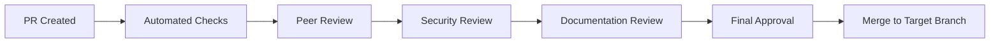

# 📋 MWAP Pull Request Guidelines

## 🎯 Overview

Pull Requests (PRs) are the primary mechanism for contributing code to MWAP. This guide establishes comprehensive standards for creating, reviewing, and merging PRs to ensure code quality, security, and maintainability.

## 🚀 Before Creating a Pull Request

### **Pre-submission Checklist**
```bash
# 1. Ensure your branch is up to date
git checkout develop
git pull upstream develop
git checkout your-feature-branch
git rebase develop

# 2. Run all quality checks locally
npm run type-check          # TypeScript compilation
npm run lint               # ESLint checks
npm run format             # Prettier formatting
npm run test:unit          # Unit tests
npm run test:integration   # Integration tests
npm run build              # Production build

# 3. Verify security requirements
npm audit                  # Security vulnerabilities
npm run security-scan      # Custom security checks

# 4. Check test coverage
npm run test:coverage      # Must be >80% for new code
```

### **Code Quality Requirements**
```typescript
// All code must meet these standards before PR submission:

// 1. TypeScript strict mode compliance
interface User {
  id: string;              // ✅ Explicit types
  name: string;
  email?: string;          // ✅ Optional properties marked
}

// 2. Proper error handling
async function createUser(data: CreateUserRequest): Promise<User> {
  try {
    const validatedData = validateUserData(data);
    return await userService.create(validatedData);
  } catch (error) {
    logger.error('User creation failed', { error: error.message });
    throw new AppError('Failed to create user', 500);
  }
}

// 3. Input validation with Zod
const createUserSchema = z.object({
  name: z.string().min(1).max(100),
  email: z.string().email().optional()
});

// 4. Authentication and authorization
router.post('/users',
  authenticateJWT(),           // ✅ Authentication required
  requireSuperAdmin(),         // ✅ Authorization check
  validateRequest(createUserSchema), // ✅ Input validation
  userController.createUser
);
```

## 📝 Pull Request Template

### **PR Title Format**
```bash
# Use conventional commit format for PR titles
feat(scope): add user authentication system
fix(api): resolve project creation validation error
docs(readme): update installation instructions
refactor(service): improve error handling patterns
```

### **PR Description Template**
```markdown
## 📋 Pull Request Description

### 🎯 Summary
Brief description of what this PR accomplishes.

### 🔗 Related Issues
- Closes #123
- Related to #456
- Fixes #789

### 🚀 Changes Made
- [ ] Added user authentication middleware
- [ ] Implemented JWT validation
- [ ] Added comprehensive unit tests
- [ ] Updated API documentation

### 🧪 Testing
- [ ] Unit tests added/updated
- [ ] Integration tests pass
- [ ] Manual testing completed
- [ ] Edge cases tested

### 📚 Documentation
- [ ] Code comments added
- [ ] API docs updated
- [ ] README updated
- [ ] Migration guide provided (if breaking changes)

### 🔒 Security Considerations
- [ ] Authentication implemented
- [ ] Authorization checks added
- [ ] Input validation with Zod
- [ ] No secrets in code
- [ ] Security implications reviewed

### ⚡ Performance Impact
- [ ] Database queries optimized
- [ ] No N+1 query problems
- [ ] Caching implemented where appropriate
- [ ] Memory usage considered

### 🔄 Breaking Changes
- [ ] No breaking changes
- [ ] Breaking changes documented with migration guide

### 📸 Screenshots (if applicable)
[Add screenshots for UI changes]

### 🧪 How to Test
1. Check out this branch
2. Run `npm install`
3. Set up environment variables
4. Run `npm test`
5. Start the application with `npm run dev`
6. Test the new functionality

### 📋 Reviewer Notes
Any specific areas that need attention or context for reviewers.
```

## 🔍 Pull Request Review Process

### **Review Stages**


### **Automated Checks**
```yaml
# GitHub Actions checks that must pass
required_checks:
  - ci/tests                 # All tests pass
  - ci/lint                  # ESLint passes
  - ci/type-check           # TypeScript compiles
  - ci/security-scan        # Security vulnerabilities
  - ci/build                # Production build succeeds
  - ci/coverage             # Test coverage >80%
  - ci/performance          # Performance benchmarks
```

### **Review Criteria**

#### **Code Quality Review**
```typescript
// Reviewers check for:
interface CodeQualityReview {
  typescript: {
    strictMode: boolean;        // Strict TypeScript compliance
    explicitTypes: boolean;     // No implicit any
    properInterfaces: boolean;  // Well-defined interfaces
  };
  
  patterns: {
    consistentNaming: boolean;  // Follows naming conventions
    properStructure: boolean;   // Feature-based organization
    errorHandling: boolean;     // Comprehensive error handling
    asyncPatterns: boolean;     // Proper async/await usage
  };
  
  performance: {
    efficientQueries: boolean;  // Optimized database queries
    properCaching: boolean;     // Appropriate caching
    memoryUsage: boolean;       // No memory leaks
    scalability: boolean;       // Scales with load
  };
}
```

#### **Security Review**
```typescript
// Security checklist for reviewers
interface SecurityReview {
  authentication: {
    jwtValidation: boolean;     // Proper JWT validation
    middlewareApplied: boolean; // Auth middleware on routes
    tokenHandling: boolean;     // Secure token handling
  };
  
  authorization: {
    rbacImplemented: boolean;   // Role-based access control
    tenantIsolation: boolean;   // Proper tenant isolation
    permissionChecks: boolean;  // Authorization checks
  };
  
  inputValidation: {
    zodSchemas: boolean;        // Zod validation schemas
    sanitization: boolean;      // Input sanitization
    injectionPrevention: boolean; // SQL/NoSQL injection prevention
  };
  
  dataProtection: {
    noSecretsInCode: boolean;   // No hardcoded secrets
    encryptionUsed: boolean;    // Proper encryption
    secureStorage: boolean;     // Secure data storage
  };
}
```

#### **Testing Review**
```typescript
// Testing requirements for reviewers
interface TestingReview {
  coverage: {
    unitTests: boolean;         // Unit tests for business logic
    integrationTests: boolean;  // API endpoint tests
    coverageThreshold: boolean; // >80% coverage for new code
  };
  
  quality: {
    testStructure: boolean;     // Well-structured tests
    edgeCases: boolean;         // Edge cases covered
    errorScenarios: boolean;    // Error paths tested
    mockingStrategy: boolean;   // Proper mocking
  };
  
  scenarios: {
    happyPath: boolean;         // Normal operation tested
    errorHandling: boolean;     // Error conditions tested
    securityScenarios: boolean; // Security edge cases
    performanceTests: boolean;  // Performance implications
  };
}
```

## 📋 Review Checklist Templates

### **For PR Authors**
```markdown
## Author Pre-submission Checklist

### Code Quality
- [ ] TypeScript strict mode compliance
- [ ] ESLint passes without warnings
- [ ] Prettier formatting applied
- [ ] No console.log statements in production code
- [ ] Proper error handling implemented
- [ ] Code follows MWAP naming conventions

### Security
- [ ] Authentication middleware applied to protected routes
- [ ] Authorization checks implemented for all endpoints
- [ ] Input validation with Zod schemas
- [ ] No secrets or sensitive data in code
- [ ] Environment variables used for configuration
- [ ] Security implications considered and documented

### Testing
- [ ] Unit tests added for new functionality
- [ ] Integration tests for API endpoints
- [ ] Test coverage >80% for new code
- [ ] All tests pass locally
- [ ] Edge cases and error scenarios tested
- [ ] Performance impact tested

### Documentation
- [ ] Code comments added for complex logic
- [ ] API documentation updated (if applicable)
- [ ] README updated (if needed)
- [ ] Migration guide provided (for breaking changes)
- [ ] Inline documentation follows standards

### Performance
- [ ] Database queries optimized with proper indexes
- [ ] No N+1 query problems introduced
- [ ] Appropriate caching implemented
- [ ] Memory leaks prevented
- [ ] Scalability considerations addressed
```

### **For Reviewers**
```markdown
## Reviewer Checklist

### Functionality Review
- [ ] Code works as intended
- [ ] All requirements met
- [ ] Edge cases handled appropriately
- [ ] Error scenarios properly managed
- [ ] Business logic is correct

### Code Quality Review
- [ ] Code is readable and maintainable
- [ ] Follows established patterns and conventions
- [ ] No code duplication
- [ ] Proper abstraction levels
- [ ] Consistent with existing codebase

### Security Review
- [ ] Authentication properly implemented
- [ ] Authorization checks are correct
- [ ] Input validation is comprehensive
- [ ] No security vulnerabilities introduced
- [ ] Sensitive data handled securely

### Performance Review
- [ ] No performance regressions
- [ ] Database queries are efficient
- [ ] Appropriate caching strategies
- [ ] Memory usage is reasonable
- [ ] Scalability considerations addressed

### Testing Review
- [ ] Test coverage is adequate (>80%)
- [ ] Tests are well-structured and meaningful
- [ ] All test scenarios covered
- [ ] Tests pass consistently
- [ ] Integration tests cover API contracts

### Documentation Review
- [ ] Code is well-documented
- [ ] API documentation is accurate
- [ ] Complex logic is explained
- [ ] Breaking changes are documented
- [ ] Migration guides provided when needed
```

## 🔄 PR Lifecycle Management

### **PR States and Actions**
```typescript
enum PRState {
  DRAFT = 'draft',
  READY_FOR_REVIEW = 'ready_for_review',
  IN_REVIEW = 'in_review',
  CHANGES_REQUESTED = 'changes_requested',
  APPROVED = 'approved',
  MERGED = 'merged',
  CLOSED = 'closed'
}

interface PRAction {
  state: PRState;
  requiredActions: string[];
  nextSteps: string[];
}

const prWorkflow: Record<PRState, PRAction> = {
  [PRState.DRAFT]: {
    state: PRState.DRAFT,
    requiredActions: ['Complete implementation', 'Add tests', 'Update docs'],
    nextSteps: ['Mark ready for review']
  },
  
  [PRState.READY_FOR_REVIEW]: {
    state: PRState.READY_FOR_REVIEW,
    requiredActions: ['Automated checks pass', 'Assign reviewers'],
    nextSteps: ['Begin peer review']
  },
  
  [PRState.CHANGES_REQUESTED]: {
    state: PRState.CHANGES_REQUESTED,
    requiredActions: ['Address review comments', 'Update code', 'Re-test'],
    nextSteps: ['Request re-review']
  }
};
```

### **Merge Strategies**
```bash
# 1. Squash and Merge (Recommended for features)
# Creates single commit with clean message
git checkout develop
git merge --squash feature/new-feature
git commit -m "feat(auth): implement user authentication system

- Add JWT validation middleware
- Implement role-based access control
- Add comprehensive unit tests
- Update API documentation

Closes #123"

# 2. Merge Commit (For complex features with meaningful history)
git checkout develop
git merge --no-ff feature/complex-feature

# 3. Rebase and Merge (For clean linear history)
git checkout feature/clean-commits
git rebase develop
git checkout develop
git merge feature/clean-commits
```

## 🚨 Common PR Issues and Solutions

### **Issue: Large Pull Requests**
```markdown
**Problem**: PR contains too many changes, making review difficult

**Solution**:
- Break into smaller, focused PRs
- Use feature flags for incremental delivery
- Create draft PRs for work-in-progress
- Separate refactoring from feature changes

**Example**:
Instead of: "feat: implement entire user management system"
Break into:
- "feat(auth): add user authentication"
- "feat(users): add user CRUD operations"
- "feat(rbac): implement role-based access control"
```

### **Issue: Failing Tests**
```markdown
**Problem**: Tests fail in CI but pass locally

**Solution**:
- Ensure consistent Node.js versions
- Check environment variable differences
- Verify database state between tests
- Use proper test isolation
- Check for race conditions in async tests

**Prevention**:
- Run tests in CI environment locally
- Use Docker for consistent environments
- Implement proper test setup/teardown
```

### **Issue: Merge Conflicts**
```markdown
**Problem**: Branch has conflicts with target branch

**Solution**:
```bash
# Rebase approach (recommended)
git checkout your-feature-branch
git fetch upstream
git rebase upstream/develop

# Resolve conflicts in each commit
git add resolved-files
git rebase --continue

# Force push after rebase
git push --force-with-lease origin your-feature-branch
```

### **Issue: Security Vulnerabilities**
```markdown
**Problem**: Security scan detects vulnerabilities

**Solution**:
- Update vulnerable dependencies
- Fix code-level security issues
- Add security tests
- Document security considerations

**Prevention**:
- Regular dependency updates
- Use security linting rules
- Implement security code review
- Automated security scanning
```

## 📊 PR Metrics and Analytics

### **PR Performance Metrics**
```typescript
interface PRMetrics {
  timeToReview: number;        // Hours from creation to first review
  timeToMerge: number;         // Hours from creation to merge
  reviewCycles: number;        // Number of review iterations
  linesChanged: number;        // Total lines added/removed
  filesChanged: number;        // Number of files modified
  testCoverage: number;        // Test coverage percentage
  reviewerCount: number;       // Number of reviewers
  commentCount: number;        // Total review comments
}

// Target metrics for healthy PR process
const targetMetrics = {
  timeToReview: 24,           // First review within 24 hours
  timeToMerge: 72,            // Merge within 3 days
  reviewCycles: 2,            // Maximum 2 review cycles
  linesChanged: 500,          // Keep PRs under 500 lines
  testCoverage: 80            // Minimum 80% coverage
};
```

### **Automated PR Analytics**
```yaml
# GitHub Actions for PR analytics
name: PR Analytics
on:
  pull_request:
    types: [opened, closed]

jobs:
  track-metrics:
    runs-on: ubuntu-latest
    steps:
      - name: Calculate PR metrics
        run: |
          # Track PR size, review time, etc.
          echo "PR Size: $(git diff --stat)"
          echo "Files Changed: $(git diff --name-only | wc -l)"
          
      - name: Update metrics dashboard
        run: |
          # Send metrics to monitoring system
          curl -X POST "$METRICS_ENDPOINT" \
            -H "Content-Type: application/json" \
            -d '{"pr_number": "${{ github.event.number }}", "metrics": {...}}'
```

## 🏆 PR Best Practices

### **For Authors**
1. **Keep PRs Small**: Aim for <500 lines of code changes
2. **Single Responsibility**: One feature or fix per PR
3. **Clear Description**: Explain what, why, and how
4. **Test Thoroughly**: Include comprehensive tests
5. **Update Documentation**: Keep docs in sync with code
6. **Respond Promptly**: Address review comments quickly
7. **Clean History**: Use meaningful commit messages

### **For Reviewers**
1. **Review Promptly**: Provide feedback within 24 hours
2. **Be Constructive**: Offer solutions, not just problems
3. **Focus on Important Issues**: Don't nitpick minor style issues
4. **Test Locally**: Pull and test complex changes
5. **Check Security**: Always review security implications
6. **Verify Tests**: Ensure adequate test coverage
7. **Approve When Ready**: Don't delay approval for minor issues

### **For Maintainers**
1. **Set Clear Standards**: Document expectations clearly
2. **Provide Templates**: Use PR and issue templates
3. **Automate Checks**: Use CI/CD for consistent validation
4. **Monitor Metrics**: Track PR health and team velocity
5. **Mentor Contributors**: Help new contributors succeed
6. **Maintain Quality**: Don't compromise on quality for speed

## 📚 Related Documentation

- [🤝 Contributing Guide](./contributing.md) - Complete contribution workflow
- [🌿 Branching Strategy](./branching.md) - Git branching conventions
- [📝 Issue Templates](./issue-template.md) - Issue reporting standards
- [📋 Commit Style](../07-Standards/commit-style.md) - Git commit conventions

---

*These PR guidelines ensure high-quality contributions while maintaining MWAP's security, performance, and maintainability standards. Following these practices leads to better code and a more efficient development process.*