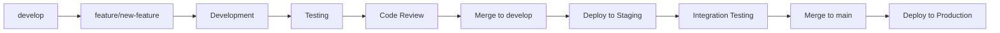
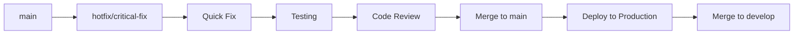
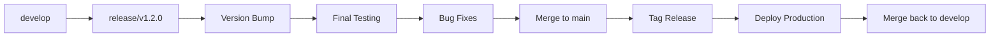

# 🌿 MWAP Branching Strategy

## 🎯 Overview

MWAP uses a **Git Flow** branching strategy optimized for continuous integration and secure deployment. This strategy ensures code quality, enables parallel development, and maintains a stable production environment.

## 🏗️ Branch Structure

### **Main Branches**
```
main                    # Production-ready code (protected)
├── develop            # Integration branch (protected)
├── staging            # Pre-production testing (protected)
└── hotfix/*           # Critical production fixes
```

### **Supporting Branches**
```
feature/*              # New feature development
├── fix/*             # Bug fixes
├── docs/*            # Documentation updates
├── refactor/*        # Code refactoring
├── test/*            # Test improvements
├── chore/*           # Maintenance tasks
├── security/*        # Security improvements
└── perf/*            # Performance optimizations
```

## 📋 Branch Types & Conventions

### **Main Branches**

#### **`main` Branch**
- **Purpose**: Production-ready code
- **Protection**: Protected, requires PR approval
- **Deployment**: Automatically deploys to production
- **Merge Sources**: `develop`, `hotfix/*`

```bash
# Main branch characteristics
- Always deployable
- Reflects production state
- Tagged with version numbers
- Never commit directly
- Requires code review
```

#### **`develop` Branch**
- **Purpose**: Integration branch for features
- **Protection**: Protected, requires PR approval
- **Deployment**: Automatically deploys to staging
- **Merge Sources**: `feature/*`, `fix/*`, `docs/*`, etc.

```bash
# Develop branch characteristics
- Latest development changes
- Integration testing environment
- Feature branch merge target
- Continuous integration
- Pre-production validation
```

#### **`staging` Branch** (Optional)
- **Purpose**: Pre-production testing
- **Protection**: Protected, auto-updated from develop
- **Deployment**: Staging environment
- **Testing**: User acceptance testing

### **Feature Branches**

#### **Naming Convention**
```bash
feature/<short-description>
feature/user-authentication
feature/project-dashboard
feature/cloud-integration
feature/multi-tenant-support
```

#### **Lifecycle**
```bash
# 1. Create from develop
git checkout develop
git pull origin develop
git checkout -b feature/user-authentication

# 2. Develop with atomic commits
git commit -m "feat(auth): add user model"
git commit -m "feat(auth): implement JWT validation"
git commit -m "test(auth): add authentication tests"

# 3. Keep updated with develop
git fetch origin
git rebase origin/develop

# 4. Push and create PR
git push -u origin feature/user-authentication
# Create PR: feature/user-authentication → develop

# 5. After merge, cleanup
git checkout develop
git pull origin develop
git branch -d feature/user-authentication
git push origin --delete feature/user-authentication
```

### **Bug Fix Branches**

#### **Naming Convention**
```bash
fix/<issue-description>
fix/jwt-validation-error
fix/database-connection
fix/api-response-format
fix/memory-leak-service
```

#### **Process**
```bash
# For non-critical bugs
git checkout develop
git checkout -b fix/jwt-validation-error

# Develop fix
git commit -m "fix(auth): resolve JWT validation error"
git commit -m "test(auth): add regression test"

# Create PR to develop
# PR: fix/jwt-validation-error → develop
```

### **Hotfix Branches**

#### **Naming Convention**
```bash
hotfix/<critical-issue>
hotfix/security-vulnerability
hotfix/data-corruption
hotfix/service-outage
hotfix/memory-leak
```

#### **Critical Fix Process**
```bash
# 1. Create from main (production)
git checkout main
git pull origin main
git checkout -b hotfix/security-vulnerability

# 2. Implement critical fix
git commit -m "security(auth): patch JWT vulnerability"
git commit -m "test(auth): add security regression test"

# 3. Create PR to main
# PR: hotfix/security-vulnerability → main

# 4. After merge to main, also merge to develop
git checkout develop
git merge main

# 5. Deploy immediately
git tag -a v1.2.1 -m "Hotfix: Security vulnerability patch"
git push origin main --tags
```

### **Documentation Branches**

#### **Naming Convention**
```bash
docs/<documentation-area>
docs/api-endpoints
docs/deployment-guide
docs/architecture-diagrams
docs/contributing-guide
```

#### **Process**
```bash
# Documentation updates
git checkout develop
git checkout -b docs/api-endpoints

git commit -m "docs(api): update project endpoints"
git commit -m "docs(api): add authentication examples"

# PR: docs/api-endpoints → develop
```

### **Refactoring Branches**

#### **Naming Convention**
```bash
refactor/<area-being-refactored>
refactor/service-layer
refactor/database-schema
refactor/error-handling
refactor/validation-logic
```

#### **Process**
```bash
# Code refactoring
git checkout develop
git checkout -b refactor/service-layer

git commit -m "refactor(service): extract common validation"
git commit -m "refactor(service): improve error handling"
git commit -m "test(service): update tests for refactored code"

# PR: refactor/service-layer → develop
```

## 🔄 Workflow Patterns

### **Feature Development Workflow**


### **Hotfix Workflow**


### **Release Workflow**


## 🛡️ Branch Protection Rules

### **Main Branch Protection**
```yaml
# GitHub branch protection settings
protection_rules:
  main:
    required_status_checks:
      - ci/tests
      - ci/security-scan
      - ci/build
    required_reviews: 2
    dismiss_stale_reviews: true
    require_code_owner_reviews: true
    restrict_pushes: true
    allowed_push_users: []  # No direct pushes
    required_linear_history: true
    allow_force_pushes: false
    allow_deletions: false
```

### **Develop Branch Protection**
```yaml
protection_rules:
  develop:
    required_status_checks:
      - ci/tests
      - ci/lint
      - ci/type-check
    required_reviews: 1
    dismiss_stale_reviews: true
    require_code_owner_reviews: false
    restrict_pushes: true
    allowed_push_users: []  # No direct pushes
    required_linear_history: false
    allow_force_pushes: false
    allow_deletions: false
```

## 🔧 Branch Management Commands

### **Common Git Commands**
```bash
# List all branches
git branch -a

# List remote branches
git branch -r

# Delete local branch
git branch -d feature/completed-feature

# Delete remote branch
git push origin --delete feature/completed-feature

# Prune deleted remote branches
git remote prune origin

# Show branch tracking
git branch -vv

# Switch to branch
git checkout develop
git switch develop  # Git 2.23+

# Create and switch to new branch
git checkout -b feature/new-feature
git switch -c feature/new-feature  # Git 2.23+
```

### **Branch Synchronization**
```bash
# Update local develop with remote
git checkout develop
git pull origin develop

# Rebase feature branch with latest develop
git checkout feature/my-feature
git rebase develop

# Interactive rebase to clean up commits
git rebase -i develop

# Force push after rebase (use with caution)
git push --force-with-lease origin feature/my-feature
```

### **Branch Cleanup**
```bash
# Clean up merged branches
git branch --merged develop | grep -v develop | xargs -n 1 git branch -d

# Clean up remote tracking branches
git remote prune origin

# Show branches that can be deleted
git for-each-ref --format='%(refname:short) %(upstream:track)' refs/heads | grep '\[gone\]'
```

## 📊 Branch Metrics & Monitoring

### **Branch Health Indicators**
```typescript
interface BranchHealth {
  name: string;
  lastCommit: Date;
  commitsBehind: number;
  commitsAhead: number;
  buildStatus: 'passing' | 'failing' | 'pending';
  testCoverage: number;
  codeQuality: number;
  securityIssues: number;
}

// Example monitoring
const branchMetrics = {
  'feature/user-auth': {
    lastCommit: new Date('2024-01-15'),
    commitsBehind: 3,
    commitsAhead: 7,
    buildStatus: 'passing',
    testCoverage: 85,
    codeQuality: 92,
    securityIssues: 0
  }
};
```

### **Automated Branch Management**
```yaml
# GitHub Actions for branch management
name: Branch Management
on:
  schedule:
    - cron: '0 2 * * 1'  # Weekly on Monday

jobs:
  cleanup-merged-branches:
    runs-on: ubuntu-latest
    steps:
      - uses: actions/checkout@v3
      - name: Delete merged branches
        run: |
          git branch -r --merged origin/develop | 
          grep -v develop | 
          grep -v main | 
          sed 's/origin\///' | 
          xargs -n 1 git push --delete origin

  stale-branch-notification:
    runs-on: ubuntu-latest
    steps:
      - name: Find stale branches
        run: |
          # Notify about branches older than 30 days
          git for-each-ref --format='%(refname:short) %(committerdate)' refs/remotes/origin |
          awk '$2 < "'$(date -d '30 days ago' '+%Y-%m-%d')'"'
```

## 🚀 Advanced Branching Strategies

### **Parallel Feature Development**
```bash
# Multiple developers working on related features
feature/auth-backend     # Backend authentication
feature/auth-frontend    # Frontend authentication
feature/auth-testing     # Authentication testing

# Coordination branch for integration
feature/auth-integration # Combines all auth features
```

### **Experimental Branches**
```bash
# For experimental features or proof of concepts
experiment/new-architecture
experiment/performance-optimization
experiment/alternative-database

# These branches may be abandoned or merged later
```

### **Release Branches**
```bash
# For release preparation
release/v1.2.0          # Prepare version 1.2.0
release/v1.3.0          # Prepare version 1.3.0

# Release branch workflow
git checkout develop
git checkout -b release/v1.2.0

# Version bump and final preparations
npm version minor
git commit -m "chore: bump version to 1.2.0"

# Merge to main and tag
git checkout main
git merge release/v1.2.0
git tag -a v1.2.0 -m "Release version 1.2.0"

# Merge back to develop
git checkout develop
git merge main
```

## 🔍 Branch Review Process

### **Pre-merge Checklist**
```markdown
## Branch Review Checklist

### Code Quality
- [ ] All tests pass
- [ ] Code coverage meets requirements (>80%)
- [ ] No linting errors or warnings
- [ ] TypeScript compilation successful
- [ ] No security vulnerabilities detected

### Functionality
- [ ] Feature works as intended
- [ ] Edge cases handled appropriately
- [ ] Error handling implemented
- [ ] Performance impact assessed
- [ ] Backward compatibility maintained

### Documentation
- [ ] Code comments added for complex logic
- [ ] API documentation updated
- [ ] README updated if necessary
- [ ] Migration guide provided (if needed)

### Testing
- [ ] Unit tests added/updated
- [ ] Integration tests pass
- [ ] Manual testing completed
- [ ] Regression testing performed
```

### **Merge Strategies**
```bash
# Merge commit (preserves branch history)
git checkout develop
git merge --no-ff feature/new-feature

# Squash merge (clean linear history)
git checkout develop
git merge --squash feature/new-feature
git commit -m "feat: implement new feature"

# Rebase merge (linear history without merge commit)
git checkout feature/new-feature
git rebase develop
git checkout develop
git merge feature/new-feature
```

## 📚 Related Documentation

- [🤝 Contributing Guide](./contributing.md) - Complete contribution workflow
- [📋 PR Guidelines](./PR-guidelines.md) - Pull request standards
- [📝 Commit Style](../07-Standards/commit-style.md) - Git commit conventions
- [🛠️ Development Guide](../07-Standards/development-guide.md) - Development standards

---

*This branching strategy ensures code quality, enables parallel development, and maintains a stable production environment while supporting the collaborative nature of the MWAP project.*