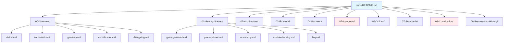

# 🚀 Plan: MWAP Documentation Structure Refactor

## 🎯 Goal Summary

**What**: Refactor the MWAP documentation structure to eliminate 60+ broken links, resolve duplicate content, and create a coherent, maintainable documentation system that accurately reflects the project's current state.

**Why**: The current documentation suffers from incomplete reorganization, resulting in broken navigation, duplicate structures, and poor developer experience. This impacts onboarding, development efficiency, and project maintainability.

**For Whom**: 
- New developers joining the MWAP project
- Existing team members seeking reference materials
- External contributors and stakeholders
- Future AI agents and automation tools

## 🏗 Technical Approach & Architecture Notes

### Current State Analysis
```
docs/
├── 00-Overview/          ✅ EXISTS (partial)
├── 01-Getting-Started/   ✅ EXISTS (partial) 
├── 02-Architecture/      ✅ EXISTS (complete)
├── 03-Frontend/          ✅ EXISTS (complete)
├── 04-Backend/           ✅ EXISTS (complete)
├── 05-AI-Agents/         ❌ MISSING (referenced 5x)
├── 06-Guides/            ✅ EXISTS (partial)
├── 07-Standards/         ✅ EXISTS (partial)
├── 08-Contribution/      ❌ MISSING (referenced 4x)
├── 09-Reports-and-History/ ✅ EXISTS (complete)
├── features/             🔄 DUPLICATE CONTENT
├── frontend/             🔄 DUPLICATE CONTENT  
├── integrations/         🔄 DUPLICATE CONTENT
├── testing/              🔄 DUPLICATE CONTENT
└── archive/              🔄 DUPLICATE CONTENT
```

### Target Architecture

**Single Source of Truth Principle**: Each piece of information exists in exactly one location within the numbered directory structure.



### Content Migration Strategy

**Phase 1: Structure Consolidation**
- Merge `docs/frontend/` → `docs/03-Frontend/`
- Merge `docs/features/` → `docs/06-Guides/`
- Merge `docs/integrations/` → `docs/06-Guides/`
- Merge `docs/testing/` → `docs/06-Guides/`

**Phase 2: Missing Directory Creation**
- Create `docs/05-AI-Agents/` with microagent documentation
- Create `docs/08-Contribution/` with PR/issue templates

**Phase 3: Link Resolution**
- Update all internal references to use new structure
- Validate all links using existing validation script

## 🔒 Security Considerations

### Documentation Security
- **No Secrets Exposure**: Ensure no API keys, tokens, or sensitive configuration in documentation
- **Access Control**: Documentation should not reveal internal security mechanisms beyond what's necessary for development
- **Sanitized Examples**: All code examples use placeholder values for sensitive data

### Content Validation
- **Source Code Verification**: All API documentation must be verified against actual route implementations
- **Authentication Patterns**: Document only approved authentication flows (Auth0 JWT with RS256)
- **GDPR Compliance**: Ensure documentation practices align with data protection requirements

## 🛠 Implementation Steps

### Phase 1: Emergency Stabilization (2-3 hours)
**Goal**: Fix critical broken links and create missing directories

#### Step 1.1: Create Missing Directory Structure
```bash
# Create missing directories
mkdir -p docs/05-AI-Agents
mkdir -p docs/08-Contribution
mkdir -p docs/02-Architecture/diagrams
mkdir -p docs/09-Reports-and-History/changelogs
mkdir -p docs/09-Reports-and-History/refactoring
```

#### Step 1.2: Create Critical Missing Files
- [ ] `docs/00-Overview/glossary.md` - Key terms and definitions
- [ ] `docs/00-Overview/contributors.md` - Team information and roles
- [ ] `docs/00-Overview/changelog.md` - Version history
- [ ] `docs/01-Getting-Started/prerequisites.md` - System requirements
- [ ] `docs/01-Getting-Started/env-setup.md` - Environment configuration
- [ ] `docs/01-Getting-Started/troubleshooting.md` - Common issues
- [ ] `docs/01-Getting-Started/faq.md` - Frequently asked questions
- [ ] `docs/05-AI-Agents/microagents.md` - AI agent documentation
- [ ] `docs/08-Contribution/contributing.md` - Contribution guidelines

#### Step 1.3: Fix Main README Navigation
- [ ] Update `docs/README.md` to remove broken links
- [ ] Add temporary placeholders for missing content
- [ ] Ensure all directory references are accurate

### Phase 2: Content Consolidation (4-6 hours)
**Goal**: Merge duplicate content and establish single source of truth

#### Step 2.1: Frontend Content Consolidation
```bash
# Merge frontend documentation
# Source: docs/frontend/ → Target: docs/03-Frontend/
```
- [ ] Compare `docs/frontend/README.md` with `docs/03-Frontend/README.md`
- [ ] Merge unique content from `docs/frontend/` into `docs/03-Frontend/`
- [ ] Update internal references to point to consolidated location
- [ ] Archive old `docs/frontend/` directory

#### Step 2.2: Features Content Migration
```bash
# Migrate feature documentation
# Source: docs/features/ → Target: docs/06-Guides/
```
- [ ] Move `docs/features/feature-pattern.md` → `docs/06-Guides/feature-development.md`
- [ ] Move cloud-related features to appropriate guides
- [ ] Update cross-references

#### Step 2.3: Integration Content Migration
```bash
# Migrate integration documentation  
# Source: docs/integrations/ → Target: docs/06-Guides/
```
- [ ] Move `docs/integrations/oauth-guide.md` → `docs/06-Guides/oauth-integration.md`
- [ ] Update references in authentication documentation

#### Step 2.4: Testing Content Migration
```bash
# Consolidate testing documentation
# Source: docs/testing/ → Target: docs/06-Guides/
```
- [ ] Merge `docs/testing/README.md` content into `docs/06-Guides/how-to-test.md`
- [ ] Resolve `TESTING.md` vs `testing.md` conflicts
- [ ] Update test documentation references

### Phase 3: Content Enhancement (6-8 hours)
**Goal**: Create comprehensive, accurate documentation

#### Step 3.1: AI Agents Documentation
- [ ] Document microagent system from `.openhands/microagents/`
- [ ] Create `docs/05-AI-Agents/openhands-integration.md`
- [ ] Document prompt engineering best practices
- [ ] Create agent development patterns guide

#### Step 3.2: Contribution Documentation
- [ ] Create comprehensive contributing guide
- [ ] Document branching strategy and PR process
- [ ] Create issue templates and guidelines
- [ ] Document code review process

#### Step 3.3: Architecture Documentation Enhancement
- [ ] Create visual diagrams for `docs/02-Architecture/diagrams/`
- [ ] Document component relationships
- [ ] Create user flow diagrams
- [ ] Update system design documentation

#### Step 3.4: Standards Documentation
- [ ] Create `docs/07-Standards/naming.md` - Naming conventions
- [ ] Create `docs/07-Standards/.env-format.md` - Environment standards
- [ ] Create `docs/07-Standards/commit-style.md` - Git conventions
- [ ] Create `docs/07-Standards/development-guide.md` - General practices

### Phase 4: Validation and Cleanup (2-3 hours)
**Goal**: Ensure all links work and content is accurate

#### Step 4.1: Link Validation
```bash
# Run comprehensive link validation
node scripts/validate-docs-links.js
```
- [ ] Fix all remaining broken links
- [ ] Validate external link accessibility
- [ ] Update outdated references

#### Step 4.2: Content Accuracy Verification
- [ ] Verify API documentation against source code
- [ ] Validate authentication flow documentation
- [ ] Check environment setup instructions
- [ ] Test getting started guide

#### Step 4.3: Archive Cleanup
- [ ] Move obsolete content to `docs/archive/`
- [ ] Remove duplicate files
- [ ] Clean up temporary files
- [ ] Update archive index

## ✅ Testing & Validation Strategy

### Automated Validation
```bash
# Link validation
node scripts/validate-docs-links.js

# Structure validation  
node scripts/test-docs-navigation.js

# Content validation (custom script to create)
node scripts/validate-docs-content.js
```

### Manual Testing Scenarios

#### New Developer Onboarding Test
1. **Setup Test**: Follow `docs/01-Getting-Started/getting-started.md` from scratch
2. **Navigation Test**: Use main README to find specific information
3. **API Test**: Use `docs/04-Backend/API-v3.md` to make actual API calls
4. **Contribution Test**: Follow `docs/08-Contribution/contributing.md` to submit a test PR

#### Documentation Maintenance Test
1. **Update Test**: Modify API endpoint and update documentation
2. **Link Test**: Add new document and verify all references work
3. **Structure Test**: Reorganize content and validate navigation
4. **Archive Test**: Move outdated content to archive

#### Content Accuracy Test
1. **API Verification**: Compare documented endpoints with actual routes
2. **Code Example Test**: Execute all code examples in documentation
3. **Environment Test**: Validate environment setup instructions
4. **Authentication Test**: Verify Auth0 integration documentation

### Validation Checklist
- [ ] Zero broken internal links
- [ ] All referenced files exist
- [ ] Main navigation works end-to-end
- [ ] Getting started guide is executable
- [ ] API documentation matches implementation
- [ ] All code examples are functional
- [ ] Cross-references are accurate
- [ ] Search functionality works (if implemented)

## ⚠ Potential Risks & Mitigations

### Risk 1: Content Loss During Migration
**Impact**: High - Loss of important documentation
**Probability**: Medium
**Mitigation**: 
- Create backup of entire `docs/` directory before starting
- Use git branches for each phase
- Implement content verification checklist

### Risk 2: Broken External References
**Impact**: Medium - External tools/links pointing to old structure
**Probability**: High
**Mitigation**:
- Document all URL changes
- Implement redirect strategy if needed
- Communicate changes to stakeholders

### Risk 3: Team Confusion During Transition
**Impact**: Medium - Temporary productivity loss
**Probability**: Medium
**Mitigation**:
- Implement changes in phases
- Communicate timeline and changes clearly
- Provide transition guide for team

### Risk 4: Incomplete Content Migration
**Impact**: High - Missing critical information
**Probability**: Low
**Mitigation**:
- Use systematic content audit approach
- Implement peer review for each phase
- Create content verification matrix

### Risk 5: Validation Script Limitations
**Impact**: Medium - Undetected broken links or issues
**Probability**: Medium
**Mitigation**:
- Enhance validation scripts during process
- Implement manual spot-checking
- Create comprehensive test scenarios

## 📌 Next Steps Checklist

### Immediate Actions (Today)
- [ ] **Backup Documentation**: Create full backup of current `docs/` directory
- [ ] **Create Feature Branch**: `git checkout -b docs-refactor-phase1`
- [ ] **Run Initial Validation**: Execute `node scripts/validate-docs-links.js` to establish baseline
- [ ] **Create Missing Directories**: Set up `05-AI-Agents/` and `08-Contribution/`
- [ ] **Fix Critical Broken Links**: Update main README.md navigation

### Phase 1 Completion (This Week)
- [ ] **Emergency Stabilization**: Complete all Phase 1 tasks
- [ ] **Validation Check**: Ensure zero critical broken links
- [ ] **Team Communication**: Notify team of structural changes
- [ ] **Documentation**: Update CHANGELOG with refactor progress

### Phase 2 Planning (Next Week)
- [ ] **Content Audit**: Complete inventory of duplicate content
- [ ] **Migration Strategy**: Finalize content consolidation approach
- [ ] **Stakeholder Review**: Get approval for major structural changes
- [ ] **Timeline Communication**: Share Phase 2 timeline with team

### Long-term Success Metrics
- [ ] **Zero Broken Links**: Maintain 100% internal link validity
- [ ] **Single Source of Truth**: Eliminate all content duplication
- [ ] **Developer Experience**: Reduce onboarding time by 50%
- [ ] **Maintenance Efficiency**: Reduce documentation update time by 60%
- [ ] **Content Accuracy**: 100% API documentation matches implementation

---

## 🎯 Success Definition

This refactor will be considered successful when:

1. **Navigation Excellence**: Any developer can find any information within 2 clicks from main README
2. **Zero Broken Links**: All internal documentation links work perfectly
3. **Content Integrity**: All technical information is verified against actual implementation
4. **Maintenance Simplicity**: Documentation updates require minimal cross-reference changes
5. **Onboarding Efficiency**: New developers can set up and contribute within 1 hour using documentation

**Estimated Total Effort**: 14-20 hours across 2-3 weeks
**Primary Risk**: Content loss during migration (mitigated by systematic backup and verification)
**Success Metric**: Zero broken links + 50% faster developer onboarding

---

*This plan aligns with MWAP's architectural principles of security-first development, TypeScript-strict standards, and maintainable code organization.*